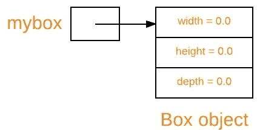
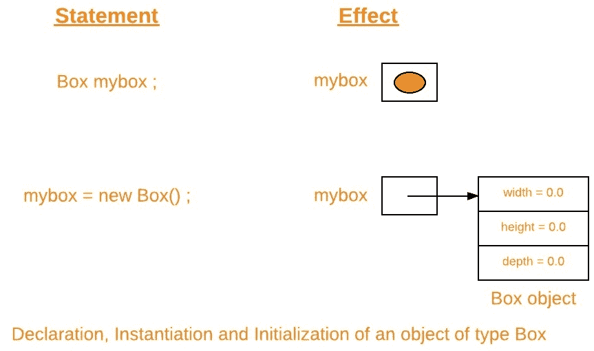

# Java 中的新操作符

> 原文:[https://www.geeksforgeeks.org/new-operator-java/](https://www.geeksforgeeks.org/new-operator-java/)

当你在 java 中声明一个类时，你只是在创建一个新的数据类型。类为对象提供蓝图。您可以从类创建对象。然而，获取一个类的对象是一个两步的过程:

1.  **Declaration :** First, you must declare a variable of the class type. This variable does not define an object. Instead, it is simply a variable that can *refer* to an object. Below is general syntax of declaration with an example :

    ```
    Syntax :
    class-name var-name;

    Example :
    // declare reference to an object of class Box
    Box mybox;

    ```

    处于这种状态的变量，当前没有引用任何对象，可以如下所示(变量名 mybox，加上一个指向空的引用):

    

2.  **Instantiation and Initialization :** Second, you must acquire an actual, physical copy of the object and assign it to that variable. You can do this using the ***new*** operator. The ***new*** operator instantiates a class by dynamically allocating(i.e, allocation at run time) memory for a new object and returning a reference to that memory. This reference is then stored in the variable. Thus, in Java, **all class objects must be dynamically allocated.**

    ***新的*** 操作符后面还有一个对类构造函数的调用，它初始化了新的对象。一个[构造器](https://www.geeksforgeeks.org/constructors-in-java/)定义了当一个类的对象被创建时会发生什么。构造函数是所有类的重要组成部分，并且有许多重要的属性。在下面的例子中，我们将使用[默认构造函数](https://www.geeksforgeeks.org/g-fact-50/)。下面是实例化和初始化的一般语法，并附有一个示例:

    ```
    Syntax :
    var-name = new class-name();

    Example :
    // instantiation via *new* operator and 
    // initialization via default constructor of class Box
    mybox = new Box();

    ```

    了解之前，如何 ***新增*** 动态分配内存，让我们看看类*盒子*原型。

    ```
    class Box
    {
        double width;
        double height;
        double depth;
    }

    ```

    第二步之后的一个变量，当前引用了一个类对象，可以说明如下(变量名 mybox，加上指向 box 对象的引用):

    

因此，类变量的声明、类的实例化和类的对象的初始化可以一起说明如下:



**要点:**

1.  以上两个语句可以重写为一个语句。

    ```
    Box mybox = new Box();

    ```

2.  由 ***新的*** 运算符返回的引用不必分配给类变量。它也可以直接用在表达式中。例如:

    ```
    double height = new Box().height;

    ```

3.  由于[数组在 java 中是对象](https://www.geeksforgeeks.org/arrays-in-java/)，因此在实例化数组时，我们使用 ***新的*** 运算符。例如:

    ```
    int arr[] = new int[5];

    ```

4.  此时，您可能会想为什么不需要使用 ***新的*** 运算符来处理[原语数据类型](https://www.geeksforgeeks.org/data-types-in-java/)。答案是 Java 的原语类型不是作为对象实现的。相反，它们被实现为“正常”变量。这样做是为了提高效率。对于原始数据类型的对象版本，请参考[包装类](https://www.geeksforgeeks.org/wrapper-classes-java/)。
5.  短语“实例化一个类”和“创建一个对象”的意思是一样的当您创建一个对象时，您正在创建一个类的“实例”，因此“实例化”了一个类。

**分配对象参考变量**

当您将一个对象引用变量分配给另一个对象引用变量时，您不是在创建对象的副本，您只是在创建引用的副本。让我们用一个例子来理解这一点。

```
// Java program to demonstrate assigning 
// of object reference variables

// Box class
class Box
{
    double width;
    double height;
    double depth;
}

// Driver class
public class Test
{
    // Driver method
    public static void main(String[] args) 
    {
        // creating box object
        Box b1 = new Box();

        // assigning b2 to b1
        Box b2 = b1;

        // height via b1 and b2
        System.out.println(b1.height);
        System.out.println(b2.height);

        // changing height via b2
        b2.height = 20;

        // height via b1 and b2
        // after modification through b2
        System.out.println(b1.height);
        System.out.println(b2.height);
    }

}
```

输出:

```
0.0
0.0
20.0
20.0

```

**说明:**

首先让我们了解以下片段在上述程序中的作用。

```
Box b1 = new Box();
Box b2 = b1;

```

您可能会认为 **b2** 正在被分配一个引用，以引用由 **b1** 引用的对象的副本。也就是说，你可能会认为 **b1** 和 **b2** 指的是分开的不同物体。然而，这是错误的。相反，在这个片段执行后， **b1** 和 **b2** 将引用同一个对象。 **b1** 到 **b2** 的分配没有分配任何内存或复制原始对象的任何部分。它只是让 **b2** 和 **b1** 引用同一个对象。因此，通过 **b2** 对对象所做的任何更改都将影响 **b1** 所指的对象，因为它们是同一对象。当我们通过 **b2** 改变箱体的*高度*时，同样可以通过输出进行验证。

这种情况可以说明如下:


**注:**虽然 **b1** 和 **b2** 都是指同一个物体，但没有任何其他的联系。例如，对 **b1** 的后续赋值将简单地*从原始对象中解开* **b1** ，而不会影响对象或影响 **b2** 。例如:

```
Box b1 = new Box();
Box b2 = b1;
// ...
b1 = null;

```

这里 **b1** 已经设置为*空*，但是 **b2** 仍然指向原对象。

**将对象引用变量传递给方法**

当我们将对象引用传递给方法时，接收它的参数将引用与参数引用的对象相同的对象。要通过例子了解更多，请参考 Java 中的[传递和返回对象。](https://www.geeksforgeeks.org/passing-and-returning-objects-in-java/)

本文由**高拉夫·米格拉尼**供稿。如果你喜欢 GeeksforGeeks 并想投稿，你也可以使用[contribute.geeksforgeeks.org](http://www.contribute.geeksforgeeks.org)写一篇文章或者把你的文章邮寄到 contribute@geeksforgeeks.org。看到你的文章出现在极客博客主页上，帮助其他极客。

如果你发现任何不正确的地方，或者你想分享更多关于上面讨论的话题的信息，请写评论。