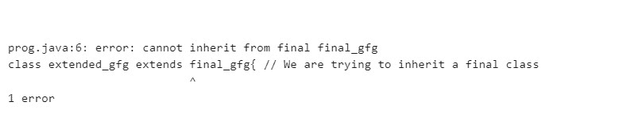
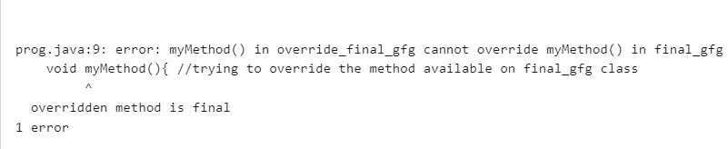
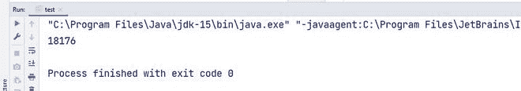
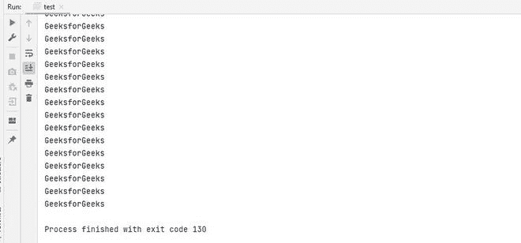
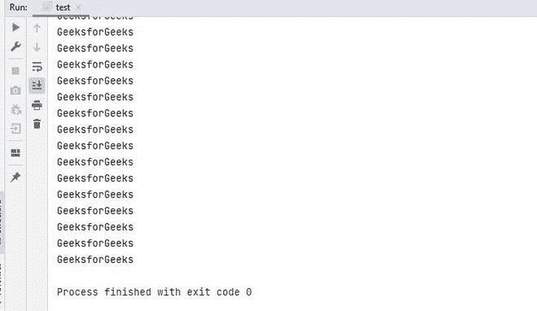
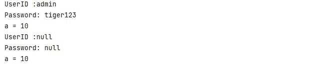
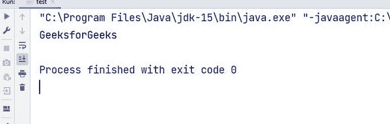

# Java 中的非访问修饰符

> 原文:[https://www.geeksforgeeks.org/non-access-modifiers-in-java/](https://www.geeksforgeeks.org/non-access-modifiers-in-java/)

**修饰符**是 Java 中存在的特定关键字，使用它我们可以对变量、方法或类的特性进行更改，并限制其范围。Java 编程语言有一组丰富的修饰符。

Java 中的修饰符分为两种类型:[**访问修饰符**](https://www.geeksforgeeks.org/access-modifiers-java/?ref=lbp) 和**非访问修饰符**。

**Java 中的访问修饰符**有助于限制变量、方法、类或构造函数的范围。**公共**、**私有**、**受保护**和**默认**这四个访问修饰符在 Java 中都有。

### **非访问修饰符**

非访问修饰符向 JVM 提供关于类、方法或变量特征的信息。Java 中有七种类型的非访问修饰符。他们是–

1.  **静态**
2.  **决赛**
3.  **摘要**
4.  **同步**
5.  **挥发性**
6.  **瞬态**
7.  **原生**

### 1.[静态](https://www.geeksforgeeks.org/static-keyword-java/)

static 关键字意味着应用它的实体在类的任何特定实例之外都是可用的。这意味着静态方法或属性是类的一部分，而不是对象。在加载类时，内存被分配给这样的属性或方法。静态修饰符的使用通过节省内存使程序更有效。静态字段存在于所有的类实例中，不需要创建类的对象，就可以调用它们。

**例 1:**

## Java 语言(一种计算机语言，尤用于创建网站)

```
import java.io.*;

// static variable
class static_gfg {
    static String s = "GeeksforGeeks"; 
}
class GFG {
    public static void main(String[] args)
    {
        // No object required
        System.out.println(
            static_gfg.s); 
    }
}
```

**Output**

```
GeeksforGeeks
```

在上面的代码示例中，我们已经将 String 声明为静态的，是 **static_gfg** 类的一部分。一般来说，要访问字符串，我们首先需要创建 **static_gfg** 类的对象，但是由于我们已经将其声明为 static，因此我们不需要创建 **static_gfg** 类的对象来访问字符串。我们可以使用**类名.变量名称**来访问它。

**例 2:**

## Java 语言(一种计算机语言，尤用于创建网站)

```
import java.io.*;

class static_gfg {

    // static variable
    static int count = 0; 
    void myMethod()
    {
        count++;
        System.out.println(count);
    }
}
class GFG {
    public static void main(String[] args)
    {
        // first object creation
        static_gfg obj1 = new static_gfg(); 

        // method calling of first object
        obj1.myMethod(); 

        // second object creation
        static_gfg obj2
            = new static_gfg(); 

        // method calling of second object
        obj2.myMethod(); 
    }
}
```

**Output**

```
1
2
```

在上面的代码中， **count** 变量是静态的，所以它不绑定到类的特定实例。因此，当调用 **obj1.myMethod()** 时，它会将 count 的值增加 1，然后 **obj2.myMethod()** 会再次增加它。如果它不是静态的，那么在这两种情况下，我们都将输出为 1，但是因为它是静态变量，所以计数变量将增加两倍，并且我们将第二次获得 2 作为输出。

### 2.[决赛](https://www.geeksforgeeks.org/final-keyword-in-java/)

**final** 关键字表示特定的类不能被扩展或者方法不能被覆盖。让我们用一个例子来理解这一点——

**例 1:**

## Java 语言(一种计算机语言，尤用于创建网站)

```
import java.io.*;

class final_gfg { 
    String s1 = "geek1";
}
class extended_gfg extends final_gfg { 

    String s2 = "geek2";
}
class GFG {
    public static void main(String[] args)
    {
      // creating object
      extended_gfg obj = new extended_gfg(); 

      System.out.println(obj.s1);
      System.out.println(obj.s2);
    }
}
```

**Output**

```
geek1
geek2
```

在上面的代码中， **final_gfg** 类被 **extended_gfg** 类扩展，代码工作正常并产生输出。

但是在将 **final** 关键字与 **final_gfg** 类一起使用之后。代码会产生错误。以下是相同的实现–

## Java 语言(一种计算机语言，尤用于创建网站)

```
import java.io.*;

// This class is final
final class final_gfg { 
    String s1 = "geek1";
}
// We are trying to inherit a final
class extended_gfg extends final_gfg { 

    String s2 = "geek2";
}
class GFG {
    public static void main(String[] args)
    {
        // creating object
        extended_gfg obj
            = new extended_gfg();

          System.out.println(obj.s1);
          System.out.println(obj.s2);
    }
}
```

**错误:**



错误截图

这里我们在编译中得到错误，因为我们试图扩展 **final_gfg** 类，它被声明为 **final。**如果一个类被声明为 final，那么我们不能扩展它或者从那个类继承。

**例 2:**

## Java 语言(一种计算机语言，尤用于创建网站)

```
import java.io.*;

class final_gfg{
     void myMethod(){
        System.out.println("GeeksforGeeks");
    }
}
class override_final_gfg extends final_gfg{
    void myMethod(){ 
        System.out.println("Overrides GeeksforGeeks");
    }
}

class GFG{
    public static void main(String[] args) {
        override_final_gfg obj=new override_final_gfg();
        obj.myMethod();
    }
}
```

**Output**

```
Overrides GeeksforGeeks
```

在上面的代码中，我们正在重写 **myMethod()** ，代码运行良好。

现在我们要将超类中的 **myMethod()** 声明为 final。以下是相同的实现–

## Java 语言(一种计算机语言，尤用于创建网站)

```
import java.io.*;

class final_gfg{
    final void myMethod(){
        System.out.println("GeeksforGeeks");
    }
}
class override_final_gfg extends final_gfg{
    // trying to override the method available on final_gfg class
    void myMethod(){ 
        System.out.println("Overrides GeeksforGeeks");
    }
}
class GFG{
    public static void main(String[] args) {
        override_final_gfg obj=new override_final_gfg();
        obj.myMethod();
    }
}
```

**错误:**



错误截图

上面的代码产生了一个错误，因为在这里，我们试图重写一个被声明为 final 的方法。 **myMethod()** 在 **final_gfg** 类中被声明为 final，我们试图从 **override_final_gfg** 类中覆盖它。不能重写最终方法；因此，代码片段在这里产生了一个错误。

### 3.[摘要](https://www.geeksforgeeks.org/abstract-keyword-in-java/)

抽象关键字用于将一个类声明为部分实现，这意味着不能直接从该类创建对象。任何子类要么需要实现抽象类的所有方法，要么也需要是抽象类。抽象关键字不能与静态、最终或私有关键字一起使用，因为它们会阻止重写，在抽象类的情况下，我们需要重写方法。

## Java 语言(一种计算机语言，尤用于创建网站)

```
// abstract class
abstract class abstract_gfg{ 
        abstract void myMethod();
}

//extending abstract class
class MyClass extends abstract_gfg{ 

    // overriding abstract method otherwise
    // code will produce error
    void myMethod(){ 
        System.out.println("GeeksforGeeks");
    }
}
class GFG{
    public static void main(String[] args) {
        MyClass obj=new MyClass();
        obj.myMethod(); 
    }
}
```

**Output**

```
GeeksforGeeks
```

上面的代码中，**抽象 _gfg** 是抽象类， **myMethod()** 是抽象方法。因此，我们首先需要扩展我们在这里使用 **MyClass** 完成的**抽象 _gfg** 类。扩展之后，我们还需要重写抽象方法，否则代码会产生错误。

### 4.[同步](https://www.geeksforgeeks.org/synchronized-in-java/)

synchronized 关键字防止一个代码块被多个线程同时执行。这对于一些关键操作非常重要。让我们通过一个例子来理解–

## Java 语言(一种计算机语言，尤用于创建网站)

```
import java.io.*;

class Counter{
    int count;
    void increment(){
        count++;
    }
}
class GFG{
    public static void main(String[] args) throws InterruptedException {
        Counter c=new Counter();

        // Thread 1
        Thread t1=new Thread(new Runnable() {
            @Override
            public void run() {
                for(int i=1;i<=10000;i++){
                    c.increment();
                }
            }
        });

        // Thread 2
        Thread t2=new Thread(new Runnable() {
            @Override
            public void run() {
                for(int i=1;i<=10000;i++){
                    c.increment();
                }
            }
        });

        t1.start();
        t2.start();
        t1.join();
        t2.join();

        System.out.println(c.count);
    }
}
```

**输出**



上面的代码应该是 **20000** 的一个输出值，因为两个线程各递增 10000 次，主等待 **Thread1，Thread2** 完成。有时候可能不是真的。视系统而定，它可能不会给出 20000 作为输出。当两个线程都在访问**计数**的值时，线程 1 可能会获取计数的值，并且在它能够递增它之前，线程 2 读取该值并递增该值。因此，结果可能不到 20000。为了解决这个问题，我们使用 synchronized 关键字。如果在声明 **increment()** 方法时使用了 synchronized 关键字，那么一个线程需要等待另一个线程完成该方法的操作，那么只有另一个线程可以对其进行操作。这样我们就能保证 20000 的产量。以下是同步代码:

## Java 语言(一种计算机语言，尤用于创建网站)

```
import java.io.*;

class Counter{
    int count;
    synchronized void increment(){
        count++;
    }
}
class GFG{
    public static void main(String[] args) throws InterruptedException {
        Counter c=new Counter();

        // Thread 1
        Thread t1=new Thread(new Runnable() {
            @Override
            public void run() {
                for(int i=1;i<=100000;i++){
                    c.increment();
                }
            }
        });

        // Thread 2
        Thread t2=new Thread(new Runnable() {
            @Override
            public void run() {
                for(int i=1;i<=100000;i++){
                    c.increment();
                }
            }
        });

        t1.start();
        t2.start();
        t1.join();
        t2.join();

        System.out.println(c.count);
    }
}
```

**Output**

```
200000
```

### 5.[挥发性](https://www.geeksforgeeks.org/volatile-keyword-in-java/)

volatile 关键字用于使类线程安全。这意味着如果一个变量被声明为易变的，那么它可以被多个线程同时修改而不会有任何问题。volatile 关键字仅适用于变量。volatile 关键字减少了内存不一致的机会。易失性变量的值总是从主内存中读取，而不是从本地线程缓存中读取，这有助于提高线程性能。让我们通过一个例子来理解:

## Java 语言(一种计算机语言，尤用于创建网站)

```
import java.io.*;
import java.util.*;

class Geeks extends Thread{
    boolean running=true;
    @Override
    public void run(){
        while(running){
            System.out.println("GeeksforGeeks");
        }
    }
    public void shutDown(){
        running=false;
    }
}
class GFG{
    public static void main(String[] args) {
        Geeks obj = new Geeks();
        obj.start();
        Scanner input = new Scanner(System.in);
        input.nextLine();
        obj.shutDown();
    }
}
```

**输出**



在上面的代码中，如果按下回车键/回车键，程序应该会理想地停止，但是在一些机器中，可能会发生运行的变量**被缓存的情况，我们无法使用**关机()**方法来更改它的值。在这种情况下，程序将执行无限次，无法正常退出。为了避免缓存并使其线程安全，我们可以在声明运行**变量的**时使用可变关键字。**

## Java 语言(一种计算机语言，尤用于创建网站)

```
import java.io.*;
import java.util.*;

class Geeks extends Thread{
    volatile boolean running=true;
    @Override
    public void run(){
        while(running){
            System.out.println("GeeksforGeeks");
        }
    }
    public void shutDown(){
        running=false;
    }
}

class GFG{
    public static void main(String[] args) {
        Geeks obj = new Geeks();
        obj.start();
        Scanner input = new Scanner(System.in);
        input.nextLine();
        obj.shutDown();
    }
}
```

**输出**



在上面的代码中，在使用 volatile 关键字后，我们可以使用 Return 键停止无限循环，程序以退出代码 0 正确退出。

### 6.[瞬态](https://www.geeksforgeeks.org/transient-keyword-java/)

这需要 Java 中序列化的先验知识。你可以参考下面的文章:java 中的[序列化](https://www.geeksforgeeks.org/serialization-in-java/)。

transient 关键字可以应用于类的成员变量，以指示在序列化包含类实例时不应序列化成员变量。序列化是将对象转换成字节流的过程。当我们不想序列化变量值时，我们就将其声明为瞬态。为了使它更加透明，让我们举一个需要接受用户标识和密码的应用程序的例子。此时，我们需要声明一些变量来接受输入并存储数据，但是由于数据易受影响，所以我们不希望在工作完成后继续存储它。为了实现这一点，我们可以使用 transient 关键字进行变量声明。该特定变量将不参与序列化过程，当我们反序列化该变量时，我们将收到该变量的默认值。让我们看看相同的示例代码–

## Java 语言(一种计算机语言，尤用于创建网站)

```
import java.io.*;

class transient_gfg implements Serializable {
    // normal variable
    int a = 10; 

    // Transient variables
    transient String UserID="admin"; 
    transient String Password="tiger123";

}
class GFG{
    public static void main(String[] args) throws IOException, ClassNotFoundException {
        transient_gfg obj=new transient_gfg();

        // printing the value of transient
        // variable before serialization process
        System.out.println("UserID :"+obj.UserID);
        System.out.println("Password: "+obj.Password);
        System.out.println("a = "+obj.a);

        // serialization
        FileOutputStream fos = new FileOutputStream("abc.txt");
        ObjectOutputStream oos = new ObjectOutputStream(fos);
        oos.writeObject(obj);

        // de-serialization
        FileInputStream fis = new FileInputStream("abc.txt");
        ObjectInputStream ois = new ObjectInputStream(fis);
        transient_gfg output = (transient_gfg)ois.readObject();

        // printing the value of transient 
        // variable after de-serialization process
        System.out.println("UserID :"+output.UserID);
        System.out.println("Password: "+output.Password);
        System.out.println("a = "+obj.a);

    }
}
```

**输出**



从输出中可以看到，序列化后，用户标识和密码的值不再存在。然而，正常变量' **a'** ，的值仍然存在。

### 7.[原生](https://www.geeksforgeeks.org/native-keyword-java/)

本机关键字可以应用于方法，以指示该方法是用 Java 以外的语言实现的。使用这个 java 应用程序可以调用用 C、C++或汇编语言编写的代码。在这种情况下，需要共享代码库或 DLL。让我们先看一个例子–

## Java 语言(一种计算机语言，尤用于创建网站)

```
import java.io.*;

class GFG
{
    // native method
    public native void printMethod (); 
    static
    {
        // The name of DLL file
        System.loadLibrary ("LibraryName");  
    }
    public static void main (String[] args)
    {
        GFG obj = new GFG ();
        obj.printMethod ();
    }
}
```

**输出:**



在上面的代码中，我们有一个本机方法。该方法是用任何其他语言定义的，由 java 应用程序使用共享 DLL 文件加载。DLL 文件的实现不在本文讨论范围内，所以如果你想了解更多，可以参考本文–[多语言编程–Java 进程类、JNI 和 IO](https://www.geeksforgeeks.org/multi-language-programming-java-process-class-jni-and-io/) 。