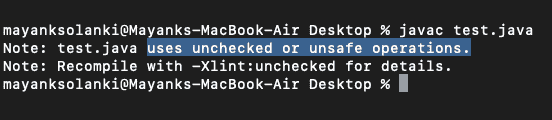
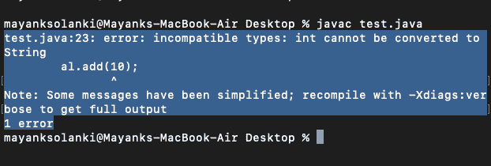

# Java 中的非泛型 Vs 泛型集合

> 原文:[https://www . geesforgeks . org/非泛型-vs-泛型-java 中的集合/](https://www.geeksforgeeks.org/non-generic-vs-generic-collection-in-java/)

稍后我们将讨论不同之处，让我们先了解什么是通用集合和非通用集合，最重要的是处理实现部分，因为在实现过程中，人们只能真正了解概念，也就是它们之间的差异。

泛型基本上是在编译时而不是运行时出现的错误。[仿制药](https://www.geeksforgeeks.org/generics-in-java/)相对于非仿制药的某些优势如下:

1.  **代码重用:**在泛型的帮助下，一个人只需要编写一次方法/类/接口，并将其用于任何类型，而在非泛型中，代码需要在任何需要的时候反复编写。
2.  **类型安全:**泛型使错误在编译时出现，而不是在运行时出现(最好在编译时知道代码中的问题，而不是让代码在运行时失败)。

> **示例:**要创建存储学生姓名的 ArrayList，如果程序员错误地添加了一个整数对象而不是字符串，编译器会允许。但是，当从数组列表中检索这些数据时，它会在运行时给非泛型数组列表带来问题

**实施:**

**例 1**

## Java 语言(一种计算机语言，尤用于创建网站)

```
// Java program to Demonstrate that Not Using Generics
// Can cause Run Time Exceptions

// Importing all utility classes
import java.util.*;

// Main class
class GFG {

    // Main driver method
    public static void main(String[] args)
    {
        // Creating an ArrayList
        // Declaring object without any type specified
        ArrayList al = new ArrayList();

        // Adding elements to the above object
        // Custom input elements
        al.add("Sachin");
        al.add("Rahul");

        // Compiler will allows this operation
        al.add(10);

        String s1 = (String)al.get(0);
        String s2 = (String)al.get(1);

        // Try block to check for exceptions
        try {

            // Causes Runtime Exception
            String s3 = (String)al.get(2);
        }

        // Catch block to handle the exceptions
        catch (Exception e) {

            // Display the exception
            System.out.println("Exception: " + e);
        }
    }
}
```

**输出:**

```
prog.java:19: warning: [unchecked] unchecked call to add(E) as a member of the raw type ArrayList
        al.add("Sachin");
              ^
  where E is a type-variable:
    E extends Object declared in class ArrayList
prog.java:20: warning: [unchecked] unchecked call to add(E) as a member of the raw type ArrayList
        al.add("Rahul");
              ^
  where E is a type-variable:
    E extends Object declared in class ArrayList
prog.java:23: warning: [unchecked] unchecked call to add(E) as a member of the raw type ArrayList
        al.add(10);
              ^
  where E is a type-variable:
    E extends Object declared in class ArrayList
3 warnings
```



**仿制药如何解决这个问题？**

如果这个列表是通用的，那么它将只接受字符串对象，并在任何其他情况下抛出编译时错误。

**例 2**

## Java 语言(一种计算机语言，尤用于创建网站)

```
// Java Program to Illustrate Conversion of
// Runitime Exceptions into compile time errors
// Using generics

// Importing all utility classes
import java.util.*;

// Main class
class GFG {

    // Main driver method
    public static void main(String[] args)
    {
        // Creating an ArrayList
        // Declaring object of string type
        ArrayList<String> al = new ArrayList<String>();

        // Adding elements to the ArrayList
        // Custom input elements
        al.add("Sachin");
        al.add("Rahul");

        // Now compiler does not allow this operation
        al.add(10);

        String s1 = al.get(0);
        String s2 = al.get(1);
        String s3 = al.get(2);
    }
}
```

**输出:**

```
prog.java:24: error: incompatible types: int cannot be converted to String
        al.add(10);
               ^
Note: Some messages have been simplified; recompile with -Xdiags:verbose to get full output
1 error
```

现在向前看，不需要**个人型铸造。**

如果不需要泛型，那么在上面的例子中，每次从数组列表中检索数据时，都需要对其进行类型转换。每次检索操作中的类型转换都是一个大问题。如果已经知道列表只保存字符串数据，这是可以避免的。

**例 3**

## Java 语言(一种计算机语言，尤用于创建网站)

```
// Java program to Illustrate Type Casting is Needed
// Everytime in Non-Generic

// Importing all utility classes
import java.util.*;

// Main class
class GFG {

    // Main driver method
    public static void main(String[] args) {

        // Creating an ArrayList
        // Declaring object without any type specified
        ArrayList al = new ArrayList();

        // Adding elements to the above object
        // using add() method
        al.add("Sachin");
        al.add("Rahul");

        // For every retrieval,
        // it needs to be casted to String for use
        String s1 = (String)al.get(0);
        String s2 = (String)al.get(1);
    }
}
```

**输出:**



**Geek** ，**现在你应该在想仿制药是怎么解决这个问题的吧？**

如果这个列表是通用的，那么它将只接受字符串对象，并且在检索时只返回字符串对象。因此不需要单独的类型转换。上述说法是有道理的

**例 4**

## Java 语言(一种计算机语言，尤用于创建网站)

```
// A Simple Java program to demonstrate that
// type casting is not needed in Generic

import java.util.*;

class Test {
    public static void main(String[] args)
    {
        // Creating an ArrayList
        // Declaring object of type String  
        ArrayList<String> al = new ArrayList<String>();

        // Custom input elements
        al.add("Sachin");
        al.add("Rahul");

        // Retrieval can be easily
        // without the trouble of casting
        String s1 = al.get(0);
        String s2 = al.get(1);

        // Print and display out the elements in objects
        System.out.print(al);
    }
}
```

**Output**

```
[Sachin, Rahul]
```

> **注:**
> 
> 在泛型的帮助下，一个人可以实现算法**实现泛型算法，一个人可以让 t** 在不同类型的对象上工作，同时它们也是类型安全的。

请记住，有一些要点将描述泛型和非泛型之间的区别，这些要点如下表所示，以便清楚地了解它们之间的区别。

<figure class="table">

| 基础 | Non-generic collection | Generic set |
| --- | --- | --- |
| grammar | ArrayList list = new ArrayList()； | Array list list = new array list (); |
| Type-security | You can save any type of data. Therefore, it is not type safe. | Only defined types of data can be saved. Therefore, the type is safe. |
|  | Each retrieval requires an individual type of casting. | No typing is required. |
| Compile-time check | Check type safety at runtime. | Check type safety at compile time. |

</figure>