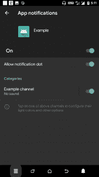
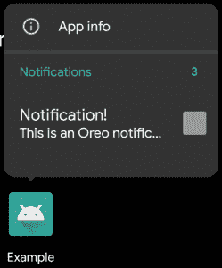
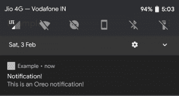

# 安卓奥利奥(8+)

中的通知

> 原文:[https://www . geesforgeks . org/notifications-in-Android-Oreo-8/](https://www.geeksforgeeks.org/notifications-in-android-oreo-8/)

安卓奥利奥带来了大量变化。这也包括用户在应用程序中发布通知的方式。在本文中，我们将讨论通知部门需要进行的更改。

发布通知时，请记住以下事项:

1.  设计*通知通道*
2.  每个通知渠道的重要性
3.  通知标识(不同于频道标识)不应设置为零。

在继续之前，确保这一行被添加到 build.gradle(模块:应用程序)依赖项中:

```
implementation 'com.android.support:appcompat-v7:26.1.0'
```

让我们从创建通知渠道开始。下面的方法创建一个通知通道:

```
@RequiresApi(api = Build.VERSION_CODES.O)
void makeNotificationChannel(String id, String name, int importance)
{
    NotificationChannel channel = new NotificationChannel(id, name, importance);
    channel.setShowBadge(true); // set false to disable badges, Oreo exclusive

    NotificationManager notificationManager =
         (NotificationManager)getSystemService(NOTIFICATION_SERVICE);

    assert notificationManager != null;
    notificationManager.createNotificationChannel(channel);
}
```

让我们详细看看这个方法是做什么的。

1.  该方法接受**字符串 id、字符串名称、int 重要性。**。
    *   *字符串 id:* 这是您在通知通道中发出通知时使用的 id。您可以将这个确切的 id 用于同一通道中的多个通知。
    *   *字符串名称:*这是当有人点击导航到设置->App&通知- >【你的 _ App _ name】->App 通知时可见的频道名称。
    *   *int 重要性:*这是通道的重要性等级。级别如下:
        1.  **通知管理器。重要性 _ 最小**–仅在通知阴影下显示，没有声音或窥视。
        2.  **通知管理器。重要性 _ 低**–无处不在，不发声，不偷看。
        3.  **通知管理器。重要性 _ 默认值**–到处显示，发出声音但不偷看。
        4.  **通知管理器。重要性 _ 高**–到处显示，发出声音和窥视(视觉中断)。
        5.  **NotificationManager.IMPORTANCE_MAX** – this importance level is usually not used. Works similar to IMPORTANCE_HIGH.

            通常，IMPORTANCE _ DEFAULT 参数是首选参数，但这会产生令人讨厌的通知声音。要静音，在*make notificationchannel()*方法中，在最后一行之前添加以下一行。

            ```
            channel.setSound(null, null);

            ```

2.  然后，该方法使用参数创建通道。
3.  设置显示标记(真)通过奥利奥通知点功能提供通知。
4.  Finally, the notification channel is created by the createNotificationChannel() method of NotificationManager.

    现在让我们发出通知。我们将使用*通知兼容性*进行向后兼容性。

    ```
    void issueNotification()
    {

        // make the channel. The method has been discussed before.
        if (Build.VERSION.SDK_INT >= Build.VERSION_CODES.O) {
            makeNotificationChannel("CHANNEL_1", "Example channel", NotificationManager.IMPORTANCE_DEFAULT);
        }
        // the check ensures that the channel will only be made
        // if the device is running Android 8+

        NotificationCompat.Builder notification =
                    new NotificationCompat.Builder(this, "CHANNEL_1");
        // the second parameter is the channel id.
        // it should be the same as passed to the makeNotificationChannel() method

        notification
            .setSmallIcon(R.mipmap.ic_launcher) // can use any other icon
            .setContentTitle("Notification!")
            .setContentText("This is an Oreo notification!")
            .setNumber(3); // this shows a number in the notification dots

        NotificationManager notificationManager =
                    (NotificationManager)getSystemService(NOTIFICATION_SERVICE);

        assert notificationManager != null;
        notificationManager.notify(1, notification.build());
        // it is better to not use 0 as notification id, so used 1.
    }
    ```

    执行是这样进行的:

    *   First, the above method initially creates a notification channel with id = “CHANNEL_1” and the name “Example channel”. The id isn’t visible anywhere but the name can be viewed by opening the “App notifications” option of the App Info page.

        

    *   Then a NotificationCompat.Builder object is made specifying the context and id as “CHANNEL_1”. A different channel id can be mentioned provided it is made with the *makeNotificationChannel()* method.
        The rest is self-explanatory. The *setNumber()* method shows a number in the notification dot of the app.

        
        

    *   Finally, the notification id (here 1) is better to not set 0 as in cases where the notification is used for a *Foreground service*, it will fail to display if the id is 0\. On executing the *issueNotification()* method, we get the following notification:

        