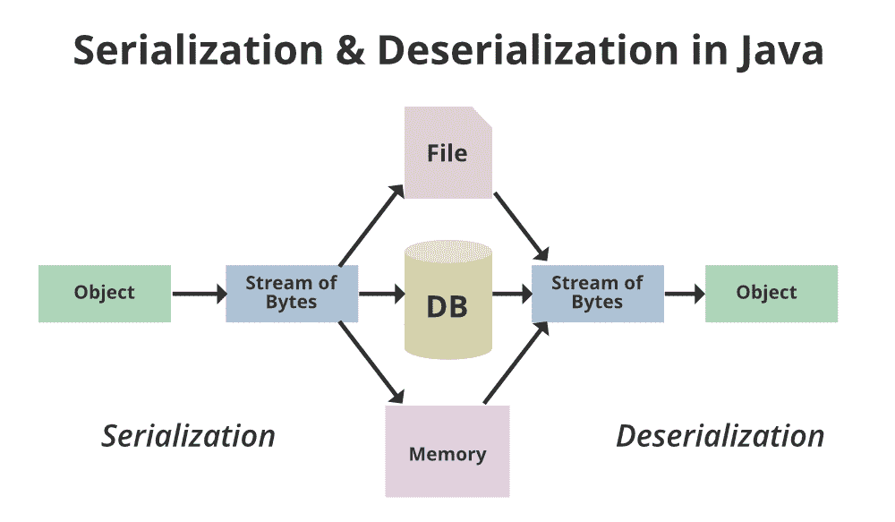

# Java 中的 NotSerializableException 示例

> 原文:[https://www . geesforgeks . org/notserializableexception-in-Java-with-examples/](https://www.geeksforgeeks.org/notserializableexception-in-java-with-examples/)

Java 中的序列化是一种将对象状态写入字节流的机制。它主要用于 Hibernate、RMI、JPA、EJB 和 JMS 技术。

序列化的反向操作称为反序列化，其中字节流被转换为对象。序列化和反序列化过程与平台无关，这意味着您可以在平台中序列化对象，并在不同的平台上反序列化它。



在 Java 中，当类的实例必须实现 Serializable 接口时，会引发 NotSerializableException 异常。序列化运行时或类的实例引发异常。NotSerializableException 的参数是类的名称。

NotSerializableException 类扩展了 ObjectStreamException 类，该类被定义为对象流类特有的所有异常的超类。此外，ObjectStreamException 类扩展了 IOException，它表示发生了输入/输出异常。

插图:

```java
java.io
Class NotSerializableException
    java.lang.Object
        java.lang.Throwable
            java.lang.Exception
                java.io.IOException
                    java.io.ObjectStreamException
                        java.io.NotSerializableException
```

> **注意:**所有实现的接口都是[可串行化接口](https://www.geeksforgeeks.org/serializable-interface-in-java/)。

**语法:**

```java
public class NotSerializableException 
extends ObjectStreamException
```

**我们先来讨论一下这个类的构造函数在一个**之前

1.  NotSerializableException():构造一个 NotSerializableException 对象。
2.  NotSerializableException(字符串类名):用消息字符串构造一个 NotSerializableException 对象。

**例 1:**

## Java 语言(一种计算机语言，尤用于创建网站)

```java
// Java Program to Illustrate NotSerializableException
// Where Exception Is Thrown

// Importing required classes
import java.io.FileOutputStream;
import java.io.IOException;
import java.io.ObjectOutputStream;

// Class 1
// Helper class
class Employee {

    // Member variables
    private String id;

    // Member methods

    // Method 1
    // To get ID of an employee
    public String getId() { return id; }

    // Method 1
    // To set ID of an employee
    public void setId(String id)
    {

        // this keyword refers to current object itself
        this.id = id;
    }
}

// Class 2
// Main Class
public class GFG {

    // Main driver method
    public static void main(String[] args)
        throws IOException
    {

        // Create FileOutputStream class object  to
        // create a file
        FileOutputStream out
            = new FileOutputStream("employee.dat");

        // Similarly creating ObjectOutputStream class
        // object
        ObjectOutputStream outputStream
            = new ObjectOutputStream(out);

        // Creating objects of class 1
        Employee obj = new Employee();

        // Assifning ID to an employee
        obj.setId("001");

        // Writing objects to stream
        outputStream.writeObject(obj);

        // Good practice is always to
        // Close the stream using close() method
        outputStream.close();
    }
}
```

**输出:**

```java
Errors in Code
Exception in thread "main" java.security.AccessControlException: access denied ("java.io.FilePermission" "employee.dat" "write")
at java.base/java.security.AccessControlContext.checkPermission(AccessControlContext.java:472)
at java.base/java.security.AccessController.checkPermission(AccessController.java:897)
at java.base/java.lang.SecurityManager.checkPermission(SecurityManager.java:322)
at java.base/java.lang.SecurityManager.checkWrite(SecurityManager.java:752)
at java.base/java.io.FileOutputStream.<init>(FileOutputStream.java:225)
at java.base/java.io.FileOutputStream.<init>(FileOutputStream.java:126)
at NotSerializableExceptionExample.main(NotSerializableExceptionExample.java:21)                                                    
```

**如何处理 NotSerializableException**

*   最简单的解决方案是找到引发异常的类，并使其实现 Serializable 接口。但是，如果引发异常的类属于第三方库，这可能不可行。
*   如果类引用了不可序列化的对象，并且这些对象不应该被序列化，那么，您可以将这些对象声明为临时对象。一旦一个类的字段被声明为临时的，那么它就会被可序列化的运行时忽略。

**例 2:**

## Java 语言(一种计算机语言，尤用于创建网站)

```java
// Java Program to Illustrate NotSerializableException
// where No Exception is Thrown Using Serializable interface

// Importing input output class
import java.io.Serializable;

// By implementing Serializable interface
// we are allowing Student object to
// be stored in TestFile.txt

// Class 1
// Helper class extending to Serializable interface
class Student implements Serializable {

    // Member variables of this class
    int id;
    String name;

    // Constructor of ths class
    public Student(int id, String name)
    {
        this.id = id;
        this.name = name;
    }
}

// Class 2
// Main class
class Persist {

    // Main driver method
    public static void main(String args[])
    {

        // try block to check for exceptions
        try {

            // Creating the object
            Student s1 = new Student(007, "Test");

            // Creating stream and writing the object
            FileOutputStream fout
                = new FileOutputStream("TestFile.txt");
            ObjectOutputStream out
                = new ObjectOutputStream(fout);

            out.writeObject(s1);
            out.flush();

            // Closing the stream to free up memory space
            // using close() method
            out.close();

            // Display command to shown proper execution of
            // a program
            System.out.println(
                "Object stored successfully");
        }

        // Catch block to handle the exceptions
        catch (Exception e) {

            // Print and display the exception on the
            // console
            System.out.println(e);
        }
    }
}
```

**输出:**

```java
Object stored successfully
```