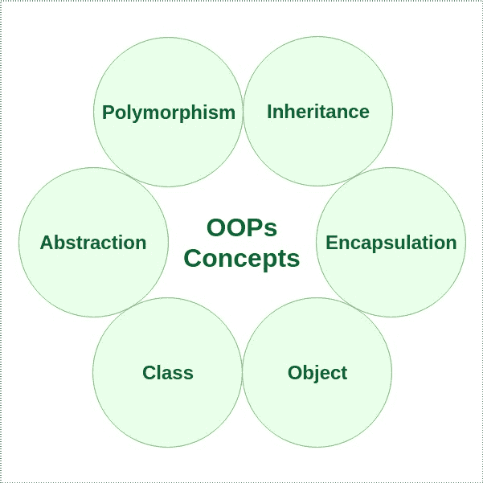

# Java 中的面向对象编程(OOPs)概念

> 原文:[https://www . geesforgeks . org/面向对象-编程-oops-概念-in-java/](https://www.geeksforgeeks.org/object-oriented-programming-oops-concept-in-java/)

顾名思义，[面向对象编程](https://www.geeksforgeeks.org/object-oriented-programming-oops-concept-in-java/)或 OOPs 是指在编程中使用对象的语言。面向对象编程的目标是在编程中实现真实世界的实体，如继承、隐藏、多态等。OOP 的主要目的是将数据和对数据进行操作的函数绑定在一起，这样除了函数之外，代码的任何其他部分都不能访问这些数据。

让我们通过完善方法声明和传递的概念来讨论先决条件。从方法声明开始，它由六个组件组成:

*   [**访问修饰符**](https://www.geeksforgeeks.org/access-modifiers-java/) :定义方法的**访问类型**，即在您的应用程序中可以从哪里访问它。在 Java 中，有 4 种类型的访问说明符。
    *   **public:** 可在应用程序的所有类中访问。
    *   **受保护:**可在其定义的包装内及其**子类(包括包装外声明的子类)**中访问
    *   **private:** 只能在定义它的类内访问。
    *   **默认值(不使用任何修饰符声明/定义):**可在定义其类的同一类和包中访问。
*   **返回类型**:方法返回的值的数据类型，如果不返回值则为 void。
*   **方法名**:字段名的规则也适用于方法名，只是约定有点不同。
*   **参数列表**:输入参数的逗号分隔列表已定义，前面带有数据类型，在括号内。如果没有参数，则必须使用空括号()。
*   **异常列表**:方法预期可以抛出的异常，可以指定这些异常。
*   **法身**:围在牙套之间。执行预期操作所需执行的代码。

[**消息传递**](https://www.geeksforgeeks.org/message-passing-in-java/) **:** 对象之间通过相互发送和接收信息进行通信。对象的消息是执行过程的请求，因此将调用接收对象中的函数来生成所需的结果。消息传递包括指定对象的名称、函数的名称和要发送的信息。

现在有了基本的先决条件来学习第 4 步，OOPS 的支柱如下。让我们从学习面向对象编程语言的不同特征开始

OOPs 概念如下:

1.  [级](https://www.geeksforgeeks.org/classes-objects-java/)
2.  [物体](https://www.geeksforgeeks.org/classes-objects-java/)
3.  [法](https://www.geeksforgeeks.org/methods-in-java/)[法通过](https://www.geeksforgeeks.org/message-passing-in-java/)
4.  OOPS 的支柱
    *   [抽象](https://www.geeksforgeeks.org/abstraction-in-java-2/)
    *   [封装](https://www.geeksforgeeks.org/encapsulation-in-java/)
    *   [继承](https://www.geeksforgeeks.org/inheritance-in-java/)
    *   [多态性](https://www.geeksforgeeks.org/polymorphism-in-java/)
        *   编译时多态性
        *   运行时多态性



一个[类](https://www.geeksforgeeks.org/classes-objects-java/)是一个用户定义的蓝图或原型，从它可以创建对象。它表示一种类型的所有对象共有的一组属性或方法。一般来说，类声明可以包含这些组件，顺序如下:

1.  **修饰符**:类可以是公共的，也可以是默认访问的(详见[本](https://www.geeksforgeeks.org/access-specifiers-for-classes-or-interfaces-in-java/))。
2.  **类名:**名称应以首字母(按惯例大写)开头。
3.  **超类(如果有的话):**类的父类(超类)的名称，如果有的话，前面加关键字 extends。一个类只能扩展(子类)一个父类。
4.  **接口(如果有):**类实现的以逗号分隔的接口列表(如果有)，前面有关键字 implements。一个类可以实现多个接口。
5.  **Body:** 大括号包围的类体，{ }。

[**Object**](https://www.geeksforgeeks.org/classes-objects-java/) 是面向对象编程的基本单元，代表现实生活中的实体。一个典型的 Java 程序会创建许多对象，正如您所知，这些对象通过调用方法进行交互。一个对象包括:

1.  **状态**:用一个对象的属性来表示。它还反映了对象的属性。
2.  **行为**:用一个对象的方法来表示。它还反映了一个对象与其他对象的反应。
3.  **身份**:为一个对象赋予唯一的名称，使一个对象能够与其他对象进行交互。
4.  [**方法**](https://www.geeksforgeeks.org/methods-in-java/) **:** 方法是执行某种特定任务并将结果返回给调用者的语句的集合。一个方法可以执行一些特定的任务而不返回任何东西。方法允许我们在不重新输入代码的情况下**重用**代码。在 Java 中，每个方法都必须是某个类的一部分，这个类不同于像 C、C++和 Python 这样的语言。
    方法是**省时器**，帮助我们**重用**代码，无需重新输入代码。

现在让我们讨论一下 OOPS 的 4 大支柱:

**支柱 1:** [抽象](https://www.geeksforgeeks.org/abstraction-in-java-2/)

数据抽象是一种属性，通过它，只有基本的细节才会显示给用户。琐碎的或非基本的单元不会显示给用户。汽车被看作是一辆汽车，而不是它的单个部件。
数据抽象也可以定义为只识别对象所需特征而忽略无关细节的过程。对象的属性和行为使其区别于其他类似类型的对象，也有助于对对象进行分类/分组。
考虑一个男人开车的现实例子。这个人只知道踩油门会提高汽车的速度，或者踩刹车会让汽车停下来，但他不知道踩油门后速度实际上是如何提高的，他不知道汽车的内部机制或者油门、刹车等在汽车中的实施。这就是抽象。
在 java 中，抽象是通过[接口](https://www.geeksforgeeks.org/interfaces-in-java/)和[抽象类](https://www.geeksforgeeks.org/abstract-classes-in-java/)实现的。我们可以使用接口实现 100%的抽象。

**支柱 2:** [封装](https://www.geeksforgeeks.org/encapsulation-in-java/)

它被定义为将数据包装在一个单元下。它是将代码及其操作的数据绑定在一起的机制。考虑封装的另一种方式是，它是一个保护屏障，防止数据被这个屏障之外的代码访问。

*   从技术上讲，在封装中，一个类的变量或数据对任何其他类都是隐藏的，只能通过声明它们的自己类的任何成员函数来访问。
*   与封装一样，一个类中的数据对其他类是隐藏的，因此也被称为**数据隐藏**。
*   封装可以通过将类中的所有变量声明为私有，并在类中编写公共方法来设置和获取变量值来实现。

**支柱 3:** [传承](https://www.geeksforgeeks.org/inheritance-in-java/)

继承是面向对象编程的重要支柱。这是 java 中允许一个类继承另一个类的特性(字段和方法)的机制。

让我们讨论一些经常使用的重要术语:

*   **超类:**特征被继承的类称为超类(或基类或父类)。
*   **子类:**继承另一个类的类称为子类(或派生类、扩展类或子类)。除了超类字段和方法之外，子类还可以添加自己的字段和方法。
*   **可重用性:**继承支持“可重用性”的概念，即当我们想要创建一个新的类，并且已经有一个类包含了我们想要的一些代码时，我们可以从现有的类中派生出我们的新类。通过这样做，我们重用了现有类的字段和方法。

**支柱 4:** [**多态性**](https://www.geeksforgeeks.org/polymorphism-in-java/)

它指的是 OOPs 编程语言有效区分同名实体的能力。这是由 Java 在这些实体的签名和声明的帮助下完成的。

> **注:**Java 中的多态性主要有 2 种类型:
> 
> 1.  [过载](https://www.geeksforgeeks.org/overloading-in-java/)
> 2.  [覆盖](https://www.geeksforgeeks.org/overriding-in-java/)

**例**

## Java 语言(一种计算机语言，尤用于创建网站)

```
// Java program to Demonstrate Polymorphism

// This class will contain
// 3 methods with same name,
// yet the program will
// compile & run successfully
public class Sum {

    // Overloaded sum().
    // This sum takes two int parameters
    public int sum(int x, int y)
    {
        return (x + y);
    }

    // Overloaded sum().
    // This sum takes three int parameters
    public int sum(int x, int y, int z)
    {
        return (x + y + z);
    }

    // Overloaded sum().
    // This sum takes two double parameters
    public double sum(double x, double y)
    {
        return (x + y);
    }

    // Driver code
    public static void main(String args[])
    {
        Sum s = new Sum();
        System.out.println(s.sum(10, 20));
        System.out.println(s.sum(10, 20, 30));
        System.out.println(s.sum(10.5, 20.5));
    }
}
```

**Output:** 

```
30
60
31.0
```