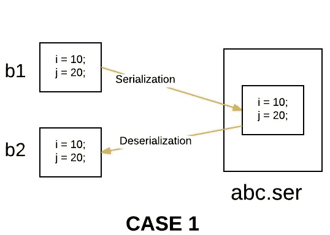
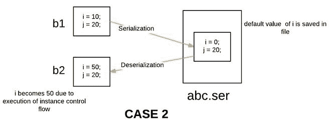

# Java 中带继承的对象序列化

> 原文:[https://www . geesforgeks . org/object-序列化-继承-java/](https://www.geeksforgeeks.org/object-serialization-inheritance-java/)

**先决条件:** [系列化](https://www.geeksforgeeks.org/serialization-in-java/)[继承](https://www.geeksforgeeks.org/inheritance-in-java/)

**序列化**是一种将对象状态转换为字节流的机制。字节数组可以是对象的类、版本和内部状态。

**反序列化**是相反的过程，使用字节流在内存中重新创建实际的 Java 对象。这种机制用于持久化对象。

***在继承方面有一些序列化的情况:***

#### 情况 1:如果超类是可序列化的，那么子类是自动可序列化的

如果超类是可序列化的，那么默认情况下，每个子类都是可序列化的。因此，即使子类没有实现 Serializable 接口(如果它的超类实现 Serializable)，我们也可以序列化子类对象。

## Java 语言(一种计算机语言，尤用于创建网站)

```
// Java program to demonstrate 
// that if superclass is 
// serializable then subclass 
// is automatically serializable 

import java.io.FileInputStream; 
import java.io.FileOutputStream; 
import java.io.ObjectInputStream; 
import java.io.ObjectOutputStream; 
import java.io.Serializable; 

// superclass A 
// implementing Serializable interface 
class A implements Serializable 
{ 
    int i; 

    // parameterized constructor 
    public A(int i) 
    { 
        this.i = i; 
    } 

} 

// subclass B 
// B class doesn't implement Serializable 
// interface. 
class B extends A 
{ 
    int j; 

    // parameterized constructor 
    public B(int i, int j) 
    { 
        super(i); 
        this.j = j; 
    } 
} 

// Driver class 
public class Test 
{ 
    public static void main(String[] args) 
            throws Exception 
    { 
        B b1 = new B(10,20); 

        System.out.println("i = " + b1.i); 
        System.out.println("j = " + b1.j); 

        /* Serializing B's(subclass) object */

        //Saving of object in a file 
        FileOutputStream fos = new FileOutputStream("abc.ser"); 
        ObjectOutputStream oos = new ObjectOutputStream(fos); 

        // Method for serialization of B's class object 
        oos.writeObject(b1); 

        // closing streams 
        oos.close(); 
        fos.close(); 

        System.out.println("Object has been serialized"); 

        /* De-Serializing B's(subclass) object */

        // Reading the object from a file 
        FileInputStream fis = new FileInputStream("abc.ser"); 
        ObjectInputStream ois = new ObjectInputStream(fis); 

        // Method for de-serialization of B's class object 
        B b2 = (B)ois.readObject(); 

        // closing streams 
        ois.close(); 
        fis.close(); 

        System.out.println("Object has been deserialized"); 

        System.out.println("i = " + b2.i); 
        System.out.println("j = " + b2.j); 
    } 
}
```

**输出:**

```
i = 10
j = 20
Object has been serialized
Object has been deserialized
i = 10
j = 20
```



#### 情况 2:如果超类不可序列化，那么子类仍然可以序列化

即使超类没有实现 Serializable 接口，如果子类本身实现了 Serializable 接口，我们也可以序列化子类对象。所以我们可以说，要序列化子类对象，超类不需要序列化。但是在这种情况下，序列化过程中超类的实例会发生什么。以下过程对此进行了解释。

#### 案例 2(a):当一个类是可序列化的，但是它的超类不是时会发生什么？

**序列化:**在序列化时，如果有任何实例变量从不可序列化的超类继承，那么 JVM 会忽略该实例变量的原始值，并将默认值保存到文件中。

**反序列化:**在反序列化的时候，如果存在任何不可序列化的超类，那么 JVM 就会在超类中执行实例控制流。为了在类中执行实例控制流，JVM 将总是调用该类的默认(无参数)构造函数。所以每个不可序列化的超类必须包含一个默认构造函数。否则，我们将得到一个运行时异常。

## Java 语言(一种计算机语言，尤用于创建网站)

```
// Java program to demonstrate
// the case if superclass need
// not to be serializable
// while serializing subclass

import java.io.FileInputStream;
import java.io.FileOutputStream;
import java.io.ObjectInputStream;
import java.io.ObjectOutputStream;
import java.io.Serializable;

// superclass A
// A class doesn't implement Serializable
// interface.
class A {
    int i;

    // parameterized constructor
    public A(int i){ 
      this.i = i; 
    }

    // default constructor
    // this constructor must be present
    // otherwise we will get runtime exception
    public A()
    {
        i = 50;
        System.out.println("A's class constructor called");
    }
}

// subclass B
// implementing Serializable interface
class B extends A implements Serializable {
    int j;

    // parameterized constructor
    public B(int i, int j)
    {
        super(i);
        this.j = j;
    }
}

// Driver class
public class Test {
    public static void main(String[] args) throws Exception
    {
        B b1 = new B(10, 20);

        System.out.println("i = " + b1.i);
        System.out.println("j = " + b1.j);

        // Serializing B's(subclass) object

        // Saving of object in a file
        FileOutputStream fos
            = new FileOutputStream("abc.ser");
        ObjectOutputStream oos
            = new ObjectOutputStream(fos);

        // Method for serialization of B's class object
        oos.writeObject(b1);

        // closing streams
        oos.close();
        fos.close();

        System.out.println("Object has been serialized");

        // De-Serializing B's(subclass) object

        // Reading the object from a file
        FileInputStream fis
            = new FileInputStream("abc.ser");
        ObjectInputStream ois = new ObjectInputStream(fis);

        // Method for de-serialization of B's class object
        B b2 = (B)ois.readObject();

        // closing streams
        ois.close();
        fis.close();

        System.out.println("Object has been deserialized");

        System.out.println("i = " + b2.i);
        System.out.println("j = " + b2.j);
    }
}
```

**输出:**

```
i = 10
j = 20
Object has been serialized
A's class constructor called
Object has been deserialized
i = 50
j = 20
```



#### 案例 3:如果超类是可序列化的，但是我们不希望子类被序列化

在 java 中，没有直接的方法可以防止子类序列化。程序员实现这一点的一种可能方法是在子类中实现 *writeObject()* 和 *readObject()* 方法，并需要从这些方法中抛出 *NotSerializableException* 。这些方法分别在序列化和反序列化期间执行。通过重写这些方法，我们只是实现了自定义序列化。

## Java 语言(一种计算机语言，尤用于创建网站)

```
// Java program to demonstrate 
// how to prevent 
// subclass from serialization 

import java.io.FileInputStream; 
import java.io.FileOutputStream; 
import java.io.IOException; 
import java.io.NotSerializableException; 
import java.io.ObjectInputStream; 
import java.io.ObjectOutputStream; 
import java.io.Serializable; 

// superclass A 
// implementing Serializable interface 
class A implements Serializable 
{ 
    int i; 

    // parameterized constructor 
    public A(int i) 
    { 
        this.i = i; 
    } 

} 

// subclass B 
// B class doesn't implement Serializable 
// interface. 
class B extends A 
{ 
    int j; 

    // parameterized constructor 
    public B(int i,int j) 
    { 
        super(i); 
        this.j = j; 
    } 

    // By implementing writeObject method, 
    // we can prevent 
    // subclass from serialization 
    private void writeObject(ObjectOutputStream out) throws IOException 
    { 
        throw new NotSerializableException(); 
    } 

    // By implementing readObject method, 
    // we can prevent 
    // subclass from de-serialization 
    private void readObject(ObjectInputStream in) throws IOException 
    { 
        throw new NotSerializableException(); 
    } 

} 

// Driver class 
public class Test 
{ 
    public static void main(String[] args) 
            throws Exception 
    { 
        B b1 = new B(10, 20); 

        System.out.println("i = " + b1.i); 
        System.out.println("j = " + b1.j); 

        // Serializing B's(subclass) object 

        //Saving of object in a file 
        FileOutputStream fos = new FileOutputStream("abc.ser"); 
        ObjectOutputStream oos = new ObjectOutputStream(fos); 

        // Method for serialization of B's class object 
        oos.writeObject(b1); 

        // closing streams 
        oos.close(); 
        fos.close(); 

        System.out.println("Object has been serialized"); 

        // De-Serializing B's(subclass) object 

        // Reading the object from a file 
        FileInputStream fis = new FileInputStream("abc.ser"); 
        ObjectInputStream ois = new ObjectInputStream(fis); 

        // Method for de-serialization of B's class object 
        B b2 = (B)ois.readObject(); 

        // closing streams 
        ois.close(); 
        fis.close(); 

        System.out.println("Object has been deserialized"); 

        System.out.println("i = " + b2.i); 
        System.out.println("j = " + b2.j); 
    } 
}
```

**输出:**

```
i = 10
j = 20
Exception in thread "main" java.io.NotSerializableException
    at B.writeObject(Test.java:44)
```

本文由**高拉夫·米格拉尼**供稿。如果你喜欢 GeeksforGeeks 并想投稿，你也可以使用[write.geeksforgeeks.org](http://www.write.geeksforgeeks.org)写一篇文章或者把你的文章邮寄到 review-team@geeksforgeeks.org。看到你的文章出现在极客博客主页上，帮助其他极客。

如果你发现任何不正确的地方，或者你想分享更多关于上面讨论的话题的信息，请写评论。