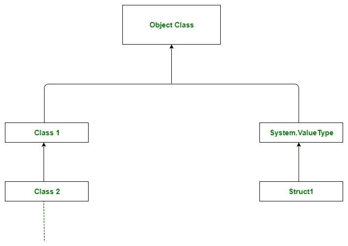
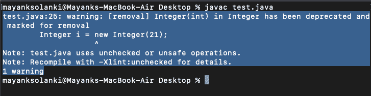

# Java 中的对象 toString()方法

> 原文:[https://www . geesforgeks . org/object-tostring-method-in-Java/](https://www.geeksforgeeks.org/object-tostring-method-in-java/)

**对象**类存在于 **java.lang** 包中。Java 中的每个类都是直接或间接从**对象**类派生的，因此它是对象类的子类。如果一个类不扩展任何其他类，那么它是**对象**的直接子类，如果扩展另一个类，那么它是间接派生的。因此，对象类方法对所有的 Java 类都是可用的。

> **注意:**对象类在任何 java 程序中充当继承层次的根



现在我们将处理它的一个方法，称为 toString()方法。我们通常使用 toString()方法来获取对象的字符串表示。这非常重要，读者应该知道，每当我们试图打印对象引用时，就会在内部调用 toString()方法。如果我们没有在您的类中定义 toString()方法，那么将调用对象类 toString()方法，否则将调用我们实现或重写的 toString()方法。

**语法:**

```
public String toString() {
      return getClass().getName()+"@"+Integer.toHexString(hashCode());
}
```

> **注意:**toString()的默认行为是打印类名，然后是@，然后是对象哈希代码的无符号十六进制表示。

**例**

## Java 语言（一种计算机语言，尤用于创建网站）

```
// Java program to Illustrate
// working of toString() method

// Main class
class Best_Friend {

    // Member attributes of this class
    String name;
    int age;
    String college;
    String course;
    String address;

    // Constructor of this class
    Best_Friend(String name, int age, String college,
                String course, String address)
    {
        // This variable refers to current instance itself
        this.name = name;
        this.age = age;
        this.college = college;
        this.course = course;
        this.address = address;
    }

    // Method of this class
    // Main driver method
    public static void main(String[] args)
    {

        // Creating an object of this class
        // Custom attributes been passed as in arguments
        Best_Friend b = new Best_Friend(
            "Gulpreet Kaur", 21, "BIT MESRA", "M.TECH",
            "Kiriburu");

        // Print and display commands to illustrate
        // toString() method as both will print the same
        // Print the object
        System.out.println(b);
        // Print the object but implicitly using toString()
        // method
        System.out.println(b.toString());
    }
}
```

**Output**

```
Best_Friend@3d075dc0
Best_Friend@3d075dc0
```

**输出说明:**在上面的程序中，我们创建了一个 Object of Best_Friend 类，并提供了一个朋友的所有信息。但是当我们试图打印对象时，我们得到了一些输出，形式是类名@ HashCode _ in _ 十六进制 _form。如果我们想要关于好友对象的正确信息，那么我们必须在好友类中重写对象类的 toString()方法。

**例 2:**

## Java 语言（一种计算机语言，尤用于创建网站）

```
// Java program to illustrate
// working of toString() method

// Main class
class Best_Friend {

    // Member attributes of this class
    String name;
    int age;
    String college;
    String course;
    String address;

    // Constructor of this class
    Best_Friend(String name, int age, String college,
                String course, String address)
    {
        // This keyword refers to current instance itself
        this.name = name;
        this.age = age;
        this.college = college;
        this.course = course;
        this.address = address;
    }

    // Method 1
    // Creating our own toString() method
    public String toString()
    {
        return name + " " + age + " " + college + " "
            + course + " " + address;
    }

    // Method 2
    // Main driver method
    public static void main(String[] args)
    {
        // Creating object of class inside main() method
        Best_Friend b = new Best_Friend(
            "Gulpreet Kaur", 21, "BIT MESRA", "M.TECH",
            "Kiriburu");

        // Print and display commands to illustrate
        // toString() method as both will print the same
        // Print the object
        System.out.println(b);

        // Printing object but using toString() method
        System.out.println(b.toString());
    }
}
```

**Output**

```
Gulpreet Kaur 21 BIT MESRA M.TECH Kiriburu
Gulpreet Kaur 21 BIT MESRA M.TECH Kiriburu
```

> **注意:**在所有的包装器类中，所有的集合类、String 类、StringBuffer、StringBuilder 类 toString()方法对于有意义的 String 表示都是被覆盖的。因此，强烈建议在我们的类中也重写 toString()方法。

**例 3:**

## Java 语言（一种计算机语言，尤用于创建网站）

```
// Java program to illustrate
// working of toString() method

// Importing all utility classes
import java.util.*;

// Main class
class Best_Friend {

    // Member attributes of this class
    String name;
    int age;
    String college;
    String course;
    String address;

    // Constructor of this class
    Best_Friend(String name, int age, String college,
                String course, String address)
    {
        // This keyword refer to current instance itself
        this.name = name;
        this.age = age;
        this.college = college;
        this.course = course;
        this.address = address;
    }

    // Method of this class
    public static void main(String[] args)
    {
        // Creating an object of class in main() method
        Best_Friend b = new Best_Friend(
            "Gulpreet Kaur", 21, "BIT MESRA", "M.TECH",
            "Kiriburu");

        System.out.println(b);

        String s = new String("Gulpreet Kaur");

        System.out.println(s);
        Integer i = new Integer(21);

        System.out.println(i);

        ArrayList l = new ArrayList();

        l.add("BIT");
        l.add("M.TECH");

        System.out.println(l);
    }
}
```

**输出:**它也会抛出，警告未检查和不安全的操作



```
Best_Friend@232204a1
Gulpreet Kaur
21
[BIT, M.TECH]
```

本文由 [**比沙尔·库马尔·杜贝**](https://auth.geeksforgeeks.org/profile.php?user=Bishal Dubey) 供稿。如果你喜欢 GeeksforGeeks 并想投稿，你也可以使用[write.geeksforgeeks.org](https://write.geeksforgeeks.org)写一篇文章或者把你的文章邮寄到 review-team@geeksforgeeks.org。看到你的文章出现在极客博客主页上，帮助其他极客。
如果发现有不正确的地方，或者想分享更多关于上述话题的信息，请写评论。