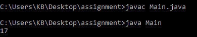

# ObjectInputStream 可用()方法在 Java 中有示例

> 原文:[https://www . geesforgeks . org/objectinputstream-available-method-in-Java-with-examples/](https://www.geeksforgeeks.org/objectinputstream-available-method-in-java-with-examples/)

Java 中 **ObjectInputStream** 类的 **available()** 方法返回在不阻塞流的情况下可以读取的字节数。

**语法**:

```
public int available()
```

**参数:**此方法不接受任何参数。

**返回值:**此方法返回可用字节数。

下面的程序说明了上面的方法:

**程序 1:**

```
// Java program to illustrate
// the above method

import java.io.*;

public class GFG {
    public static void main(String[] args) throws Exception
    {

        FileOutputStream out
            = new FileOutputStream("gopal.txt");
        ObjectOutputStream out1
            = new ObjectOutputStream(out);

        // write something in the file
        out1.writeUTF("Geeks For Geeks");

        // Flushes the Stream
        out1.flush();

        // Closes the stream
        out1.close();

        // create an ObjectInputStream
        // for the file we created before
        ObjectInputStream example
            = new ObjectInputStream(
                new FileInputStream(
                    "gopal.txt"));

        // Print the number of bytes available
        System.out.println(example.available());
        example.close();
    }
}
```

**输出:**



**参考**:[https://docs . Oracle . com/javase/10/docs/API/Java/io/objectinputstream . html # available()](https://docs.oracle.com/javase/10/docs/api/java/io/ObjectInputStream.html#available())