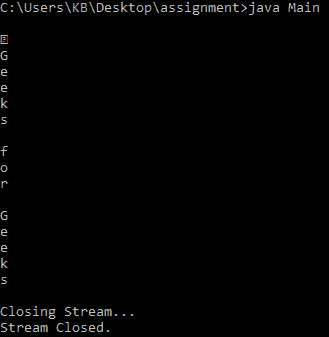

# Java 中 ObjectInputStream close()方法，带示例

> 原文:[https://www . geesforgeks . org/objectinputstream-close-method-in-Java-with-examples/](https://www.geeksforgeeks.org/objectinputstream-close-method-in-java-with-examples/)

Java 中 **ObjectInputStream** 类的 **close()** 方法关闭输入流。

**语法**:

```
public void close()
```

**参数:**此方法不接受任何参数。

**返回值:**这个方法不返回任何东西。

下面的程序说明了上面的方法:

**程序 1:**

```
// Java program to illustrate 
// the above method

import java.io.*;

public class GFG {

    public static void main(String[] args) throws Exception
    {

        try {
            // Creates a new file
            // with an ObjectOutputStream
            FileOutputStream out
                = new FileOutputStream("gopal.txt");
            ObjectOutputStream out1
                = new ObjectOutputStream(out);

            // write in the file
            out1.writeUTF("Geeks for Geeks");

            // FLushes the stream
            out1.flush();

            // Create an ObjectInputStream
            // for the file we created before
            ObjectInputStream example
                = new ObjectInputStream(
                    new FileInputStream("gopal.txt"));

            // read from the stream
            for (int i = 0; i < example.available();) {
                System.out.println("" + (char)example.read());
            }

            // closes the stream
            System.out.println("\nClosing Stream...");

            example.close();

            // Stream closed
            System.out.println("Stream Closed.");
        }
        catch (Exception ex) {
            ex.printStackTrace();
        }
    }
}
```

**输出:**
[](https://media.geeksforgeeks.org/wp-content/uploads/20190525170522/Screen-Shot-2019-05-25-at-5.05.04-PM.png)

**参考**:[https://docs . Oracle . com/javase/10/docs/API/Java/io/objectinputstream . html # close()](https://docs.oracle.com/javase/10/docs/api/java/io/ObjectInputStream.html#close())