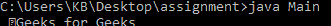

# Java 中 ObjectInputStream read()方法，带示例

> 原文:[https://www . geesforgeks . org/objectinputstream-read-method-in-Java-with-examples/](https://www.geeksforgeeks.org/objectinputstream-read-method-in-java-with-examples/)

Java 中 **ObjectInputStream** 类的 **read()** 方法读取一个字节的数据。如果没有数据，这个方法就不会运行。

**语法**:

```java
public int read()
```

**参数:**此方法不接受任何参数。

**返回值:**该方法返回读取的字节，如果到达流的末尾，则返回-1。

**异常**:如果出现输入输出错误，该函数将抛出**异常**。

下面的程序说明了上面的方法:

**程序 1:**

```java
// Java program to illustrate
// the above method

import java.io.*;

public class GFG {
    public static void main(String[] args)
    {
        try {

            // create a new file
            // with an ObjectOutputStream
            FileOutputStream out
                = new FileOutputStream("gopal.txt");
            ObjectOutputStream out1
                = new ObjectOutputStream(out);

            // write
            out1.writeUTF("Geeks for Geeks");

            // Flushes the stream
            out1.flush();

            // create an ObjectInputStream
            // for the file
            ObjectInputStream example
                = new ObjectInputStream(
                    new FileInputStream(
                        "gopal.txt"));

            // Read from the stream
            for (int i = 0; i < example.available();) {
                System.out.print("" + (char)example.read());
            }
        }
        catch (Exception ex) {
            ex.printStackTrace();
        }
    }
}
```

**输出:**


**参考**:[https://docs . Oracle . com/javase/10/docs/API/Java/io/objectinputstream . html # read()](https://docs.oracle.com/javase/10/docs/api/java/io/ObjectInputStream.html#read())