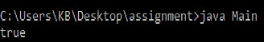

# Java 中 ObjectInputStream readBoolean()方法，带示例

> 原文:[https://www . geesforgeks . org/objectinputstream-readboolean-in-Java-method-with-examples/](https://www.geeksforgeeks.org/objectinputstream-readboolean-method-in-java-with-examples/)

Java 中 **ObjectInputStream** 类的 **readBoolean()** 方法从流中读取一个布尔值。

**语法**:

```java
public boolean readBoolean()
```

**参数:**此方法不接受任何参数。

**返回值:**这个方法返回已经读取的布尔值。

**错误和异常**:函数抛出两个异常，描述如下:

*   **EOFException:** 如果到达文件末尾，则抛出该函数。
*   **IOException:** 如果出现输入/输出错误，将引发该函数。

下面的程序说明了上面的方法:

**程序 1:**

```java
// Java program to illustrate
// the above method

import java.io.*;

public class GFG {
    public static void main(String[] args)
    {
        try {

            // create a new file
            // with an ObjectOutputStream
            FileOutputStream out
                = new FileOutputStream("gopal.txt");
            ObjectOutputStream out1
                = new ObjectOutputStream(out);

            // write
            out1.writeUTF("Geeks for Geeks");

            // Flushes the stream
            out1.flush();

            // create an ObjectInputStream
            // for the file
            ObjectInputStream example
                = new ObjectInputStream(
                    new FileInputStream("gopal.txt"));

            // Read from the stream
            for (int i = 0; i < example.available();) {
                System.out.print("" + (char)example.read());
            }
        }
        catch (Exception ex) {
            ex.printStackTrace();
        }
    }
}
```

**输出:**


**参考**:[https://docs . Oracle . com/javase/10/docs/API/Java/io/objectinputstream . html # readBoolean()](https://docs.oracle.com/javase/10/docs/api/java/io/ObjectInputStream.html#readBoolean())