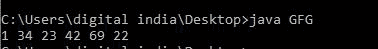
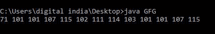

# Java 中 ObjectInputStream readByte()方法，带示例

> 原文:[https://www . geesforgeks . org/objectinputstream-read byte-method-in-Java-with-examples/](https://www.geeksforgeeks.org/objectinputstream-readbyte-method-in-java-with-examples/)

Java 中 **ObjectInputStream** 类的 **readByte()** 方法用于读取 8 位(字节)。

**语法:**

```
public byte readByte()

```

**参数:**此方法不接受任何参数。

**返回值:**该方法返回 8 位字节的读取值

**错误和异常:**函数抛出三个异常，如下所述:

*   **EOFException:** 如果到达文件末尾，将引发异常。
*   **IOException:** 如果出现输入/输出错误，将引发异常。

下面的程序说明了上面的方法:

**程序 1:**

## Java 语言(一种计算机语言，尤用于创建网站)

```
// Java program to illustrate
// the above method

import java.io.*;

public class GFG {

    public static void main(String[] args)
        throws IOException
    {
        byte[] array
            = { 1, 34, 23,
                42, 69, 22 };

        try {

            // create new byte
            // array input stream
            InputStream input
                = new ByteArrayInputStream(array);

            // create data input stream
            DataInputStream output
                = new DataInputStream(input);

            // readBoolean till the
            // data available to read
            while (output.available() > 0) {

                // read one single byte
                byte bt = output.readByte();

                // print the byte
                System.out.print(bt + " ");
            }
        }

        catch (Exception ex) {
        }
    }
}
```

**输出:**

[](https://media.geeksforgeeks.org/wp-content/uploads/20200601114559/byte1.JPG)

**程序 2:**

## Java 语言(一种计算机语言，尤用于创建网站)

```
// Java program to illustrate
// the above method

import java.io.*;

public class GFG {

    public static void main(String[] args)
        throws IOException
    {
        byte[] array
            = { 'G', 'e', 'e', 'k',
                's', 'f', 'o', 'r',
                'g', 'e', 'e', 'k',
                's' };

        try {

            // create new byte
            // array input stream
            InputStream input
                = new ByteArrayInputStream(array);

            // create data input stream
            DataInputStream output
                = new DataInputStream(input);

            // readBoolean till the
            // data available to read
            while (output.available() > 0) {

                // read one single byte
                byte bt = output.readByte();

                // print the byte
                System.out.print(bt + " ");
            }
            System.out.println();
            System.out.println();
        }

        catch (Exception ex) {
        }
    }
}
```

**输出:**

[](https://media.geeksforgeeks.org/wp-content/uploads/20200601114559/byte2.JPG)

**参考:**

[https://docs . Oracle . com/javae/10/docs/API/Java/io/object input stream . html # read byte()](https://docs.oracle.com/javase/10/docs/api/java/io/ObjectInputStream.html#readByte())