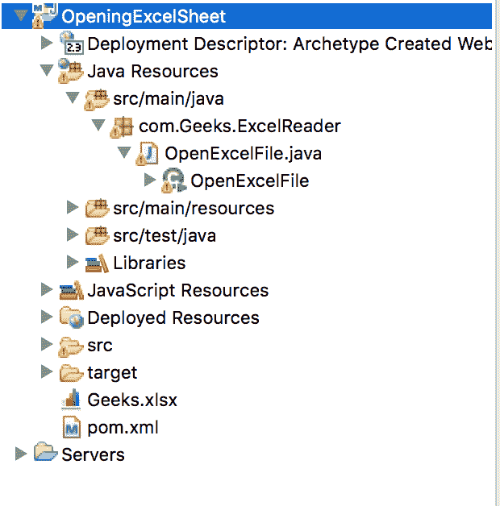

# 使用 Apache POI 打开现有的 Java Excel 表单

> 原文:[https://www . geesforgeks . org/open-existing-excel-sheet-in-Java-using-Apache-poi/](https://www.geeksforgeeks.org/opening-existing-excel-sheet-in-java-using-apache-poi/)

**Apache POI** 是一个强大的 API，通过它可以读取、写入和修改任何微软文档，如 powerpoint、world 或 excel。
阿帕奇 POI 有不同的类和方法来处理不同的微软办公文档。

*   **POIFS–**
    它代表**“糟糕的混淆实现文件系统”**。该组件是所有其他兴趣点元素的基本因素。它用于显式读取不同的文件。
*   **HSSF**
    是代表**“可怕的电子表格格式”**。用于读写 MS-Excel 文件的 xls 格式。
*   **XSF**
    它代表**“XML 电子表格格式”**。用于 MS-Excel 的 xlsx 文件格式。
*   **HPSF**
    是代表**“恐怖属性集格式”**。它用于提取微软办公文件的属性集。
*   **HWPF**
    是代表**“恐怖文字处理器格式”**。用于 MS-Word 文档扩展文件的读写。
*   **XWPF**
    它代表**“XML 文字处理器格式”**。用于读写 MS-Word 的 docx 扩展文件。
*   **HSLF**
    是代表**“恐怖幻灯片版式”**。它用于阅读、创建和编辑 PowerPoint 演示文稿。
*   **HDGF**
    是代表**【恐怖图格式】**。它包含用于 MS-Visio 二进制文件的类和方法。
*   **HPBF**
    是代表**【恐怖发布者格式】**。它用于读写微软发布者文件。

**在 eclipse 中用 Java 打开现有 Excel 工作表的步骤**

*   创建一个 JAVA Maven 项目
*   在 pom.xml 文件中添加依赖关系

## 可扩展标记语言

```java
<!-- https://mvnrepository.com/artifact/org.apache.poi/poi -->

<dependency>
      <groupId>org.apache.poi</groupId>
      <artifactId>poi</artifactId>
      <version>3.12</version>
    </dependency>
    <dependency>
      <groupId>org.apache.poi</groupId>
      <artifactId>poi-ooxml</artifactId>
      <version>3.12</version>
    </dependency>
```

*   在 javaResource 文件夹中创建一个类

## Java 语言(一种计算机语言，尤用于创建网站)

```java
import java.io.File;
import java.io.FileInputStream;

import org.apache.poi.xssf.usermodel.XSSFWorkbook;

public class GFG {
    public static void main(String args[]) throws Exception
    {

        // Create a file object
        // for the path of existing Excel file
        // Give the path of the file as parameter
        // from where file is to be read
        File file = new File("Geeks.xlsx");

        // Create a FileInputStream object
        // for getting the information of the file
        FileInputStream fip = new FileInputStream(file);

        // Getting the workbook instance for XLSX file
        XSSFWorkbook workbook = new XSSFWorkbook(fip);

        // Ensure if file exist or not
        if (file.isFile() && file.exists()) {
            System.out.println("Geeks.xlsx open");
        }
        else {
            System.out.println("Geeks.xlsx either not exist"
                               + " or can't open");
        }
    }
}
```

*   作为 java 应用程序运行代码

**输出:**

> Geeks.xlsx 开放游戏

**月食中的文件位置**

