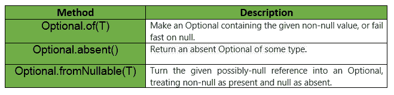

# 可选类|番石榴|爪哇

> 原文:[https://www.geeksforgeeks.org/optional-class-guava-java/](https://www.geeksforgeeks.org/optional-class-guava-java/)

**简介:** Optional 是一个 ***不可变对象*** ，它可能包含对另一个对象的非空引用。这种类型的每个实例要么包含一个非空引用，要么不包含任何内容，在这种情况下，我们说引用不存在。从来没有说过它包含 null。

**示例:**当在 Hashmap 中找不到键时，Hashmap.get(key)可能会返回 null，但如果键存在但值为 null，它也可能会返回 null。 ***可选类可用于可能使用空对象的地方*** 。

可选类没有构造函数，但是提供 **3 个公共静态方法**来获取类的实例。

*   **可选。fromNullable(T)** 允许在新的可选实例中提供和包装空或非空引用。
    *   如果传入的参数为 null，则该实例没有存储任何引用，并且是“不存在”的实例。
    *   如果传入的参数不为空，则该非空引用存储在新的可选实例中。
*   **Optional.of(T)** 的作用类似于 Optional.fromNullable(T)，只是它期望向它传递一个非空参数。如果将 null 传递给它，则会抛出一个***null pointerexception***。
*   **Optional . exceled()**当一个人的代码知道将被提供给 Optional.fromNullable(T)的参数为 null 时，它是很有用的，并且它比应该返回的 Optional 的“缺席”版本更容易表达。



一旦获取了可选的实例，就可以在该实例上调用几个实例方法。例如， **Optional.isPresent()** 方法对于确定给定的 Optional 实例中是否包含非空参数非常有用。一旦知道可选实例包含非空引用， **Optional.get()** 方法返回存储的非空引用。

**注意:**如果没有非空引用，调用此方法时会引发异常。所以，还是先调用 isPresent()比较好。

**申报:**

```
@GwtCompatible(serializable = true)
public abstract class Optional<T>
extends Object
implements Serializable

Where, T is the type of instance that can be contained.

```

**可选类方法:**


**示例:**

```
// Java code to show implementation of
// Guava Optional class
import java.util.ArrayList;
import java.util.List;
import com.google.common.base.Optional;
import static com.google.common.base.Strings.emptyToNull;

class GuavaLibrary {

    // Driver code
    public static void main(String[] args)
    {

        // Creating a List of Strings
        List<String> myList = new ArrayList<String>();

        // Adding values to the Strings
        myList.add("Geeks");
        myList.add("for");
        myList.add("GeeksClasses");
        myList.add(null);
        myList.add("GeeksforGeeks");
        myList.add("");
        myList.add("Data Structures");

        // Displaying values using Java Nulls
        displayValuesUsingJavaNulls(myList);

        // Displaying values using Guava Optional
        displayValuesUsingGuavaOptional(myList);
    }

    // Method to display values using Java Nulls
    public static void displayValuesUsingJavaNulls(List<String> myList)
    {
        System.out.println("Displaying values using Java Nulls");

        // For every String in myList
        for (String str : myList) {

            if (str == null || str.isEmpty()) {
                System.out.println("String : Value is empty or not available");
            }
            else {
                System.out.println("String : " + str);
            }
        }
        System.out.println();
    }

    // Method to display values using Guava Optional
    public static void displayValuesUsingGuavaOptional(List<String> myList)
    {
        System.out.println("Displaying values using Guava Optional");

        // For each String in myList
        for (String str : myList) {
            Optional<String> optionalName = Optional.fromNullable(emptyToNull(str));
            System.out.println("String : " + optionalName.or("String : Value is empty or not available"));
        }
    }
}
```

输出:

```
Displaying values using Java Nulls
String : Geeks
String : for
String : GeeksClasses
String : Value is empty or not available
String : GeeksforGeeks
String : Value is empty or not available
String : Data Structures

Displaying values using Guava Optional
String : Geeks
String : for
String : GeeksClasses
String : String : Value is empty or not available
String : GeeksforGeeks
String : String : Value is empty or not available
String : Data Structures

```

下面给出的是番石榴可选类提供的一些其他方法:


**番石榴自选类 Vs [爪哇. util .自选](https://www.geeksforgeeks.org/java-8-optional-class/)T3】**

*   番石榴可选类是可序列化的，但是 java.util.Optional 不是。
*   java.util.Optional 具有额外的方法 ifPresent、filter、flatMap 和 orElseThrow。
*   java.util.Optional 提供了 OptionalInt、OptionalLong 和 OptionalDouble 这三个原始专用版本，但是 Guava 没有这些版本。

**参考:**T2】谷歌番石榴