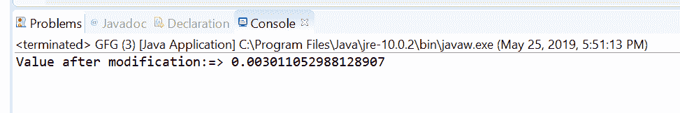
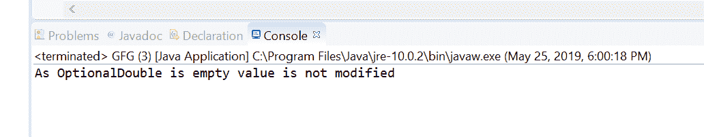

# Java 中的 optionalduble if present(double consumer)方法，示例

> 原文:[https://www . geeksforgeeks . org/optionaldouble-if presentdouble consumer-in-Java-method-with-examples/](https://www.geeksforgeeks.org/optionaldouble-ifpresentdoubleconsumer-method-in-java-with-examples/)

**ifPresentOrElse([Java . util . function . DoubleConsumer](https://www.geeksforgeeks.org/doubleconsumer-interface-in-java-with-examples/))**方法帮助我们执行指定的 double consumer 操作这个 OptionalDouble 对象的值。如果一个值不在这个 OptionalDouble 中，那么这个方法什么也不做。

**语法:**

```
public void ifPresentOrElse(DoubleConsumer action)

```

**参数:**如果存在值，该方法接受参数**动作**，该动作是要在该选项上执行的动作。

**返回值:**此方法不返回任何内容。

**异常:**如果存在一个值，并且给定的动作为空，则该方法抛出**[null podoubleexception](https://www.geeksforgeeks.org/null-podoubleer-exception-in-java/)**。

下面的程序说明了 ifPresent(双消费者)方法:

**程序 1:**

```
// Java program to demonstrate
// OptionalDouble.ifPresent(DoubleConsumer) method

import java.util.OptionalDouble;

public class GFG {

    public static void main(String[] args)
    {

        // create a OptionalDouble
        OptionalDouble opdouble = OptionalDouble.of(0.23425);

        // apply ifPresent(DoubleConsumer)
        opdouble.ifPresent((value) -> {
            value = Math.pow(value, 4);
            System.out.println("Value after modification:=> "
                               + value);
        });
    }
}
```

**输出:**


**程序 2:**

```
// Java program to demonstrate
// OptionalDouble.ifPresent(DoubleConsumer) method

import java.util.OptionalDouble;

public class GFG {

    public static void main(String[] args)
    {

        // create a OptionalDouble
        OptionalDouble opdouble = OptionalDouble.empty();

        // apply ifPresent(DoubleConsumer)
        opdouble.ifPresent((value) -> {
            System.out.println("Value:=> "
                               + value);
        });

        System.out.println("As OptionalDouble is empty value"
                           + " is not modified");
    }
}
```

**输出:**


**参考文献:**[https://docs . Oracle . com/javase/10/docs/API/Java/util/optionalduble . html # if present(Java . util . function . double consumer)](https://docs.oracle.com/javase/10/docs/api/java/util/OptionalDouble.html#ifPresent(java.util.function.DoubleConsumer))