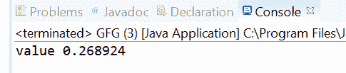
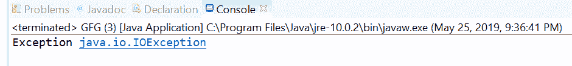

# Java 中的 OptionalDouble orElseThrow(供应商)方法，示例

> 原文:[https://www . geeksforgeeks . org/optionaldouble-orelsetowsupplier-method-in-Java-with-examples/](https://www.geeksforgeeks.org/optionaldouble-orelsethrowsupplier-method-in-java-with-examples/)

optionalduble 类的 **orElseThrow(Supplier)** 方法，用于获取 optionalduble 包含的值。如果存在值，此方法将返回该值，否则，此方法将引发异常提供函数产生的异常。例外供应商函数作为参数传递。

**语法:**

```java
public <X extends Throwable> double 
    orElseThrow(Supplier<X> exceptionSupplier)
        throws X extends Throwable

```

**参数:**这个方法接受一个参数 exceptionSupplier，它是产生要抛出的异常的供应函数。

**返回值:**该方法返回值(如果存在)。

**异常:**该方法抛出以下异常:

*   x–如果不存在任何值。
*   NullPointerException–如果不存在任何值，并且异常提供函数为空
*   x 扩展了可投掷性

下面的程序说明了 orElseThrow(供应商)方法:
**程序 1:**

```java
// Java program to demonstrate
// OptionalDouble.orElseThrow(Supplier) method

import java.util.OptionalDouble;

public class GFG {

    public static void main(String[] args)
    {

        // create a OptionalDouble
        OptionalDouble opDouble
            = OptionalDouble.of(0.268924);

        // apply orElseThrow(Supplier)
        double value
            = opDouble.orElseThrow(ArithmeticException::new);

        System.out.println("value " + value);
    }
}
```

**输出:**


**程序 2:**

```java
// Java program to demonstrate
// OptionalDouble.orElseThrow(Supplier) method
import java.io.IOException;
import java.util.OptionalDouble;

public class GFG {

    public static void main(String[] args)
    {

        // create a OptionalDouble
        OptionalDouble opDouble
            = OptionalDouble.empty();

        // apply orElseThrow(Supplier)
        double value;

        try {

            value = opDouble.orElseThrow(IOException::new);
        }
        catch (IOException e) {

            System.out.println("Exception " + e);
        }
    }
}
```

**输出:**


**参考文献:**[https://docs . Oracle . com/javase/10/docs/API/Java/util/optionaldouble . html # orelsthrow(Java . util . function . supplier)](https://docs.oracle.com/javase/10/docs/api/java/util/OptionalDouble.html#orElseThrow(java.util.function.Supplier))