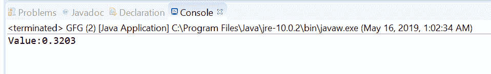
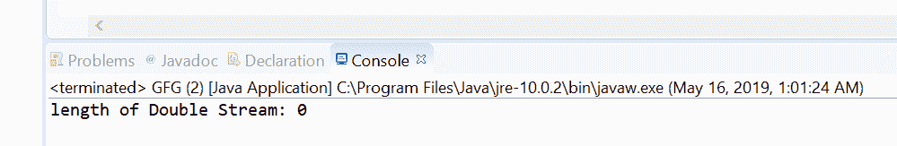

# Java 中的 OptionalDouble stream()方法，带示例

> 原文:[https://www . geesforgeks . org/optionalduble-stream-method-in-Java-with-examples/](https://www.geeksforgeeks.org/optionaldouble-stream-method-in-java-with-examples/)

**stream()** 方法帮助我们获得由[optionalduble](https://www.geeksforgeeks.org/tag/java-optionaldouble/)作为 DoubleStream 包含的双值。如果存在一个值，则方法返回一个仅包含该值的连续双流，否则返回一个空双流。

**语法:**

```
public DoubleStream stream()

```

**参数:**此方法不接受任何内容。

**返回值:**该方法将可选值作为双流返回。

以下节目举例说明 stream()方法:
**节目 1:**

```
// Java program to demonstrate
// OptionalDouble.stream() method

import java.util.OptionalDouble;
import java.util.stream.DoubleStream;

public class GFG {

    public static void main(String[] args)
    {

        // create a OptionalDouble
        OptionalDouble opDouble
            = OptionalDouble.of(.3203);

        // get value as stream
        DoubleStream out = opDouble.stream();

        // print value
        System.out.print("Value: ");
        out.forEach(System.out::print);
    }
}
```

**输出:**


**程序 2:**

```
// Java program to demonstrate
// OptionalDouble.stream() method

import java.util.OptionalDouble;
import java.util.stream.DoubleStream;

public class GFG {

    public static void main(String[] args)
    {

        // create a empty OptionalDouble
        OptionalDouble opDouble
            = OptionalDouble.empty();

        // get value as stream
        DoubleStream out = opDouble.stream();

        // print value
        System.out.print("length of Double Stream: "
                         + out.count());
    }
}
```

**输出:**


**参考文献:**[https://docs . Oracle . com/javase/10/docs/API/Java/util/optionaldouble . html # empty()](https://docs.oracle.com/javase/10/docs/api/java/util/OptionalDouble.html#empty())