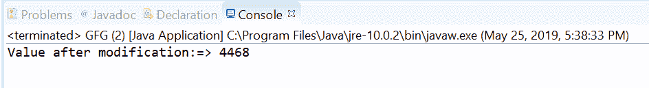
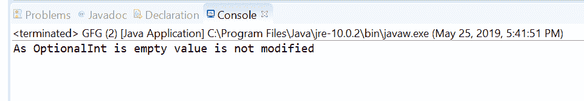

# 选项 Java 中的 ifPresent(IntConsumer)方法，示例

> 原文:[https://www . geesforgeks . org/option alint-if presentconsumer-method-in-Java-with-examples/](https://www.geeksforgeeks.org/optionalint-ifpresentintconsumer-method-in-java-with-examples/)

**ifPresentOrElse([Java . util . function . IntConsumer](https://www.geeksforgeeks.org/intconsumer-interface-in-java-with-examples/))**方法帮助我们执行指定的 IntConsumer 操作这个 OptionalInt 对象的值。如果该选项中没有值，则该方法不执行任何操作。

**语法:**

```
public void ifPresentOrElse(IntConsumer action)

```

**参数:**如果存在值，该方法接受参数**动作**，该动作是要在该选项上执行的动作。

**返回值:**此方法不返回任何内容。

**异常:**如果存在一个值并且给定的动作为空，则该方法抛出 **[空指针异常](https://www.geeksforgeeks.org/null-pointer-exception-in-java/)** 。

下面的程序说明了 ifPresent(IntConsumer)方法:

**程序 1:**

```
// Java program to demonstrate
// OptionalInt.ifPresent(IntConsumer) method

import java.util.OptionalInt;

public class GFG {

    public static void main(String[] args)
    {

        // create a OptionalInt
        OptionalInt opint = OptionalInt.of(2234);

        // apply ifPresent(IntConsumer)
        opint.ifPresent((value) -> {
            value = value * 2;
            System.out.println("Value after modification:=> "
                               + value);
        });
    }
}
```

**输出:**


**程序 2:**

```
// Java program to demonstrate
// OptionalInt.ifPresent(IntConsumer) method

import java.util.OptionalInt;

public class GFG {

    public static void main(String[] args)
    {

        // create a OptionalInt
        OptionalInt opint = OptionalInt.empty();

        // apply ifPresent(IntConsumer)
        opint.ifPresent((value) -> {
            value = value * 2;
            System.out.println("Value after modification:=> "
                               + value);
        });

        System.out.println("As OptionalInt is empty value"
                           + " is not modified");
    }
}
```

**输出:**


**参考文献:**[https://docs . Oracle . com/javase/10/docs/API/Java/util/optional int . html # if present(Java . util . function . int consumer)](https://docs.oracle.com/javase/10/docs/api/java/util/OptionalInt.html#ifPresent(java.util.function.IntConsumer))