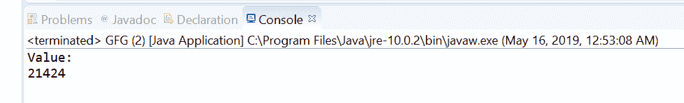
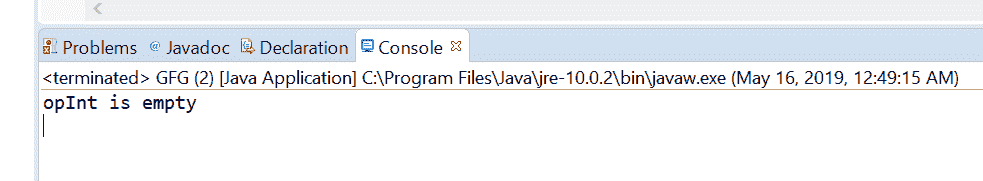

# Java 中的 OptionalInt stream()方法，带示例

> 原文:[https://www . geesforgeks . org/optional int-stream-method-in-Java-with-examples/](https://www.geeksforgeeks.org/optionalint-stream-method-in-java-with-examples/)

**stream()** 方法帮助我们通过[选项将](https://www.geeksforgeeks.org/tag/java-optionalint/)设置为 IntStream 来获取包含的值。如果存在一个值，则方法返回一个仅包含该值的连续 IntStream，否则返回一个空 IntStream。

**语法:**

```java
public IntStream stream()

```

**参数:**此方法不接受任何内容。

**返回值:**该方法将可选值作为 IntStream 返回。

以下节目举例说明 stream()方法:
**节目 1:**

```java
// Java program to demonstrate
// OptionalInt.stream() method

import java.util.OptionalInt;
import java.util.stream.IntStream;

public class GFG {

    public static void main(String[] args)
    {

        // create a OptionalInt
        OptionalInt opInt = OptionalInt.of(452146);

        // get value as stream
        IntStream out = opInt.stream();

        // print value
        System.out.println("Value:");
        out.forEach(System.out::println);
    }
}
```

**输出:**


**程序 2:**

```java
// Java program to demonstrate
// OptionalInt.stream() method

import java.util.OptionalInt;
import java.util.stream.IntStream;

public class GFG {

    public static void main(String[] args)
    {

        // create a OptionalInt
        OptionalInt opInt = OptionalInt.empty();

        // get value as stream
        IntStream out = opInt.stream();

        // print value
        if (out.count() == 0)
            System.out.println("opInt is empty");
    }
}
```

**输出:**


**参考文献:**[https://docs . Oracle . com/javase/10/docs/API/Java/util/optional int . html # empty()](https://docs.oracle.com/javase/10/docs/api/java/util/OptionalInt.html#empty())