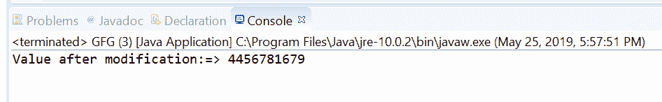
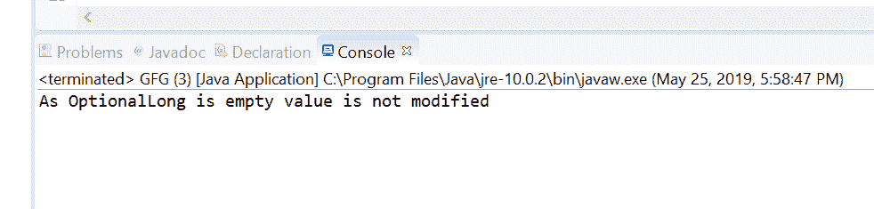

# 选项用示例在 Java 中使用 ifPresent(LongConsumer)方法

> 原文:[https://www . geesforgeks . org/option allong-if presentlongconsumer-method-in-Java-with-examples/](https://www.geeksforgeeks.org/optionallong-ifpresentlongconsumer-method-in-java-with-examples/)

**if presentorelse([Java . util . function . LongConsumer](https://www.geeksforgeeks.org/longconsumer-interface-in-java-with-examples/))**方法帮助我们执行指定的 long consumer 操作这个 OptionalLong 对象的值。如果该选项中没有值，则该方法不执行任何操作。

**语法:**

```java
public void ifPresentOrElse(LongConsumer action)

```

**参数:**如果存在值，该方法接受参数**动作**，该动作是要在该选项上执行的动作。

**返回值:**此方法不返回任何内容。

**异常:**如果存在一个值并且给定的动作为空，则该方法抛出 **[空值异常](https://www.geeksforgeeks.org/null-polonger-exception-in-java/)** 。

以下程序说明了 ifPresent(LongConsumer)方法:
**程序 1:**

```java
// Java program to demonstrate
// OptionalLong.ifPresent(LongConsumer) method

import java.util.OptionalLong;

public class GFG {

    public static void main(String[] args)
    {

        // create a OptionalLong
        OptionalLong oplong
            = OptionalLong.of(23456745678L);

        // apply ifPresent(LongConsumer)
        oplong.ifPresent((value) -> {

            value = Math.round(value * 0.19);
            System.out.println("Value after modification:=> "
                               + value);
        });
    }
}
```

**输出:**


**程序 2:**

```java
// Java program to demonstrate
// OptionalLong.ifPresent(LongConsumer) method

import java.util.OptionalLong;

public class GFG {

    public static void main(String[] args)
    {

        // create a OptionalLong
        OptionalLong oplong = OptionalLong.empty();

        // apply ifPresent(LongConsumer)
        oplong.ifPresent((value) -> {

            value = value * 132435;
            System.out.println("Value:=> "
                               + value);
        });

        System.out.println("As OptionalLong is empty value"
                           + " is not modified");
    }
}
```

**输出:**


**参考文献:**[https://docs . Oracle . com/javase/10/docs/API/Java/util/optional long . html # if present(Java . util . function . long consumer)](https://docs.oracle.com/javase/10/docs/api/java/util/OptionalLong.html#ifPresent(java.util.function.LongConsumer))