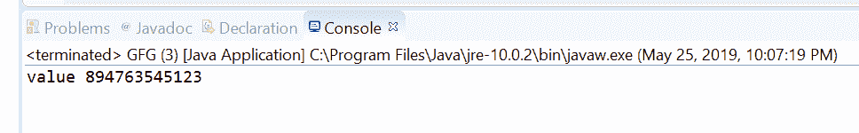
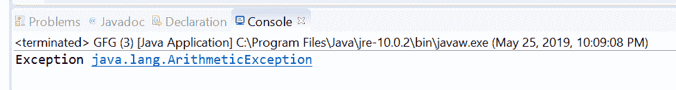

# 选项 Java 中的 orElseThrow(供应商)方法，示例

> 原文:[https://www . geesforgeks . org/optional long-orelsetowsupplier-method-in-Java-with-examples/](https://www.geeksforgeeks.org/optionallong-orelsethrowsupplier-method-in-java-with-examples/)

OptionalLong 类的 **orElseThrow(Supplier)** 方法用于获取 OptionalLong 包含的长值。如果存在值，此方法将返回该值，否则，此方法将引发异常提供函数产生的异常。例外供应商函数作为参数传递。

**语法:**

```java
public <X extends Throwable> long 
    orElseThrow(Supplier<X> exceptionSupplier)
        throws X extends Throwable

```

**参数:**这个方法接受一个参数**异常提供者**，它是产生要抛出的异常的提供函数。

**返回值:**该方法返回值(如果存在)。

**异常:**该方法抛出以下异常:

*   x–如果不存在任何值。
*   NullPointerException–如果不存在任何值，并且异常提供函数为空
*   x 扩展了可投掷性

下面的程序说明了 orElseThrow(供应商)方法:
**程序 1:**

```java
// Java program to demonstrate
// OptionalLong.orElseThrow(Supplier) method

import java.util.OptionalLong;

public class GFG {

    public static void main(String[] args)
    {

        // create a OptionalLong
        OptionalLong opLong = OptionalLong.of(894763545123L);

        // apply orElseThrow(Supplier)
        long value = opLong.orElseThrow(ArithmeticException::new);

        System.out.println("value " + value);
    }
}
```

**输出:**


**程序 2:**

```java
// Java program to demonstrate
// OptionalLong.orElseThrow(Supplier) method

import java.io.IOException;
import java.util.OptionalLong;

public class GFG {

    public static void main(String[] args)
    {

        // create a OptionalLong
        OptionalLong opLong = OptionalLong.empty();

        // apply orElseThrow(Supplier)
        Long value;

        try {

            value = opLong.orElseThrow(ArithmeticException::new);
        }
        catch (ArithmeticException e) {
            // TODO Auto-generated catch block
            System.out.println("Exception " + e);
        }
    }
}
```

**输出:**


**参考文献:**[https://docs . Oracle . com/javase/10/docs/API/Java/util/optional long . html # orelsthrow(Java . util . function . supplier)](https://docs.oracle.com/javase/10/docs/api/java/util/OptionalLong.html#orElseThrow(java.util.function.Supplier))