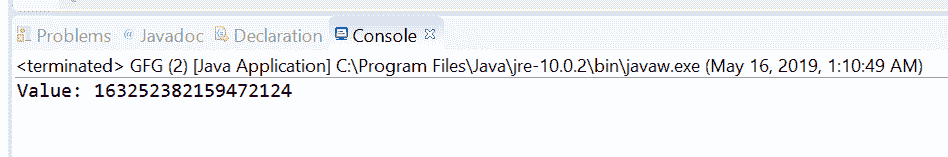
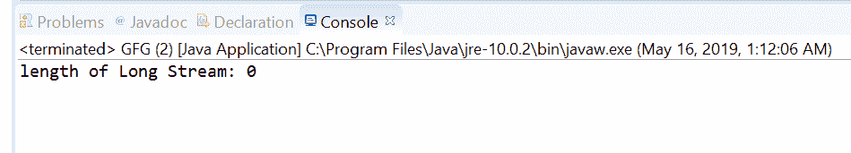

# Java 中的 OptionalLong stream()方法，带示例

> 原文:[https://www . geesforgeks . org/optional long-stream-method-in-Java-with-examples/](https://www.geeksforgeeks.org/optionallong-stream-method-in-java-with-examples/)

**stream()** 方法帮助我们通过将设置为 LongStream 来获取[选项所包含的 Long 值。如果存在一个值，方法返回一个只包含该值的连续长流，否则返回一个空的长流。](https://www.geeksforgeeks.org/tag/java-optionallong/)

**语法:**

```java
public LongStream stream()

```

**参数:**此方法不接受任何内容。

**返回值:**该方法将可选值作为 LongStream 返回。

以下节目举例说明 stream()方法:
**节目 1:**

```java
// Java program to demonstrate
// OptionalLong.stream() method

import java.util.OptionalLong;
import java.util.stream.LongStream;

public class GFG {

    public static void main(String[] args)
    {

        // create a OptionalLong
        OptionalLong opLong
            = OptionalLong.of(163252382159472124L);

        // get value as stream
        LongStream out = opLong.stream();

        // print value
        System.out.print("Value: ");
        out.forEach(System.out::print);
    }
}
```

**输出:**


**程序 2:**

```java
// Java program to demonstrate
// OptionalLong.stream() method

import java.util.OptionalLong;
import java.util.stream.LongStream;

public class GFG {

    public static void main(String[] args)
    {

        // create a empty OptionalLong
        OptionalLong opLong = OptionalLong.empty();

        // get value as stream
        LongStream out = opLong.stream();

        // print value
        System.out.print("length of Long Stream: "
                         + out.count());
    }
}
```

**输出:**


**参考文献:**[https://docs . Oracle . com/javase/10/docs/API/Java/util/optional long . html # empty()](https://docs.oracle.com/javase/10/docs/api/java/util/OptionalLong.html#empty())