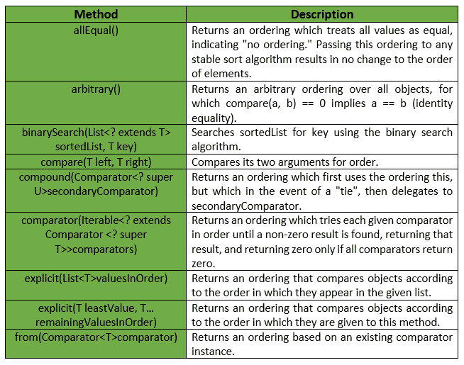
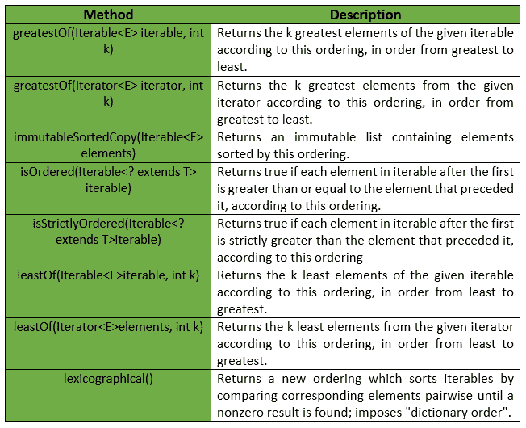
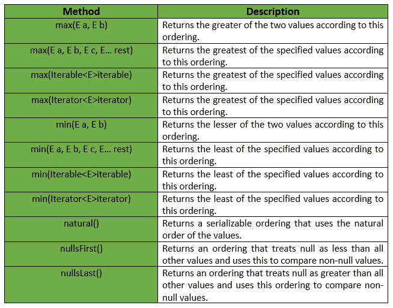
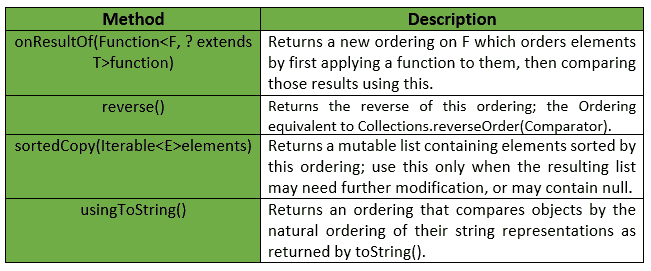

# 订购类|番石榴|爪哇

> 原文:[https://www.geeksforgeeks.org/ordering-class-guava-java/](https://www.geeksforgeeks.org/ordering-class-guava-java/)

一个**比较器，有额外的方法支持常用操作。这是比较器的“丰富”版本。获取排序实例的常见方法有:**

*   **将其子类化并实现比较(T，T)，而不是直接实现比较器。**
*   **将预先存在的比较器实例传递给(比较器)。**
*   **使用自然排序，自然()。**

****申报:**申报为**com . Google . common . collect . ording<**T**T7**类为:**

```java
@GwtCompatible
public abstract class Ordering<**T**>
   extends Object
      implements Comparator<**T**> 
```

**下面给出的是番石榴排序类提供的一些方法:

**排序():**这是番石榴排序类的一个构造函数。它构造这个类的一个新实例(只能由子类构造函数调用，通常是隐式的)。本类提供的其他方法有:

**例外:****

*   ****显式(列表值订单):** *空指针异常*如果提供的任何值为空， *IllegalArgumentException* 如果值订单包含任何重复值。**
*   ****显式(T 最小值，T…保留值排序):** *空指针异常*如果提供的任何值为空，则 *IllegalArgumentException* 如果有重复值。**
*   ****min(迭代器迭代器):***no suchelementexception*如果迭代器为空，则 *ClassCastException* 如果参数在此顺序下不可相互比较。**
*   ****min(可迭代):***no suchelementexception*如果可迭代为空，则 *ClassCastException* 如果参数在此顺序下不可相互比较。**
*   ****min(E a，E b):***class castexception*如果参数在此顺序下不可相互比较。**
*   ****min(E a，E b，E c，E…rest):***class castexception*如果在此排序下参数不可相互比较。**
*   ****max(迭代器迭代器):***no suchelementexception*如果迭代器为空，则 *ClassCastException* 如果参数在此顺序下不可相互比较。**
*   ****max(可迭代):***no suchelementexception*如果可迭代为空，则 *ClassCastException* 如果参数在此顺序下不可相互比较。**
*   ****max(E a，E b):***class castexception*如果参数在此顺序下不可相互比较。**
*   ****最大值(E a，E b，E c，E… rest) :** *分类例外*如果参数在此顺序下不可相互比较。**
*   ****最小(可迭代，int k):**T2【IllegalArgumentException】如果 k 为负。**
*   ****最小(迭代器元素，int k) :** *如果 k 为负，则出现 IllegalArgumentException* 。**
*   ****greatestOf(iteratable，int k):**T2【IllegalArgumentException】如果 k 为负。**
*   ****greatestOf(Iterator 元素，int k):***IllegalArgumentException*如果 k 为负。**
*   ****不变的 rtedcopy:***null pointerexception*如果任何元素(或元素本身)为空。**

**这个类提供的其他一些方法有:

**例 1 :****

```java
// Java code to show implementation of
// Ordering class
import java.util.*;

import com.google.common.collect.Ordering;

class GFG {

    // Driver code
    public static void main(String args[])
    {

        // Creating a list of Integers
        List<Integer> myList = new ArrayList<Integer>();

        myList.add(new Integer(12));
        myList.add(new Integer(3));
        myList.add(new Integer(78));
        myList.add(new Integer(50));
        myList.add(new Integer(6));
        myList.add(new Integer(70));
        myList.add(new Integer(18));
        myList.add(new Integer(9));
        myList.add(new Integer(10));

        // Displaying natural order of numbers
        Ordering ordering = Ordering.natural();
        System.out.println("Input List : " + myList);

        // Displaying the sorted list
        Collections.sort(myList, ordering);
        System.out.println("Sorted List : " + myList);
    }
}
```

**输出:**

```java
Input List : [12, 3, 78, 50, 6, 70, 18, 9, 10]
Sorted List : [3, 6, 9, 10, 12, 18, 50, 70, 78] 
```

**下面给出的是番石榴订购类提供的一些其他方法:

**例 2 :****

```java
// Java code to show implementation of
// Ordering class
import java.util.*;

import com.google.common.collect.Ordering;

class GFG {

    // Driver code
    public static void main(String args[])
    {

        // Creating a list of Integers
        List<Integer> myList = new ArrayList<Integer>();

        myList.add(new Integer(12));
        myList.add(new Integer(3));
        myList.add(new Integer(78));
        myList.add(new Integer(50));
        myList.add(new Integer(6));
        myList.add(new Integer(70));
        myList.add(new Integer(18));
        myList.add(new Integer(9));
        myList.add(new Integer(10));

        // Displaying natural order of numbers
        Ordering ordering = Ordering.natural();
        System.out.println("Minimum element is : " + ordering.min(myList));
    }
}
```

**输出:**

```java
Minimum element is : 3 
```

****例 3 :****

```java
// Java code to show implementation of
// Ordering class
import java.util.*;

import com.google.common.collect.Ordering;

class GFG {

    // Driver code
    public static void main(String args[])
    {

        // Creating a list of Integers
        List<Integer> myList = new ArrayList<Integer>();

        myList.add(new Integer(12));
        myList.add(new Integer(3));
        myList.add(new Integer(78));
        myList.add(new Integer(50));
        myList.add(new Integer(6));
        myList.add(new Integer(70));
        myList.add(new Integer(18));
        myList.add(new Integer(9));
        myList.add(new Integer(10));

        // Displaying natural order of numbers
        Ordering ordering = Ordering.natural();
        System.out.println("Maximum element is : " + ordering.max(myList));
    }
}
```

**输出:**

```java
Maximum element is : 78 
```

****例 4 :****

```java
// Java code to show implementation of
// Ordering class
import java.util.*;

import com.google.common.collect.Ordering;

class GFG {

    // Driver code
    public static void main(String args[])
    {

        // Creating a list of Integers
        List<Integer> myList = new ArrayList<Integer>();

        myList.add(new Integer(12));
        myList.add(new Integer(3));
        myList.add(new Integer(78));
        myList.add(new Integer(50));
        myList.add(new Integer(6));
        myList.add(new Integer(70));
        myList.add(new Integer(18));
        myList.add(new Integer(9));
        myList.add(new Integer(10));

        // Displaying natural order of numbers
        Ordering ordering = Ordering.natural();

        // To get reverse of original list
        Collections.sort(myList, ordering.reverse());

        // Displaying the reversed elements
        System.out.println(myList);
    }
}
```

**输出:**

```java
[78, 70, 50, 18, 12, 10, 9, 6, 3] 
```

****参考:**T2】谷歌番石榴**