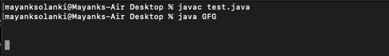
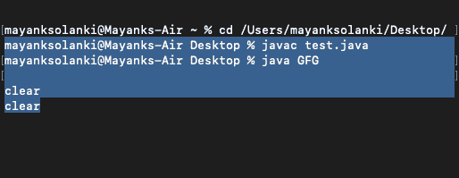

# 用示例在 Java 中覆盖 filelockexception

> 原文:[https://www . geeksforgeeks . org/overlappingfilelockexception-in-Java-with-examples/](https://www.geeksforgeeks.org/overlappingfilelockexception-in-java-with-examples/)

当试图获取与该进程持有的现有或挂起锁重叠的锁时，将引发**OverlappingFileLockException**。

如果请求的锁区域与该 JVM 中某个线程已经持有的文件锁重叠，或者如果该 JVM 中已经有一个线程在等待锁定同一文件的重叠区域，则 FileChannel 的 lock()和 tryLock()方法会引发此异常。文件通道文件锁定机制旨在锁定文件，防止两个单独的进程并发访问。同一个 JVM 中的两个线程不应该试图获取同一个文件的重叠区域的锁，任何这样做的尝试都会导致引发这种类型的异常。

**包装视图**

```
java.lang.Object
    java.lang.Throwable
         java.lang.Exception
              java.lang.RuntimeException
                   java.lang.IllegalStateException
                    java.nio.channels.OverlappingFileLockException
```

> **记住:**它确实实现了[Serializable 接口](https://www.geeksforgeeks.org/serializable-interface-in-java/)。

**语法:**

```
public class OverlappingFileLockException
extends IllegalStateException
```

> **注意:**当试图获取与同一 Java 虚拟机已经锁定的区域重叠的文件区域的锁时，或者当另一个线程已经在等待锁定同一文件的重叠区域时，抛出[未检查的异常](https://www.geeksforgeeks.org/checked-vs-unchecked-exceptions-in-java/)。

**建造师总结**

*   **OverlappingFileLockException():**构造此类的一个实例。

**实施:**

在这个例子中，我们将向您展示如何在 Java 中创建一个共享文件锁，并处理 OverlappingFileLockException。使用 Java NIO 通道创建共享文件锁意味着应该:

1.  创建一个 File 对象来封装您想要锁定的文件系统中的实际文件
2.  创建随机访问文件流(读写)。为此，您必须首先创建一个 RandomAccessFile 对象来封装上面创建的文件对象，并将其打开进行读写操作。然后使用 RandomAccessFile 对象的 getChannel() API 方法来获取文件通道，以便从/向其中读取/写入数据
3.  通过使用 FileChannel 类的 lock(long，long，boolean) API 方法获取此通道文件的排他锁。此方法会一直阻塞，直到区域被锁定、此通道被关闭或调用线程被中断。布尔属性将锁标记为共享或非共享。该方法返回文件锁类的句柄以利用锁
4.  或者，我们可以使用文件通道类的 tryLock(长，长，布尔)API 方法。此方法试图获取此通道文件的排他锁，但不会阻止；调用总是立即返回，要么已经获得了所请求区域的锁，要么没有这样做。

**例 1**

## Java 语言(一种计算机语言，尤用于创建网站)

```
// Java Program to Illustrate Shared lock over File

// Importing required classes
import java.io.File;
import java.io.IOException;
import java.io.RandomAccessFile;
import java.nio.channels.FileChannel;
import java.nio.channels.FileLock;
import java.nio.channels.OverlappingFileLockException;

// Main class
// CreateSharedFileLockOnFile
public class GFG {

    // Main driver method
    public static void main(String[] args)
    {

        // Try block to check for exceptions
        try {

            // Creating a file
            File file = new File("fileToLock.dat");

            // Creates a random access file stream to read
            // from, and optionally to write to
            FileChannel channel
                = new RandomAccessFile(file, "rw")
                      .getChannel();

            // Acquire an exclusive lock on this channel's
            // file ( block until the region can be locked,
            // this channel is closed, or the invoking
            // thread is interrupted)
            FileLock lock
                = channel.lock(0, Long.MAX_VALUE, true);

            // Attempts to acquire an exclusive lock on this
            // channel's file (does not block, an invocation
            // always returns immediately, either having
            // acquired a lock on the requested region or
            // having failed to do so.
            try {

                lock = channel.tryLock(0, Long.MAX_VALUE,
                                       true);
            }
            catch (OverlappingFileLockException e) {
                // thrown when an attempt is made to acquire
                // a lock on a a file that overlaps a region
                // already locked by the same JVM or when
                // another thread is already waiting to lock
                // an overlapping region of the same file
                System.out.println(
                    "Overlapping File Lock Error: "
                    + e.getMessage());
            }

            // Checking whether this lock is shared
            boolean isShared = lock.isShared();

            // Releasing the lock
            // using release() method
            lock.release();

            // Closing the channel
            // using standard close() method
            channel.close();
        }

        // Catch block to handle exceptions
        catch (IOException e) {

            // Display message(error) if I/O exception
            // occurs
            System.out.println("I/O Error: "
                               + e.getMessage());
        }
    }
}
```

**输出:**



**例 2:**

## Java 语言(一种计算机语言，尤用于创建网站)

```
// Java Program to Lock a File before Writing into It

// Importing required classes
import java.io.RandomAccessFile;
import java.nio.channels.FileChannel;
import java.nio.channels.FileLock;
import java.nio.channels.OverlappingFileLockException;
import java.util.concurrent.TimeUnit;

// Main class
public class Demo {

    // Main driver method
    public static void main(String[] args) throws Exception
    {
        // Creating object of RandomAccessFile
        RandomAccessFile file
            = new RandomAccessFile("accounts.txt", "rw");

        // Similarly creating object of FileChannel class
        FileChannel channel = file.getChannel();

        // Initially setting lock to file as null
        // as there is no lock by far
        FileLock lock = null;

        // Try block to check for exceptions
        try {
            lock = channel.tryLock();
        }

        // Catch block to handle exceptions
        catch (final OverlappingFileLockException e) {

            // Closing channel and file in order to
            // free up memory resources and avoid leakage
            // using close() method
            file.close();
            channel.close();
        }

        // Writing something while inlocked
        file.writeChars("writing after lock");

        // Making it to sleep for very small amount of time
        TimeUnit.HOURS.sleep(1);

        // Releasig lock over file using release() method
        lock.release();

        // Again closing channel and file in order to
        // free up memory resources and avoid leakage
        // using close() method
        file.close();
        channel.close();
    }
}
```

**输出:**



> 它将抛出**OverlappingFileLockException，如果与所请求区域重叠的锁已经被这个 Java 虚拟机持有，或者如果另一个线程已经在这个方法中被阻塞并试图锁定一个重叠区域。**