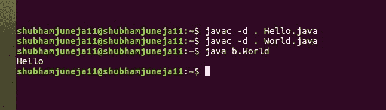

# 在 Java 中覆盖不同包的方法

> 原文:[https://www . geesforgeks . org/overriding-methods-different-packages-Java/](https://www.geeksforgeeks.org/overriding-methods-different-packages-java/)

**先决条件:** [在 Java 中覆盖](https://www.geeksforgeeks.org/overriding-in-java/)、[在 Java 中包](https://www.geeksforgeeks.org/packages-in-java/)
包为类提供了更多的封装层。因此，不同包中方法的可见性不同于同一包中方法的可见性。

**JVM 如何找到要调用的方法？**
当我们运行一个 java 程序时，

*   JVM 检查对象的运行时类。
*   JVM 检查对象的运行时类是否覆盖了声明的类的方法。
*   如果是，那就是调用的方法。否则，调用声明类的方法。

因此，关键是在不同的包中可见性检查方法的**可见性。**

**以下是我们将在不同的包中看到方法覆盖的情况**

**1。私有方法覆盖:**这里，我们要覆盖的方法的访问修饰符是私有的。

```
// Filename: Hello.java
package a;
public class Hello {
    private void printMessage()
    {
        System.out.println("Hello");
    }
    public void fun()
    {
        printMessage();
    }
}

// Filename: World.java
package b;
import a.Hello;
public class World extends Hello {
    private void printMessage()
    {
        System.out.println("World");
    }

    public static void main(String[] args)
    {
        Hello gfg = new World();
        gfg.fun();
    }
}
```

输出:

```
Hello
```

因为父类的私有方法在子类中不可见。因此，这里没有压倒一切的事情发生。
如果你不知道如何从终端运行这个程序，那么按照上面的说明创建 Hello.java 文件和 World.java 文件，然后运行这些命令。


**2。公共方法覆盖:**这里，我们要覆盖的方法的访问修饰符是公共的。

```
// Hello.java
package a;
public class Hello {
    public void printMessage()
    {
        System.out.println("Hello");
    }
}

// World.java
package b;
import a.Hello;
public class World extends Hello {
    public void printMessage()
    {
        System.out.println("World");
    }

    public static void main(String[] args)
    {
        Hello gfg = new World();
        gfg.printMessage();
    }
}
```

输出:

```
World

```

公共方法在任何地方都是可访问的，因此当调用 printMessage()时，jvm 可以找到被覆盖的方法并调用它。
因此这里发生了压倒一切的事情。

**3。默认方法覆盖**

```
// Hello.java
package a;
public class Hello {
    void printMessage()
    {
        System.out.println("Hello");
    }
}

// World.java
package b;
import a.Hello;
public class World extends Hello {
    void printMessage()
    {
        System.out.println("World");
    }
    public static void main(String[] args)
    {
        Hello gfg = new World();
        gfg.printMessage();
    }
}
```

```
error: printMessage() is not public in Hello; cannot be accessed from outside package
```

默认方法的可见性仅在其包中。因此，它不能在包外访问。
因此，在这种情况下没有压倒性的优势。

**预测以下程序的输出**

```
/* Hello.java */
package a;
public class Hello {
    public void doIt()
    {
        printMessage();
    }
    void printMessage()
    {
        System.out.println("Hello");
    }
}

/* World.java */
package b;
import a.Hello;
public class World {
    private static class GFG extends Hello {
        void printMessage()
        {
            System.out.println("World");
        }
    } 
    public static void main(String[] args)
    {
        GFG gfg = new GFG();
        gfg.doIt();
    }
}
```

输出:

```
Hello

```

**解释**
打印消息()的可见性在包 a 中是默认的。因此，这里不会发生覆盖。

本文由 **Shubham Juneja 供稿。**如果你喜欢 GeeksforGeeks 并且愿意投稿，你也可以使用[contribute.geeksforgeeks.org](http://www.contribute.geeksforgeeks.org)写一篇文章或者把你的文章邮寄到 contribute@geeksforgeeks.org。看到你的文章出现在极客博客主页上，帮助其他极客。

如果你发现任何不正确的地方，或者你想分享更多关于上面讨论的话题的信息，请写评论。