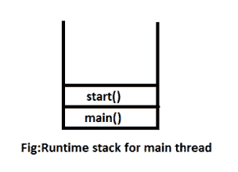

# 线程类开始()方法的覆盖

> 原文:[https://www . geesforgeks . org/overriding-thread-class-start-method/](https://www.geeksforgeeks.org/overriding-thread-class-start-method/)

每当我们重写 start()方法时，我们的 start()方法就会像正常的方法调用一样执行，并且不会创建新的线程。我们可以覆盖线程类的启动/运行方法，因为它不是最终的。但是**不建议超驰 start()方法**，否则会破坏多线程概念。

```java
// Java program illustrate the concept of
// overriding of start() method
class Bishal extends Thread {
public void start()
    {
        System.out.println("Start Method");
    }
public void run()
    {
        System.out.println("Run Method");
    }
} class Geeks {
public static void main(String[] args)
    {
        Bishal thread = new Bishal();
        thread.start();
        System.out.println("Main Method");
    }
}
```

**输出:**

```java
Start Method
Main Method

```

**注意:**在上面的程序中，当我们用 Bishal 类的一个对象调用 start()方法时，那么不会创建任何线程，所有的功能都只由主线程完成。

**JVM 为上述程序提供的运行时栈:**


当我们在线程上调用 start()方法时，它会在内部用新创建的线程调用 run()方法。因此，如果我们重写 start()方法，那么 run()方法将不会被调用，直到我们编写用于调用 run()方法的代码。
**另一个例子:**

```java
class GThread extends Thread
{
    public void run()
    {
        System.out.println("GThread: run()");
    }

    public void start()
    {
        System.out.println("GThread: start()");
    }
}

class GRunnable implements Runnable
{
    public void run()
    {
        System.out.println("GRunnable: run()");
    }

    public void start()
    {
        System.out.println("GRunnable: start()");
    }
}

public class MyTest 
{
    public static void main(String args[])
    {
        GThread gt  =  new GThread();
        GRunnable gr = new GRunnable();
        Thread thread  =  new Thread(gr);
        gt.start();
        thread.start();
    }
}
```

输出:

```java
GThread: start()
GRunnable: run()

```

调用 GThread.start()时，输出为:“GThread:start()”。当我们调用 thread.start()时，新线程将调用 runnable 的 run()方法，我们将得到“GRunnable:run()”消息。

本文由**比沙尔·库马尔·杜贝**供稿。如果你喜欢 GeeksforGeeks 并想投稿，你也可以使用[contribute.geeksforgeeks.org](http://www.contribute.geeksforgeeks.org)写一篇文章或者把你的文章邮寄到 contribute@geeksforgeeks.org。看到你的文章出现在极客博客主页上，帮助其他极客。

如果你发现任何不正确的地方，或者你想分享更多关于上面讨论的话题的信息，请写评论。