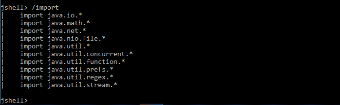
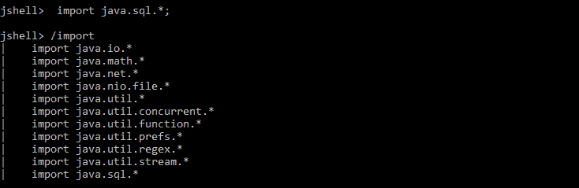
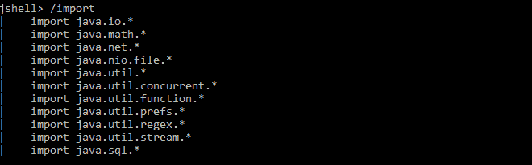
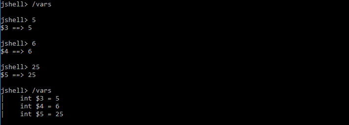
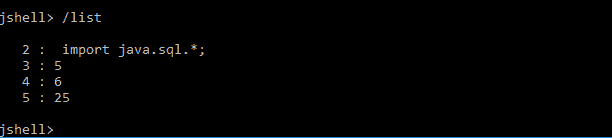

# Java 9 JShell 中的包导入

> 原文:[https://www . geesforgeks . org/package-imports-jshell-Java-9/](https://www.geeksforgeeks.org/package-imports-jshell-java-9/)

## **包装进口**

默认情况下，导入 10 个包，也可以使用 import 语句导入任何包。

要查看默认导入包，我们可以使用以下命令。

**导入 java.sql 包。**

列出导入包，它会显示可用的可访问包。

现在包的数量是 11 个，包括新的 **java.sql.***

## 外壳命令

Jshell 提供了各种有用的命令，我们可以使用它们来修改环境、管理代码和获取代码相关信息。以下是有用的信息。

**包裹进口**

命令 **/vars** 显示变量

要获取所有编写的源代码，请使用 **/list**

