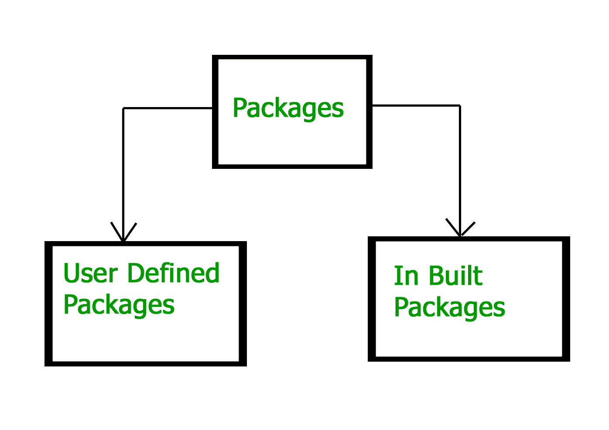
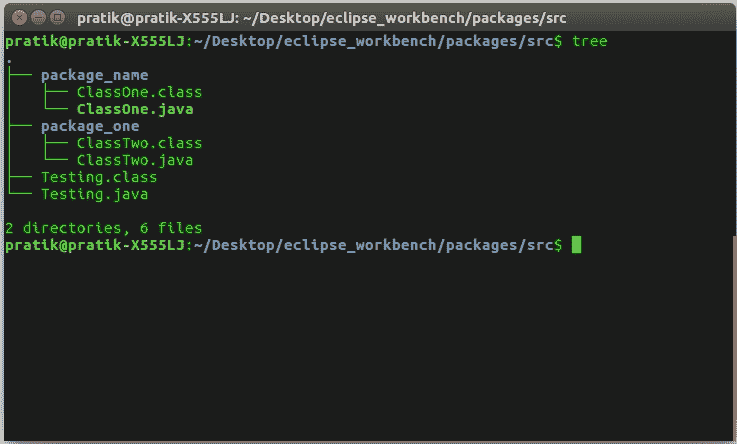

# Java 包

> 原文:[https://www.geeksforgeeks.org/packages-in-java/](https://www.geeksforgeeks.org/packages-in-java/)

[Java](https://www.geeksforgeeks.org/java/) 中的**包**是封装一组类、子包和接口的机制。包用于:

*   防止命名冲突。例如，在两个包中可以有两个名为 Employee 的类，college.staff.cse.Employee 和 college.staff.ee.Employee
*   使类、接口、枚举和注释的搜索/定位和使用更加容易
*   提供受控访问:受保护和默认具有包级访问控制。同一包及其子类中的类可以访问受保护的成员。默认成员(没有任何访问说明符)只能由同一包中的类访问。
*   包可以被认为是数据封装(或数据隐藏)。

我们所需要做的就是将相关的类放入包中。之后，我们可以简单地从现有的包中编写一个导入类，并在我们的程序中使用它。包是一组相关类的容器，其中一些类是可访问的，一些是公开的，而另一些是为了内部目的而保留的。
我们可以在程序中根据需要多次重用包中的现有类。

**包是如何工作的？**

包名和目录结构密切相关。例如，如果一个包名是 *college.staff.cse* ，那么有三个目录， *college* 、 *staff* 和 *cse* 使得 *cse* 出现在 *staff* 中， *staff* 出现在 *college* 中。另外，目录*学院*可以通过[类路径](https://en.wikipedia.org/wiki/Classpath_(Java))变量访问，即学院的父目录路径存在于类路径中。这个想法是为了确保类易于定位。
**包命名约定:**包按照域名的逆序命名，即 org.geeksforgeeks.practice，比如在一个学院，推荐的约定是 college.tech.cse、college.tech.ee、college.art.history 等。

**向包中添加类:**我们可以通过使用程序顶部的包名并将其保存在包目录中，向创建的包中添加更多的类。我们需要一个新的 **java** 文件来定义一个公共类，否则我们可以将新类添加到现有的**中。java** 文件并重新编译。

**子包:**在另一个包中的包是**子包**。这些默认情况下是不导入的，它们必须显式导入。此外，子包的成员没有访问权限，也就是说，它们被视为受保护和默认访问说明符的不同包。
**例:**

```
import java.util.*;

```

**util** 是在 **java** 包中创建的一个子包。

**访问包内的类**

考虑以下两种说法:

```
// import the Vector class from util package.
import java.util.vector; 

// import all the classes from util package
import java.util.*; 

```

*   第一个语句用于从包含在 **java** 中的 **util** 包导入**向量**类。
*   第二条语句从 **util** 包导入所有类。

```
// All the classes and interfaces of this package
// will be accessible but not subpackages.
import package.*;

// Only mentioned class of this package will be accessible.
import package.classname;

// Class name is generally used when two packages have the same
// class name. For example in below code both packages have
// date class so using a fully qualified name to avoid conflict
import java.util.Date;
import my.packag.Date;

```

```
// Java program to demonstrate accessing of members when
// corresponding classes are imported and not imported.
import java.util.Vector;

public class ImportDemo
{
   public ImportDemo()
   {
      // java.util.Vector is imported, hence we are
      // able to access directly in our code.
      Vector newVector = new Vector();

      // java.util.ArrayList is not imported, hence 
      // we were referring to it using the complete 
      // package.
      java.util.ArrayList newList = new java.util.ArrayList();
   }

   public static void main(String arg[])
   {
      new ImportDemo();
   }
}
```

**套餐类型:**


**内置包**
这些包包含大量的类，它们是 Java **API** 的一部分。一些常用的内置包是:
1) **java.lang:** 包含语言支持类(例如定义基本数据类型、数学运算的 classed)。此包会自动导入。
2) **java.io:** 包含支持输入/输出操作的类。
3) **java.util:** 包含实现链表、字典和支持等数据结构的实用程序类；用于日期/时间操作。
4) **java.applet:** 包含用于创建 applet 的类。
5) **java.awt:** 包含用于实现图形用户界面组件的类(如按钮，；菜单等)。
6) **java.net:** 包含支持网络操作的类。

**用户定义的包**
这些是用户定义的包。首先我们创建一个目录**我的包**(名字应该和包的名字一样)。然后在目录中创建 **MyClass** ，第一个语句是**包名**。

```
// Name of the package must be same as the directory
// under which this file is saved
package myPackage;

public class MyClass
{
    public void getNames(String s)
    {        
        System.out.println(s);        
    }
}

```

现在我们可以在程序中使用 **MyClass** 类。

```
/* import 'MyClass' class from 'names' myPackage */
import myPackage.MyClass;

public class PrintName 
{
   public static void main(String args[]) 
   {       
      // Initializing the String variable 
      // with a value 
      String name = "GeeksforGeeks";

      // Creating an instance of class MyClass in 
      // the package.
      MyClass obj = new MyClass();

      obj.getNames(name);
   }
}

```

**注意:****必须保存在**我的包**目录中，因为它是包的一部分。**

****使用静态导入****

**静态导入是 **Java** 编程语言(版本 5 及以上)中引入的一项功能，它允许在类中定义为公共的成员(字段和方法)**静态**在 Java 代码中使用，而无需指定定义字段的类。
以下程序演示**静态导入**:**

```
// Note static keyword after import.
import static java.lang.System.*;

class StaticImportDemo
{
   public static void main(String args[])
   {      
        // We don't need to use 'System.out' 
        // as imported using static.
        out.println("GeeksforGeeks");
   }
}
```

**输出:**

```
 GeeksforGeeks
```

****处理名称冲突****

**我们唯一需要注意包的时候是我们有名字冲突的时候。例如，java.util 和 java.sql 包都有一个名为 Date 的类。如果我们在程序中导入这两个包，如下所示:**

```
import java.util.*;
import java.sql.*;

//And then use Date class, then we will get a compile-time error :

Date today ; //ERROR-- java.util.Date or java.sql.Date? 
```

**编译器将无法计算出我们想要哪个日期类。这个问题可以通过使用特定的导入语句来解决:**

```
import java.util.Date;
import java.sql.*; 
```

**如果我们需要两个日期类，那么我们需要在每次声明该类的新对象时使用完整的包名。
例如:**

```
java.util.Date deadLine = new java.util.Date();
java.sql.Date today = new java.sql.Date(); 
```

****目录结构****

**包名与用于存储类的目录结构密切相关。属于特定包的类(和其他实体)一起存储在同一个目录中。此外，它们存储在由其包名指定的子目录结构中。例如，包 com . zzz . project 1 . subject 2 的类 Circle 存储为“$BASE_DIR \ com \ zzz \ project 1 \ subject 2 \ Circle . class”，其中$ BASE _ DIR 表示包的基目录。显然，包名中的“点”对应于文件系统的子目录。**

**基本目录($BASE_DIR)可以位于文件系统中的任何位置。因此，Java 编译器和运行时必须被告知$BASE_DIR 的位置，以便定位这些类。这是通过一个名为 CLASSPATH 的环境变量来实现的。类路径类似于另一个环境变量 PATH，命令外壳使用它来搜索可执行程序。**

****设置类路径** :
类路径可以通过以下任意方式设置:**

*   **类路径可以在环境中永久设置:在 Windows 中，选择控制面板？系统？高级？环境变量？选择“系统变量”(针对所有用户)还是“用户变量”(仅针对当前登录的用户)？选择“编辑”(如果类路径已经存在)或“新建”？输入“CLASSPATH”作为变量名？输入所需的目录和 JAR 文件(用分号分隔)作为值(例如。；c:\ javaproject \ class；d:\tomcat\lib\servlet-api.jar”)。请注意，您需要包含当前的工作目录(用“.”表示))在类路径中。
    要检查类路径的当前设置，发出以下命令:

    ```
    > SET CLASSPATH

    ```** 
*   **通过发出以下命令，可以为特定的 CMD shell 会话临时设置类路径:

    ```
    > SET CLASSPATH=.;c:\javaproject\classes;d:\tomcat\lib\servlet-api.jar

    ```** 
*   **Instead of using the CLASSPATH environment variable, you can also use the command-line option -classpath or -cp of the javac and java commands, for example,

    ```
    > java –classpath c:\javaproject\classes com.abc.project1.subproject2.MyClass3

    ```

    **用户定义包的图示:**
    创建我们的第一个包:
    文件名–ClassOne.java

    ```
    package package_name;

    public class ClassOne {
        public void methodClassOne() {
            System.out.println("Hello there its ClassOne");
        }
    }
    ```

    创建我们的第二个包:
    文件名-ClassTwo.java

    ```
    package package_one;

    public class ClassTwo {
        public void methodClassTwo(){
            System.out.println("Hello there i am ClassTwo");
        }    
    }
    ```

    利用两个创建的包:
    文件名-Testing.java

    ```
    import package_one.ClassTwo;
    import package_name.ClassOne;

    public class Testing {
        public static void main(String[] args){
            ClassTwo a = new ClassTwo();
            ClassOne b = new ClassOne();
            a.methodClassTwo();
            b.methodClassOne();
        }
    }
    ```

    输出:

    ```
    Hello there i am ClassTwo
    Hello there its ClassOne

    ```

    现在看看包和测试类文件的目录结构:
    [](https://media.geeksforgeeks.org/wp-content/uploads/112.jpg)

    **重要点:**

    1.  每个类都是某个包的一部分。
    2.  如果没有指定包，文件中的类将进入一个特殊的未命名包(所有文件都是同一个未命名包)。
    3.  文件中的所有类/接口都是同一个包的一部分。多个文件可以指定相同的包名。
    4.  如果指定了包名，文件必须位于名为 name 的子目录中(即目录名必须与包名匹配)。
    5.  我们可以使用:**包名.类名**访问另一个(命名的)包中的公共类

    **相关文章:**[Java 中的 Packages 小测验](https://www.geeksforgeeks.org/java-gq/packages-gq/)
    **参考资料:**[http://pages . cs . wisc . edu/~ hasti/cs 368/javattorial/NOTES/Packages . html](http://pages.cs.wisc.edu/~hasti/cs368/JavaTutorial/NOTES/Packages.html)
    本文由[**Nikhil Meherwal**](https://auth.geeksforgeeks.org/profile.php?user=Nikhil%20Meherwal&list=practice)和 Prateek Agarwal 投稿。如果你喜欢 GeeksforGeeks 并想投稿，你也可以使用[write.geeksforgeeks.org](https://write.geeksforgeeks.org)写一篇文章或者把你的文章邮寄到 review-team@geeksforgeeks.org。看到你的文章出现在极客博客主页上，帮助其他极客。

    如果你发现任何不正确的地方，或者你想分享更多关于上面讨论的话题的信息，请写评论。**