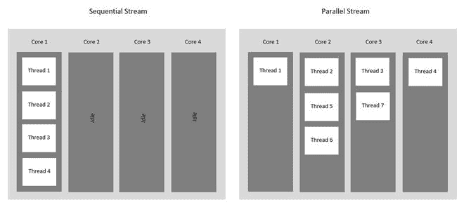

# Java 中的并行流与顺序流

> 原文:[https://www . geesforgeks . org/parallel-vs-sequential-stream-in-Java/](https://www.geeksforgeeks.org/parallel-vs-sequential-stream-in-java/)

**先决条件:** [**爪哇溪流**](https://www.geeksforgeeks.org/stream-in-java/)

Java 中的流是对数据源(如数组或集合)进行操作并支持各种方法的对象序列。它是在 Java 8 的 java.util.stream 包中引入的。Stream 支持许多聚合操作，如过滤、映射、限制、减少、查找和匹配，以根据程序员的需要将原始数据定制为不同的形式。对流执行的操作不会修改其源，因此会根据对其应用的操作创建一个新流。新数据是原始表单的转换副本。



### 顺序流

顺序流是使用单线程来处理流水线操作的非并行流。任何没有明确指定为并行的流操作都被视为顺序流。顺序流的对象在同一处理系统的单个流中流水线化，因此即使底层系统支持并行执行，它也从不利用多核系统的优势。顺序流逐个执行操作。

**stream()** 方法返回 Java 中的顺序流。

**示例:**

## Java 语言(一种计算机语言，尤用于创建网站)

```java
// Java program to understand execution
// of sequential streams

import java.io.*;
import java.util.*;
import java.util.stream.*;

class SequentialStreamDemo {

    public static void main(String[] args)
    {
        // create a list
        List<String> list = Arrays.asList( "Hello ", 
                          "G", "E", "E", "K", "S!");

        // we are using stream() method
          // for sequential stream
        // Iterate and print each element
          // of the stream
        list.stream().forEach(System.out::print);
    }
}
```

**Output**

```java
Hello GEEKS!
```

在本例中， **list.stream()** 通过 print()操作在单线程上按顺序工作，在前面程序的输出中，列表的内容按顺序打印，因为这是一个顺序流。

### 平行流

使用并行处理是 Java 非常有用的特性，即使整个程序可能没有并行化。并行流利用多核处理器，这提高了其性能。使用并行流，我们的代码被分成多个流，这些流可以在系统的不同内核上并行执行，最终结果显示为所有单个内核结果的组合。整个程序不一定要并行化，但至少某些处理流的部分应该并行化。执行的顺序不在我们的控制之下，可能会给我们带来不可预测的无序结果，就像任何其他并行编程一样，它们既复杂又容易出错。

Java 流库提供了两种实现方法。容易，并且以可靠的方式。

*   获取并行流的简单方法之一是调用**集合**接口的[parallelistream()](https://www.geeksforgeeks.org/what-is-java-parallel-streams/)方法。
*   另一种方法是调用[【并行】(](https://www.geeksforgeeks.org/what-is-java-parallel-streams/) )方法的 **BaseStream** 接口上的一个顺序流。

确保并行流的结果与通过顺序流获得的结果相同非常重要，因此并行流必须是无状态的、无干扰的和关联的。

**示例:**

## Java 语言(一种计算机语言，尤用于创建网站)

```java
// Java code to demonstrate
// ParallelStreams

import java.io.*;
import java.util.*;
import java.util.stream.*;

class ParallelStreamExample {
    public static void main(String[] args)
    {
        // create a list
        List<String> list = Arrays.asList("Hello ", 
                         "G", "E", "E", "K", "S!");

        // using parallelStream() 
        // method for parallel stream
        list.parallelStream().forEach(System.out::print);
    }
}
```

**Output**

```java
ES!KGEHello
```

在这里我们可以看到顺序并没有像列表中那样被维护。如果我们多次运行这个代码，那么我们还可以看到，每次我们都获得不同的输出顺序，但是这个并行流提高了性能，所以顺序不重要的情况是最好的技术。

**注意:**如果我们想让并行流中的每个元素都有序，我们可以使用 [forEachOrdered()](https://www.geeksforgeeks.org/stream-foreachordered-method-java-examples/) 方法，而不是 [forEach()](https://www.geeksforgeeks.org/stream-foreach-method-java-examples/) 方法。

**示例:**

## Java 语言(一种计算机语言，尤用于创建网站)

```java
// Java code to demonstrate Iterating in 
// the same order via parallelStream

import java.io.*;
import java.util.*;
import java.util.stream.*;

class ParallelStreamWithOrderedIteration {

    public static void main(String[] args)
    {
          // create a list
        List<String> list
            = Arrays.asList("Hello ","G", "E", "E", "K", "S!");

        // using parallelStream() method for parallel stream
        list.parallelStream().forEachOrdered(System.out::print);
    }
}
```

**Output**

```java
Hello GEEKS!
```

根据我们的要求，我们总是可以很容易地在并行和顺序之间切换。如果我们想将并行流更改为顺序流，那么我们应该使用**基础流**接口指定的顺序()方法。

**顺序流和并行流的区别**

<figure class="table">

| 

顺序流

 | 

并行流

 |
| --- | --- |
| Run on the single core of the computer. | Using multi-core of computer. |
| Poor performance | High performance. |
| Order is maintained. | Don't care about the order, |
| There is only one iteration at a time, just like for-loop | Run multiple iterations in different available cores at the same time. |
| Each iteration waits for the completion of the currently running iteration, | Wait only when there is no idle or available kernel at a given time, |
| More reliable, fewer mistakes, | Not reliable, easy to make mistakes. |
| Platform independence, | Platform dependence |

</figure>

### 结论

流应用编程接口由于其有趣的特性，长期以来一直是 Java 的一部分。由于并行处理能力和改进的性能，它也非常受欢迎。在这个时代，每个现代机器都是多核的，所以为了有效地利用这个核，我们应该使用并行流，然而并行编程设计是复杂的。因此，程序员完全可以根据需求决定是使用并行流还是顺序流。