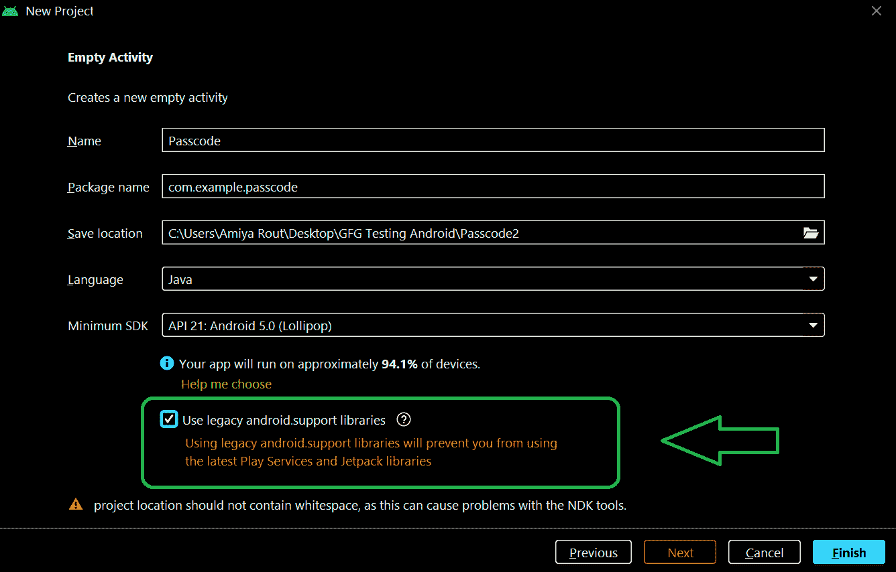
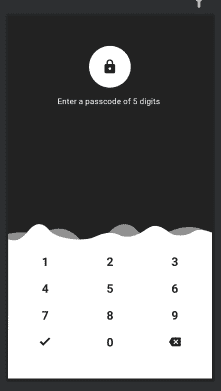

# 安卓密码视图，示例

> 原文:[https://www . geeksforgeeks . org/passcodeview-in-Android-with-example/](https://www.geeksforgeeks.org/passcodeview-in-android-with-example/)

在这里，我们将看到如何在 android studio 中实现数字密码视图，以及如何使用它来为用户的应用程序设置数字密码。

### 什么是密码视图？

“密码”视图是一个自定义视图，带有键盘和用于身份验证的字符或数字显示。数字密码(个人识别码)的应用

*   用于在安卓应用程序中保护我们的隐私细节和个人信息。
*   使用数字密码或 pin 变得非常方便。
*   没有人能轻易猜出这样或破解这样的密码。
*   它在我们的设备上作为应用锁定我们的应用。

### 我们将在本文中构建什么？

在本文中，我们将使用依赖项在项目中添加密码视图，然后使用它在 activity_main.xml 文件中导入密码视图，然后我们必须使用 MainActivity.java 文件设置密码。注意，我们将使用 **Java** 语言来实现这个应用程序。下面给出了一个示例视频，以了解我们将在本文中做什么。

<video class="wp-video-shortcode" id="video-641669-1" width="640" height="360" preload="metadata" controls=""><source type="video/mp4" src="https://media.geeksforgeeks.org/wp-content/uploads/20210708145631/WhatsApp-Video-2021-07-08-at-14.54.21.mp4?_=1">[https://media.geeksforgeeks.org/wp-content/uploads/20210708145631/WhatsApp-Video-2021-07-08-at-14.54.21.mp4](https://media.geeksforgeeks.org/wp-content/uploads/20210708145631/WhatsApp-Video-2021-07-08-at-14.54.21.mp4)</video>

### 逐步实施

**第一步:创建新项目**

*   打开一个新项目。
*   我们将使用 Java 语言来处理空活动。保持所有其他选项不变。
*   您可以在方便的时候更改项目的名称。
*   将有两个名为 activity_main.xml 和 MainActivity.java 的默认文件。

如果你不知道如何在安卓工作室创建新项目，那么你可以参考[如何在安卓工作室创建/启动新项目？](https://www.geeksforgeeks.org/android-how-to-create-start-a-new-project-in-android-studio/)

> **注意:**不要忘记勾选“使用旧版 android.support 库”选项。否则，当我们将应用程序安装到手机上时，它可能会崩溃。参考下图。



**第二步:**导航到**Gradle Scripts>build . Gradle(模块)**文件，并在其中添加以下依赖项。之后点击立即同步保存项目中的更改。

```java
implementation 'com.hanks:passcodeview:0.1.2'
```

**第三步:创建新活动**

按照以下流程创建新活动。右键点击**布局>新增>活动>清空活动。**选择语言为 java，命名为**密码 _ 活动**。

**第 4 步:处理 XML 文件**

**使用 activity_main.xml 文件:**

这里我们将创建一个密码视图，它是从我们在项目开始时添加的依赖项中导入的。在 **activity_main.xml** 文件中使用下面的代码。

## 可扩展标记语言

```java
<?xml version="1.0" encoding="utf-8"?>
<!-- Relative layout as parent layout-->
<RelativeLayout 
    xmlns:android="http://schemas.android.com/apk/res/android"
    xmlns:app="http://schemas.android.com/apk/res-auto"
    xmlns:tools="http://schemas.android.com/tools"
    android:layout_width="match_parent"
    android:layout_height="match_parent"
    tools:context=".MainActivity">

    <!-- Passcode view , which is imported
         from the dependency which have been added in
         gradle file-->
    <com.hanks.passcodeview.PasscodeView
        android:id="@+id/passcodeview"
        android:layout_width="match_parent"
        android:layout_height="match_parent"
        android:background="#222222"
        app:correctStateColor="#71bb4d"
        app:firstInputTip="Enter a passcode of 5 digits "
        app:normalStateColor="#ffffff"
        app:numberTextColor="#222222"
        app:passcodeLength="5"
        app:passcodeViewType="set_passcode"
        app:wrongStateColor="#ea2b46" />

</RelativeLayout>
```

执行上述代码后， **activity_main.xml** 的设计如下



**使用 activity _ 验证码. xml 文件:**

这是在我们的密码被成功接受后或当我们输入正确的密码时出现的屏幕。在**activity _ 验证码. xml** 文件中使用下面的代码。

## 可扩展标记语言

```java
<?xml version="1.0" encoding="utf-8"?>
<!-- Constraint layout as parent layout-->
<android.support.constraint.ConstraintLayout 
    xmlns:android="http://schemas.android.com/apk/res/android"
    xmlns:app="http://schemas.android.com/apk/res-auto"
    xmlns:tools="http://schemas.android.com/tools"
    android:layout_width="match_parent"
    android:layout_height="match_parent"
    tools:context=".passcode_activity">

    <!-- textview to display welcome message-->
    <TextView
        android:id="@+id/textView"
        android:layout_width="wrap_content"
        android:layout_height="wrap_content"
        android:text="Welcome"
        android:textColor="#00C809"
        android:textColorHint="#10B618"
        android:textSize="40sp"
        android:textStyle="bold|italic"
        app:layout_constraintBottom_toBottomOf="parent"
        app:layout_constraintEnd_toEndOf="parent"
        app:layout_constraintHorizontal_bias="0.497"
        app:layout_constraintStart_toStartOf="parent"
        app:layout_constraintTop_toTopOf="parent"
        app:layout_constraintVertical_bias="0.235" />

    <!-- textview displaying message "to"-->
    <TextView
        android:id="@+id/textView2"
        android:layout_width="wrap_content"
        android:layout_height="wrap_content"
        android:text="to"
        android:textColor="#02E30C"
        android:textSize="24sp"
        android:textStyle="bold|italic"
        app:layout_constraintBottom_toBottomOf="parent"
        app:layout_constraintEnd_toEndOf="parent"
        app:layout_constraintStart_toStartOf="parent"
        app:layout_constraintTop_toBottomOf="@+id/textView"
        app:layout_constraintVertical_bias="0.094" />

    <!-- image view to display image of geeksforgeeks logo-->
    <ImageView
        android:id="@+id/imageView"
        android:layout_width="wrap_content"
        android:layout_height="wrap_content"
        app:layout_constraintBottom_toBottomOf="parent"
        app:layout_constraintEnd_toEndOf="parent"
        app:layout_constraintHorizontal_bias="1.0"
        app:layout_constraintStart_toStartOf="parent"
        app:layout_constraintTop_toBottomOf="@+id/textView2"
        app:layout_constraintVertical_bias="0.166"
        app:srcCompat="@drawable/gfgimage" />

</android.support.constraint.ConstraintLayout>
```

执行完上面的 activity _ 验证码. xml 的代码设计后，看起来像。


**第五步:使用 Java 文件**

**正在处理 MainActivity.java 文件:**

转到**MainActivity.java**文件，参考以下代码。以下是**MainActivity.java**文件的代码。代码中添加了注释，以更详细地理解代码。

## Java 语言(一种计算机语言，尤用于创建网站)

```java
import android.content.Intent;
import android.os.Bundle;
import android.support.v7.app.AppCompatActivity;
import android.widget.Toast;

import com.hanks.passcodeview.PasscodeView;

public class MainActivity extends AppCompatActivity {

    // initialize variable passcodeview
    PasscodeView passcodeView;

    @Override
    protected void onCreate(Bundle savedInstanceState) {
        super.onCreate(savedInstanceState);
        setContentView(R.layout.activity_main);

        passcodeView = findViewById(R.id.passcodeview);

        // to set length of password as here
        // we have set the length as 5 digits
        passcodeView.setPasscodeLength(5)
                // to set pincode or passcode
                .setLocalPasscode("12369")

                // to set listener to it to check whether
                // passwords has matched or failed
                .setListener(new PasscodeView.PasscodeViewListener() {
                    @Override
                    public void onFail() {
                        // to show message when Password is incorrect
                        Toast.makeText(MainActivity.this, "Password is wrong!", Toast.LENGTH_SHORT).show();
                    }

                    @Override
                    public void onSuccess(String number) {
                        // here is used so that when password
                        // is correct user will be
                        // directly navigated to next activity
                        Intent intent_passcode = new Intent(MainActivity.this, passcode_activity.class);
                        startActivity(intent_passcode);
                    }
                });
    }
}
```

**使用验证码 _activity.java 文件:**

在**密码 _activity.java** 文件中使用下面的代码。

## Java 语言(一种计算机语言，尤用于创建网站)

```java
import android.os.Bundle;
import android.support.v7.app.AppCompatActivity;

public class passcode_activity extends AppCompatActivity {

    @Override
    protected void onCreate(Bundle savedInstanceState) {
        super.onCreate(savedInstanceState);
        setContentView(R.layout.activity_passcode);
    }

    @Override
    public void onBackPressed() {
        // this method is used to finish the activity
        // when user enters the correct password
        this.finishAffinity();
    }
}
```

恭喜你！！，我们已经使用密码视图成功实现了数字密码。这是我们应用程序的最终输出。

**输出:**

<video class="wp-video-shortcode" id="video-641669-2" width="640" height="360" preload="metadata" controls=""><source type="video/mp4" src="https://media.geeksforgeeks.org/wp-content/uploads/20210708145631/WhatsApp-Video-2021-07-08-at-14.54.21.mp4?_=2">[https://media.geeksforgeeks.org/wp-content/uploads/20210708145631/WhatsApp-Video-2021-07-08-at-14.54.21.mp4](https://media.geeksforgeeks.org/wp-content/uploads/20210708145631/WhatsApp-Video-2021-07-08-at-14.54.21.mp4)</video>