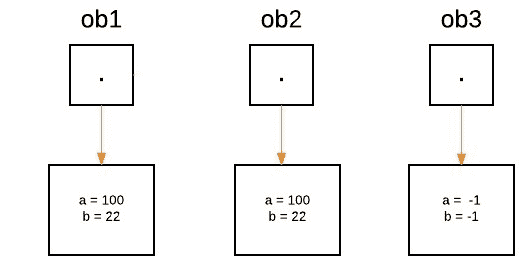
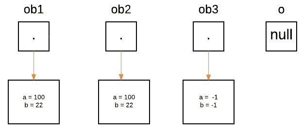
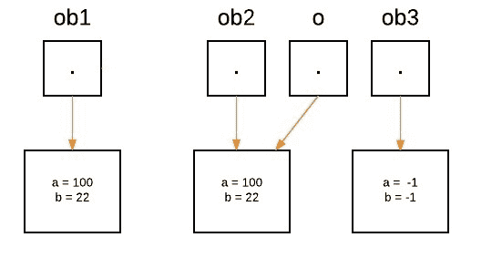
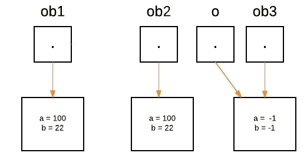

# 在 Java 中传递和返回对象

> 原文:[https://www . geesforgeks . org/Java 中传递和返回对象/](https://www.geeksforgeeks.org/passing-and-returning-objects-in-java/)

虽然 Java 是通过值严格传递[的，但是传递的是](https://www.geeksforgeeks.org/g-fact-31-java-is-strictly-pass-by-value/)[基元类型](https://www.geeksforgeeks.org/data-types-in-java/)还是引用类型之间的精确效果是不同的。当我们将一个基元类型传递给一个方法时，它是通过值传递的。但是当我们将一个对象传递给一个方法时，情况会发生巨大的变化，因为对象是通过有效的按引用调用传递的。Java 做了一件有趣的事情，有点像是按值传递和按引用传递的混合。
基本上，一个参数是不能被函数改变的，但是函数可以通过调用其中的某个方法来要求参数改变自己。

*   创建类类型的变量时，我们只创建对对象的引用。因此，当我们将此引用传递给方法时，接收它的参数将引用与参数引用的对象相同的对象。
*   这实际上意味着对象的行为就像它们通过使用引用调用被传递给方法一样。
*   对方法内部对象的更改确实反映了用作参数的对象。

**图解:**假设创建了三个对象‘ob1’、‘ob2’和‘ob3’:

```
ObjectPassDemo ob1 = new ObjectPassDemo(100, 22);
ObjectPassDemo ob2 = new ObjectPassDemo(100, 22);
ObjectPassDemo ob3 = new ObjectPassDemo(-1, -1);
```



在方法端，一个名为 a 的 Foo 类型的引用被声明，并且它最初被赋值为 null。

```
boolean equalTo(ObjectPassDemo o);
```



当我们调用 equalTo 方法时，引用“o”将被分配给作为参数传递的对象，即“o”将在以下语句执行时引用“ob2”。

```
System.out.println("ob1 == ob2: " + ob1.equalTo(ob2));
```



现在我们可以看到，在‘ob1’上调用了 equalTo 方法，‘o’指的是‘ob2’。因为“a”和“b”的值对于两个引用都是相同的，所以如果(condition)为真，那么将返回布尔值 true。

```
if(o.a == a && o.b == b)
```

当以下语句执行时,“o”将再次重新分配给“ob3”。

```
System.out.println("ob1 == ob3: " + ob1.equalTo(ob3));
```



*   现在我们可以看到，在‘ob1’上调用了 equalTo 方法，‘o’指的是‘ob3’。由于两个引用的“a”和“b”的值不相同，因此如果(条件)为 false，则执行 else 块，并返回 false。

在 Java 中，我们可以通过下面的程序将对象传递给方法，如下所示:

**示例:**

## Java 语言(一种计算机语言，尤用于创建网站)

```
// Java Program to Demonstrate Objects Passing to Methods.

// Class
// Helper class
class ObjectPassDemo {
    int a, b;

    // Constructor
    ObjectPassDemo(int i, int j)
    {
        a = i;
        b = j;
    }

    // Method
    boolean equalTo(ObjectPassDemo o)
    {
        // Returns true if o is equal to the invoking
        // object notice an object is passed as an
        // argument to method
        return (o.a == a && o.b == b);
    }
}

// Main class
public class GFG {
    // MAin driver method
    public static void main(String args[])
    {
        // Creating object of above class inside main()
        ObjectPassDemo ob1 = new ObjectPassDemo(100, 22);
        ObjectPassDemo ob2 = new ObjectPassDemo(100, 22);
        ObjectPassDemo ob3 = new ObjectPassDemo(-1, -1);

        // Checking whether object arw equal as custom
        // values
        // above passed and printing corresponding boolean
        // value
        System.out.println("ob1 == ob2: "
                           + ob1.equalTo(ob2));
        System.out.println("ob1 == ob3: "
                           + ob1.equalTo(ob3));
    }
}
```

**Output**

```
ob1 == ob2: true
ob1 == ob3: false
```

### 定义将类的对象作为参数的构造函数

对象参数最常见的用途之一涉及构造函数。通常，在实践中，需要构造一个新的对象，以便它最初与一些现有的对象相同。为此，我们可以使用 [Object.clone()](https://www.geeksforgeeks.org/clone-method-in-java-2/) 方法，或者定义一个构造函数，将它的类的一个对象作为参数。

**例**

## Java 语言(一种计算机语言，尤用于创建网站)

```
// Java program to Demonstrate One Object to
// Initialize Another

// Class 1
class Box {
    double width, height, depth;

    // Notice this constructor. It takes an
    // object of type Box. This constructor use
    // one object to initialize another
    Box(Box ob)
    {
        width = ob.width;
        height = ob.height;
        depth = ob.depth;
    }

    // constructor used when all dimensions
    // specified
    Box(double w, double h, double d)
    {
        width = w;
        height = h;
        depth = d;
    }

    // compute and return volume
    double volume() { return width * height * depth; }
}

// MAin class
public class GFG {
    // Main driver method
    public static void main(String args[])
    {
        // Creating a box with all dimensions specified
        Box mybox = new Box(10, 20, 15);

        //  Creating a copy of mybox
        Box myclone = new Box(mybox);

        double vol;

        // Get volume of mybox
        vol = mybox.volume();
        System.out.println("Volume of mybox is " + vol);

        // Get volume of myclone
        vol = myclone.volume();
        System.out.println("Volume of myclone is " + vol);
    }
}
```

**Output**

```
Volume of mybox is 3000.0
Volume of myclone is 3000.0
```

### **返回物体**

在 java 中，方法可以返回任何类型的数据，包括对象。例如，在下面的程序中， **incrByTen( )** 方法返回一个对象，其中一个(整数变量)的值比它在调用对象中的值大十倍。

**例**

## Java 语言(一种计算机语言，尤用于创建网站)

```
// Java Program to Demonstrate Returning of Objects

// Class 1
class ObjectReturnDemo {
    int a;

    // Constructor
    ObjectReturnDemo(int i) { a = i; }

    // Method returns an object
    ObjectReturnDemo incrByTen()
    {
        ObjectReturnDemo temp
            = new ObjectReturnDemo(a + 10);
        return temp;
    }
}

// Class 2
// Main class
public class GFG {

    // Main driver method
    public static void main(String args[])
    {

        // Creating object of class1 inside main() method
        ObjectReturnDemo ob1 = new ObjectReturnDemo(2);
        ObjectReturnDemo ob2;

        ob2 = ob1.incrByTen();

        System.out.println("ob1.a: " + ob1.a);
        System.out.println("ob2.a: " + ob2.a);
    }
}
```

**Output**

```
ob1.a: 2
ob2.a: 12
```

> **注意:**当一个对象引用被传递给一个方法时，引用本身是通过使用按值调用来传递的。但是，由于正在传递的值引用了一个对象，因此该值的副本仍将引用与其相应参数相同的对象。这就是为什么我们说 java 是[严格的按值传递](https://www.geeksforgeeks.org/g-fact-31-java-is-strictly-pass-by-value/)。

本文由**高拉夫·米格拉尼**供稿。如果你喜欢 GeeksforGeeks 并想投稿，你也可以使用[write.geeksforgeeks.org](https://write.geeksforgeeks.org)写一篇文章或者把你的文章邮寄到 review-team@geeksforgeeks.org。看到你的文章出现在极客博客主页上，帮助其他极客。如果你发现任何不正确的地方，或者你想分享更多关于上面讨论的话题的信息，请写评论。