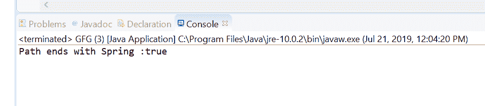
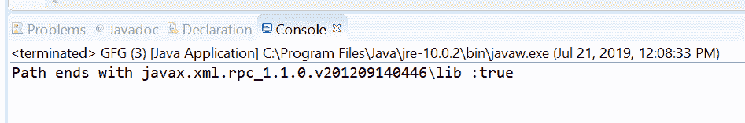

# Java 中的 Path endsWith()方法，示例

> 原文:[https://www . geesforgeks . org/path-end swith-method-in-Java-with-examples/](https://www.geeksforgeeks.org/path-endswith-method-in-java-with-examples/)

**end swith()**[的](https://www.geeksforgeeks.org/tag/java-path/)**方法使用 c 来检查这个路径对象是否以我们作为参数传递的给定路径或字符串结束。
有两种类型的 endsWith()方法。**

1.  **endsWith(String other)** method of **[java.nio.file.Path](https://www.geeksforgeeks.org/tag/java-path/)** used to check if this path ends with a Path, constructed by converting the given path string which we passed as a parameter to this method. For example, this path “dir1/file1” ends with “dir1/file1” and “file1”. It does not end with “1” or “/file1”. Note that trailing separators are not taken into account, and so invoking this method on the Path”dir1/file1″ with the String “file1/” returns true.

    **语法:**

    ```
    default boolean endsWith(String other)

    ```

    **参数:**此方法接受单个参数**其他**，这是给定的路径字符串。

    **返回值:**如果该路径以给定路径结束，则该方法返回 true 否则为假。

    **异常:**如果路径字符串无法转换为路径，该方法抛出**invaliddathexception**。

    下面的程序说明了 endwith(String other)方法:
    **程序 1:**

    ```
    // Java program to demonstrate
    // Path.endsWith(String other) method

    import java.nio.file.Path;
    import java.nio.file.Paths;
    public class GFG {
        public static void main(String[] args)
        {

            // create object of Path
            Path path = Paths.get("\\temp\\Spring");

            // create a string object
            String passedPath = "Spring";

            // call endsWith() to check path object
            // ends with passedPath or not
            boolean check = path.endsWith(passedPath);

            // print result
            System.out.println("Path ends with "
                               + passedPath + " :"
                               + check);
        }
    }
    ```

    **Output:**
2.  **endsWith(Path other)** method of **[java.nio.file.Path](https://www.geeksforgeeks.org/tag/java-path/)** used to check if this path ends with the given path as parameter to method or not.This method return true if this path ends with the given path; otherwise false.
    If the passed path has N elements, and no root component and this path have N or more elements, then this path ends with the given path if the last N elements of each path, starting at the element farthest from the root, are equal.
    If the passed path has a root component then this path ends with the given path if the root component of this path ends with the root component of the given path, and the corresponding elements of both paths are equal. Whether or not the root component of this path ends with the root component of the given path is filesystem-specific. If this path does not have a root component and the given path has a root component then this path does not end with the given path.
    If the given path is associated with a different FileSystem to this path then false is returned.

    **语法:**

    ```
    boolean endsWith(Path other)

    ```

    **参数:**此方法接受单个参数**其他**，这是给定的路径。

    **返回值:**如果该路径以给定路径结束，则该方法返回 true 否则为假。

    以下程序说明了结束切换(路径其他)方法:
    **程序 1:**

    ```
    // Java program to demonstrate
    // java.nio.file.Path.(Path other) method

    import java.nio.file.Path;
    import java.nio.file.Paths;
    public class GFG {
        public static void main(String[] args)
        {

            // create an object of Path
            Path path
                = Paths.get("D:\\eclipse"
                            + "\\plugins"
                            + "\\javax.xml.rpc_1.1.0.v201209140446"
                            + "\\lib");

            // create a path object which we will pass
            // to endsWith method to check functionality
            // of endsWith(Path other) method
            Path passedPath = Paths.get(
                "javax.xml.rpc_1.1.0.v201209140446"
                + "\\lib");

            // call endsWith() to check path object
            // ends with passedPath or not
            boolean check = path.endsWith(passedPath);

            // print result
            System.out.println("Path ends with "
                               + passedPath + " :"
                               + check);
        }
    }
    ```

    **Output:**

**参考文献:**

*   [https://docs . Oracle . com/javase/10/docs/API/Java/nio/file/path . html # end swith(Java . lang . string)](https://docs.oracle.com/javase/10/docs/api/java/nio/file/Path.html#endsWith(java.lang.String))
*   [https://docs . Oracle . com/javase/10/docs/API/Java/nio/file/path . html # endsWith(Java . nio . file . path)](https://docs.oracle.com/javase/10/docs/api/java/nio/file/Path.html#endsWith(java.nio.file.Path))