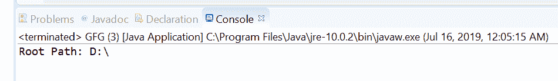
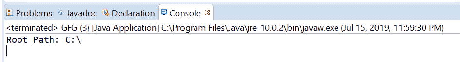

# Java 中的 Path getRoot()方法，带示例

> 原文:[https://www . geesforgeks . org/path-getroot-method-in-Java-with-examples/](https://www.geeksforgeeks.org/path-getroot-method-in-java-with-examples/)

Java 7 中的 [Java NIO](https://www.geeksforgeeks.org/tag/java-nio-package/) 增加了 Java **路径接口**。Path 接口位于 java.nio.file 包中，因此 Java Path 接口的完全限定名是 Java . nio . file . Path。Java Path 实例表示文件系统中的一个路径。路径可以用来定位文件或目录。实体的路径可以有两种类型:一种是绝对路径，另一种是相对路径。绝对路径是从根到实体的位置地址，而相对路径是相对于其他路径的位置地址。

**getRoot()** 方法的 **java.nio.file.Path** 用来返回这个 Path 对象的根组件的 path 对象，如果这个 path 没有根组件则返回 null。

**语法:**

```
Path getRoot()

```

**参数:**此方法不接受任何内容。

**返回值:**这个方法返回一个表示这个路径的根组件的路径，或者 null。

以下程序说明 getRoot()方法:
**程序 1:**

```
// Java program to demonstrate
// java.nio.file.Path.getRoot() method

import java.io.IOException;
import java.nio.file.Path;
import java.nio.file.Paths;

public class GFG {
    public static void main(String[] args)
        throws IOException
    {

        // create object of Path
        Path path = Paths.get("D:\\eclipse");

        // call getRoot() to get root path
        Path root = path.getRoot();

        // print Root Path
        System.out.println("Root Path: "
                           + root);
    }
}
```

**Output:**[](https://media.geeksforgeeks.org/wp-content/uploads/20190716000557/getRoot1.png)

**程序 2:**

```
// Java program to demonstrate
// java.nio.file.Path.getRoot() method

import java.io.IOException;
import java.nio.file.Path;
import java.nio.file.Paths;

public class GFG {
    public static void main(String[] args)
        throws IOException
    {

        // create object of Path
        Path path = Paths.get("C:/Resume.pdf");

        // call getRoot() to get root path
        Path root = path.getRoot();

        // print RootPath
        System.out.println("Root Path: "
                           + root);
    }
}
```

**Output:**[](https://media.geeksforgeeks.org/wp-content/uploads/20190716000622/getRoot2.png)

**参考文献:**[https://docs . Oracle . com/javase/10/docs/API/Java/nio/file/path . html # getRoot()](https://docs.oracle.com/javase/10/docs/api/java/nio/file/Path.html#getRoot())