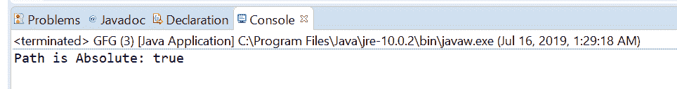

# Java 中的 Path isAbsolute()方法，带示例

> 原文:[https://www . geesforgeks . org/path-isabsolut-method-in-Java-with-examples/](https://www.geeksforgeeks.org/path-isabsolute-method-in-java-with-examples/)

Java 7 中的 [Java NIO](https://www.geeksforgeeks.org/tag/java-nio-package/) 增加了 Java **路径接口**。**isabsolut()**方法的 **java.nio.file.Path** 用来检查这个路径是否是绝对的。当且仅当此路径是绝对路径时，此方法返回 true。绝对路径是不需要与其他路径信息组合来定位文件的路径。

**语法:**

```java
boolean isAbsolute()

```

**参数:**此方法不接受任何内容。

**返回值:**当且仅当该路径为绝对路径时，该方法返回 true。

下面的程序说明了 isAbsolute()方法:
**程序 1:**

```java
// Java program to demonstrate
// java.nio.file.Path.isAbsolute() method

import java.io.IOException;
import java.nio.file.Path;
import java.nio.file.Paths;

public class GFG {
    public static void main(String[] args)
        throws IOException
    {

        // create an object of Path
        Path path
            = Paths.get("D:\\eclipse\\configuration"
                        + "\\org.eclipse.update");

        // call isAbsolute() to get check
        // path is absolute or not
        boolean isAbsolute = path.isAbsolute();

        // print isAbsolute
        System.out.println("Path is Absolute: "
                           + isAbsolute);
    }
}
```

**Output:**[](https://media.geeksforgeeks.org/wp-content/uploads/20190716013203/isAbsolute1.png)

**程序 2:**

```java
// Java program to demonstrate
// java.nio.file.Path.isAbsolute() method

import java.io.IOException;
import java.nio.file.Path;
import java.nio.file.Paths;

public class GFG {
    public static void main(String[] args)
        throws IOException
    {

        // create object of Path
        Path path = Paths.get("temp\\Spring");

        // call isAbsolute() to get check
        // path is absolute or not
        boolean isAbsolute = path.isAbsolute();

        // print isAbsolute
        System.out.println("Path is Absolute: "
                           + isAbsolute);
    }
}
```

**Output:**[](https://media.geeksforgeeks.org/wp-content/uploads/20190716013221/isAbsolute2.png)

**参考文献:**[https://docs . Oracle . com/javase/10/docs/API/Java/nio/file/path . html # isabsolut()](https://docs.oracle.com/javase/10/docs/api/java/nio/file/Path.html#isAbsolute())