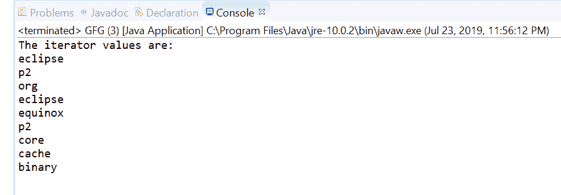
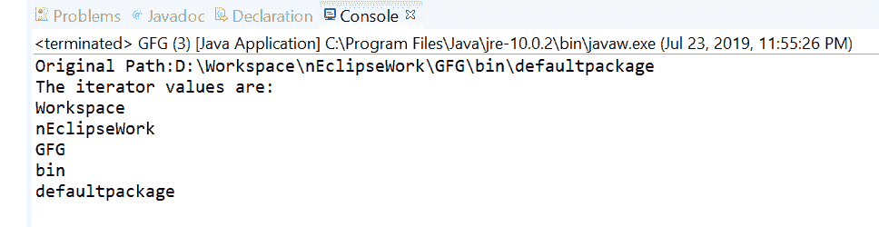

# Java 中的路径迭代器()方法，示例

> 原文:[https://www . geesforgeks . org/path-iterator-method-in-Java-with-examples/](https://www.geeksforgeeks.org/path-iterator-method-in-java-with-examples/)

**[的**迭代器()**方法。](https://www.geeksforgeeks.org/tag/java-nio-file-package/)[路径](https://www.geeksforgeeks.org/tag/java-path/)** 用于返回构造该路径的名称元素的迭代器。
这个迭代器的第一个元素包含目录层次结构中最接近根目录的 name 元素，第二个元素是次接近的，以此类推。这个迭代器的最后一个元素是由这个路径表示的文件或目录的名称。迭代器不返回根组件。

**语法:**

```
default Iterator<Path> iterator()

```

**参数:**此方法不接受任何内容。它是无参数方法。

**返回值:**这个方法返回这个路径的名字元素的迭代器。

下面的程序说明迭代器()方法:
**程序 1:**

```
// Java program to demonstrate
// java.nio.file.Path.iterator() method

import java.nio.file.Path;
import java.nio.file.Paths;
import java.util.*;

public class GFG {
    public static void main(String[] args)
    {

        // create object of Path
        Path path
            = Paths.get("D:\\eclipse\\p2"
                        + "\\org\\eclipse\\equinox\\p2\\core"
                        + "\\cache\\binary");

        // Creating an iterator
        Iterator<Path> elements
            = path.iterator();

        // Displaying the values
        System.out.println("The iterator values are: ");
        while (elements.hasNext()) {
            System.out.println(elements.next());
        }
    }
}
```

**Output:**

**程序 2:**

```
// Java program to demonstrate
// java.nio.file.Path.iterator() method

import java.nio.file.Path;
import java.nio.file.Paths;
import java.util.*;

public class GFG {
    public static void main(String[] args)
    {

        // create object of Path
        Path path
            = Paths.get("D:\\Workspace"
                        + "\\nEclipseWork"
                        + "\\GFG\\bin\\defaultpackage");

        System.out.println("Original Path:"
                           + path);

        // Creating an iterator
        Iterator<Path> elements
            = path.iterator();

        // Displaying the values
        System.out.println("The iterator values are: ");
        while (elements.hasNext()) {
            System.out.println(elements.next());
        }
    }
}
```

**Output:**

**参考文献:**[https://docs . Oracle . com/javase/10/docs/API/Java/nio/file/path . html # iterator()](https://docs.oracle.com/javase/10/docs/api/java/nio/file/Path.html#iterator())