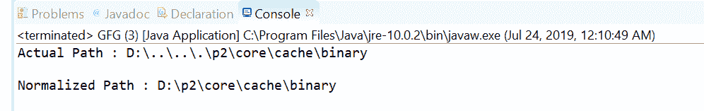
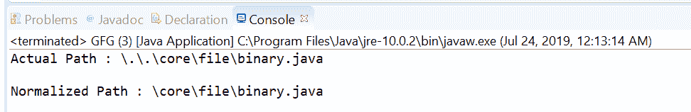

# Java 中的路径规范化()方法，示例

> 原文:[https://www . geesforgeks . org/path-normalize-method-in-Java-with-examples/](https://www.geeksforgeeks.org/path-normalize-method-in-java-with-examples/)

**[java.nio.file](https://www.geeksforgeeks.org/tag/java-nio-file-package/) 的 **normalize()** 方法。[路径](https://www.geeksforgeeks.org/tag/java-path/)** 用于从当前路径返回一条路径，在该路径中消除了所有冗余的名称元素。
这个方法的精确定义是依赖于实现的，并且它导出了一个不包含冗余名称元素的路径。在许多文件系统中和“..”是表示当前目录和父目录的特殊名称。在这些情况下，所有出现的“.”被认为是多余的，如果一个“..”前面是一个非“-..”那么这两个名字都被认为是多余的。

**语法:**

```
Path normalize()

```

**参数:**此方法不接受任何内容。它是无参数方法。

**返回值:**该方法返回结果路径，如果不包含冗余名称元素，则返回该路径；如果此路径没有根组件，并且所有名称元素都是冗余的，则返回空路径。

以下程序说明 normalize()方法:
**程序 1:**

```
// Java program to demonstrate
// java.nio.file.Path.normalize() method

import java.nio.file.*;

public class GFG {
    public static void main(String[] args)
    {

        // create object of Path
        // In this example \\.. starts with non".."
        // element
        Path path
            = Paths.get("D:\\..\\..\\.\\p2\\core"
                        + "\\cache\\binary");

        // print actual path
        System.out.println("Actual Path : "
                           + path);

        // normalize the path
        Path normalizedPath = path.normalize();

        // print normalized path
        System.out.println("\nNormalized Path : "
                           + normalizedPath);
    }
}
```

**Output:**

**程序 2:**

```
// Java program to demonstrate
// java.nio.file.Path.normalize() method

import java.nio.file.*;

public class GFG {
    public static void main(String[] args)
    {

        // create object of Path
        Path path
            = Paths.get("\\.\\.\\core"
                        + "\\file\\binary.java");

        // print actual path
        System.out.println("Actual Path : "
                           + path);

        // normalize the path
        Path normalizedPath = path.normalize();

        // print normalized path
        System.out.println("\nNormalized Path : "
                           + normalizedPath);
    }
}
```

**Output:**

**参考文献:**[https://docs . Oracle . com/javase/10/docs/API/Java/nio/file/path . html # normalize()](https://docs.oracle.com/javase/10/docs/api/java/nio/file/Path.html#normalize())