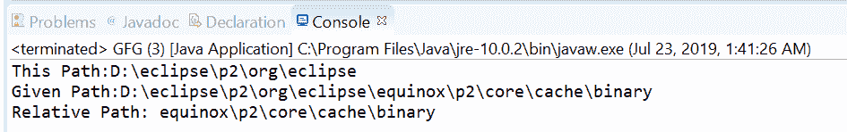
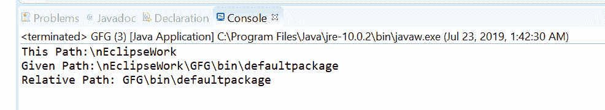

# Java 中的路径相对化()方法，示例

> 原文:[https://www . geesforgeks . org/path-relatize-method-in-Java-with-examples/](https://www.geeksforgeeks.org/path-relativize-method-in-java-with-examples/)

**[的**相对化(路径其他)**方法。](https://www.geeksforgeeks.org/tag/java-nio-file-package/)[路径](https://www.geeksforgeeks.org/tag/java-path/)** 用于创建该路径与给定路径之间的相对路径作为参数。
相对化是分辨率的倒数。此方法创建一个相对路径，当根据此路径对象解析时，会产生一个路径，帮助我们定位与给定路径相同的文件。

**例如**如果这个路径是“/dir1/dir2”，给定的路径作为参数是“/dir1/dir2/dir3/file1”，那么这个方法将构造一个相对路径“dir3/file1”。如果该路径和给定路径没有根组件，则可以构建相对路径。

如果任何一个路径都有根组件，那么相对路径就不能被构造。当两个路径都有根组件时，如果可以构造相对路径，则它依赖于实现。如果该路径和给定路径相等，则返回一个空路径。

**语法:**

```java
Path relativize(Path other)

```

**参数:**该方法接受一个参数**另一个参数**，这是相对于该路径的路径。

**返回值:**该方法返回得到的相对路径，如果两条路径相等，则返回空路径。

**异常:**如果其他不是可以相对于此路径的路径，此方法将引发 IllegalArgumentException。

下面的程序说明相对化()方法:
**程序 1:**

```java
// Java program to demonstrate
// java.nio.file.Path.relativize() method

import java.nio.file.Path;
import java.nio.file.Paths;
public class GFG {
    public static void main(String[] args)
    {

        // create objects of Path
        Path path
            = Paths.get("D:\\eclipse\\p2"
                        + "\\org\\eclipse");
        Path passedPath
            = Paths.get("D:\\eclipse\\p2"
                        + "\\org\\eclipse\\equinox\\p2\\core"
                        + "\\cache\\binary");

        // print paths
        System.out.println("This Path:"
                           + path);
        System.out.println("Given Path:"
                           + passedPath);

        // call relativize() to create
        // a relative path
        Path relativize
            = path.relativize(passedPath);

        // print result
        System.out.println("Relative Path: "
                           + relativize);
    }
}
```

**Output:**

**程序 2:**

```java
// Java program to demonstrate
// java.nio.file.Path.relativize() method

import java.nio.file.Path;
import java.nio.file.Paths;
public class GFG {
    public static void main(String[] args)
    {

        // create objects of Path
        Path path
            = Paths.get("\\nEclipseWork");
        Path passedPath
            = Paths.get("\\nEclipseWork\\GFG"
                        + "\\bin\\defaultpackage");

        // print paths
        System.out.println("This Path:"
                           + path);
        System.out.println("Given Path:"
                           + passedPath);

        // call relativize()
        // to create a relative path
        Path relativize
            = path.relativize(passedPath);

        // print result
        System.out.println("Relative Path: "
                           + relativize);
    }
}
```

**Output:**

**参考文献:**[https://docs . Oracle . com/javase/10/docs/API/Java/nio/file/path . html # relative ize(Java . nio . file . path)](https://docs.oracle.com/javase/10/docs/api/java/nio/file/Path.html#relativize(java.nio.file.Path))