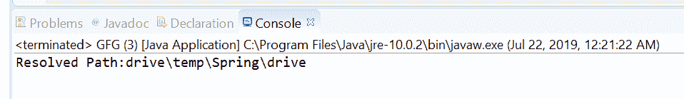
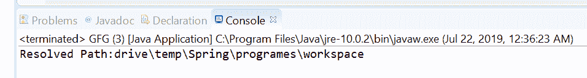

# Java 中的路径解析()方法，示例

> 原文:[https://www . geesforgeks . org/path-resolve-method-in-Java-with-examples/](https://www.geeksforgeeks.org/path-resolve-method-in-java-with-examples/)

**resolve()**[Java . nio . file . path](https://www.geeksforgeeks.org/tag/java-path/)**的**方法，用于根据此路径解析给定路径。

resolve()方法有两种类型。

1.  **resolve(String other)** method of **[java.nio.file.Path](https://www.geeksforgeeks.org/tag/java-path/)** used to converts a given path string to a Path and resolves it against this Path in the exact same manner as specified by the resolve method. For example, If the name separator is “/” and a path represents “c/drive/files”, then invoking this method with the path string “file1” will result in the Path “c/drive/files/file1”.

    **语法:**

    ```java
    default Path resolve(String other)

    ```

    **参数:**此方法接受单个参数**其他**，这是针对此路径解析的路径字符串。

    **返回值:**此方法返回结果路径。

    **异常:**如果路径字符串不能转换为路径，该方法抛出**无效路径异常**..

    以下程序说明了解析(字符串其他)方法:
    **程序 1:**

    ```java
    // Java program to demonstrate
    // Path.resolve(String other) method

    import java.nio.file.*;

    public class GFG {
        public static void main(String[] args)
        {

            // create an object of Path
            Path path
                = Paths.get("drive\\temp\\Spring");

            // create a string object
            String passedPath = "drive";

            // call resolve() to create resolved Path
            Path resolvedPath
                = path.resolve(passedPath);

            // print result
            System.out.println("Resolved Path:"
                               + resolvedPath);
        }
    }
    ```

    **Output:**
2.  **resolve(Path other)** method of **[java.nio.file.Path](https://www.geeksforgeeks.org/tag/java-path/)** used to resolve the given path against this path. This method will going to connect both paths together.If this path is “C/temp” and passed path is “drive/newFile” then this method will add passed path in the end of this path and use “/” as a separator. So resolved path will be “C/temp/drive/newFile”.

    如果另一个参数是绝对路径，那么这个方法通常会返回其他。如果 other 是一个空路径，那么这个方法通常会返回这个路径。否则，此方法将此路径视为目录，并根据此路径解析给定路径。在最简单的情况下，给定路径没有根组件，在这种情况下，该方法将给定路径连接到该路径，并返回以给定路径结束的结果路径。在给定路径有根组件的情况下，解析高度依赖于实现，因此未指定。

    **语法:**

    ```java
    Path resolve(Path other)

    ```

    **参数:**此方法接受单个参数**其他**，这是针对此路径进行解析的路径。

    **返回值:**此方法返回结果路径。

    以下程序说明了解析(路径其他)方法:
    **程序 1:**

    ```java
    // Java program to demonstrate
    // Path.resolve(Path other) method

    import java.nio.file.*;

    public class GFG {
        public static void main(String[] args)
        {

            // create an object of Path
            Path path
                = Paths.get("drive\\temp\\Spring");

            // create an object of Path
            // to pass to resolve method
            Path path2
                = Paths.get("programes\\workspace");

            // call resolve()
            // to create resolved Path
            Path resolvedPath
                = path.resolve(path2);

            // print result
            System.out.println("Resolved Path:"
                               + resolvedPath);
        }
    }
    ```

    **Output:**

**参考文献:**

*   [https://docs . Oracle . com/javase/10/docs/API/Java/nio/file/path . html # resolve(Java . lang . string)](https://docs.oracle.com/javase/10/docs/api/java/nio/file/Path.html#resolve(java.lang.String))
*   [https://docs . Oracle . com/javase/10/docs/API/Java/nio/file/path . html # resolve(Java . nio . file . path)](https://docs.oracle.com/javase/10/docs/api/java/nio/file/Path.html#resolve(java.nio.file.Path))