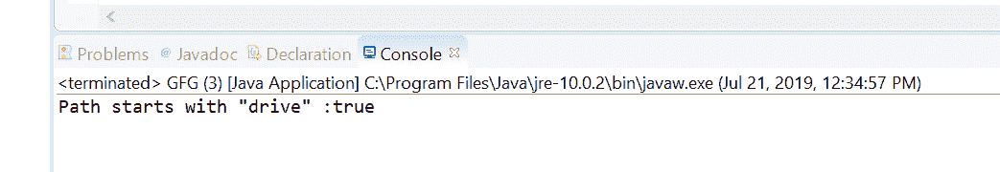
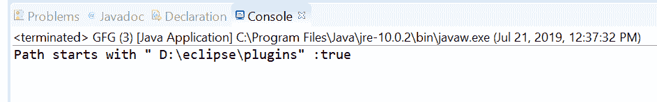

# Java 中的 Path startsWith()方法，示例

> 原文:[https://www . geesforgeks . org/path-starts with-method-in-Java-with-examples/](https://www.geeksforgeeks.org/path-startswith-method-in-java-with-examples/)

**starts with()**[方法使用 c 来检查这个路径对象是否以我们作为参数传递的给定路径或字符串开始。
starts with()方法有两种类型。](https://www.geeksforgeeks.org/tag/java-path/)****

1.  **startsWith(String other)** method of **[java.nio.file.Path](https://www.geeksforgeeks.org/tag/java-path/)** used to check if this path starts with a Path, constructed by converting the given path string which we passed as a parameter to this method. For example, this path “dir1/file1” starts with “dir1/file1” and “dir1”. It does not end with “d” or “dir”.

    **语法:**

    ```
    default boolean startsWith(String other)

    ```

    **参数:**此方法接受单个参数**其他**，这是给定的路径字符串。

    **返回值:**如果该路径从给定路径开始，则该方法返回 true 否则为假。

    **异常:**如果路径字符串无法转换为路径，该方法抛出**invaliddathexception**。

    下面的程序举例说明了 startwith(String other)方法:
    **程序 1:**

    ```
    // Java program to demonstrate
    // Path.startsWith(String other) method

    import java.nio.file.Path;
    import java.nio.file.Paths;
    public class GFG {
        public static void main(String[] args)
        {

            // create object of Path
            Path path
                = Paths.get("drive\\temp\\Spring");

            // create a string object
            String passedPath = "drive";

            // call startsWith() to check path object
            // starts with passedPath or not
            boolean check = path.startsWith(passedPath);

            // print result
            System.out.println("Path starts with \""
                               + passedPath + "\" :"
                               + check);
        }
    }
    ```

    **Output:**
2.  **startsWith(Path other)** method of **[java.nio.file.Path](https://www.geeksforgeeks.org/tag/java-path/)** used to check if this path starts with the given path as parameter to method or not.This method return true if this path starts with the given path; otherwise false.
    This path starts with the given path if this path’s root component starts with the root component of the given path, and this path starts with the same name elements as the given path. If the given path has more name elements than this path then false is returned.
    Whether or not the root component of this path starts with the root component of the given path is files system-specific. If this path does not have a root component and the given path has a root component then this path does not start with the given path.
    If the given path is associated with a different FileSystem to this path then false is returned.

    **语法:**

    ```
    boolean startsWith(Path other)

    ```

    **参数:**此方法接受单个参数**其他**，这是给定的路径。

    **返回值:**如果该路径从给定路径开始，则该方法返回 true 否则为假。

    下面的程序举例说明了 startsWith(路径其他)方法:
    **程序 1:**

    ```
    // Java program to demonstrate
    // java.nio.file.Path.(Path other) method

    import java.nio.file.Path;
    import java.nio.file.Paths;
    public class GFG {
        public static void main(String[] args)
        {

            // create object of Path
            Path path
                = Paths.get("D:\\eclipse"
                            + "\\plugins"
                            + "\\javax.xml.rpc_1.1.0.v201209140446"
                            + "\\lib");

            // create a path object which we will pass
            // to startsWith method to check functionality
            // of startsWith(Path other) method
            Path passedPath
                = Paths.get(
                    "D:\\eclipse"
                    + "\\plugins");

            // call startsWith() to check path object
            // starts with passedPath or not
            boolean check = path.startsWith(passedPath);

            // print result
            System.out.println("Path starts with \" "
                               + passedPath + "\" :"
                               + check);
        }
    }
    ```

    **Output:**

**参考文献:**

*   [https://docs . Oracle . com/javase/10/docs/API/Java/nio/file/path . html # starts with(Java . lang . string)](https://docs.oracle.com/javase/10/docs/api/java/nio/file/Path.html#startsWith(java.lang.String))
*   [https://docs . Oracle . com/javase/10/docs/API/Java/nio/file/path . html # starts with(Java . nio . file . path)](https://docs.oracle.com/javase/10/docs/api/java/nio/file/Path.html#startsWith(java.nio.file.Path))