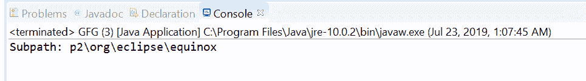
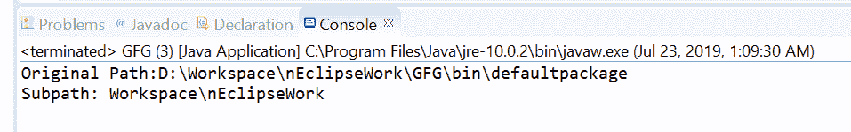

# Java 中的路径子路径()方法，示例

> 原文:[https://www . geesforgeks . org/path-subpath-method-in-Java-with-examples/](https://www.geeksforgeeks.org/path-subpath-method-in-java-with-examples/)

**[java.nio.file](https://www.geeksforgeeks.org/tag/java-nio-file-package/) 的**子路径(int beginIndex，int endIndex)** 方法。[路径](https://www.geeksforgeeks.org/tag/java-path/)** 用于返回相对路径，该路径是该路径的名称元素的子序列。我们将通过**开始和结束索引**来构建一个子路径。beginIndex 和 EnDix 参数指定名称元素的子序列。目录层次结构中最接近根的名称元素是索引 0，最远离根的名称元素的索引计数为-1。返回的子路径对象的名称元素从 beginIndex 开始，延伸到索引 endIndex-1 处的元素。

**语法:**

```
Path subpath(int beginIndex,
             int endIndex)

```

**参数:**该方法接受一个两个参数:

*   **beginIndex** 是第一个元素的索引，包含和
*   **endIndex** 是最后一个元素的索引，不包括。

**返回值:**该方法返回一个**新路径对象**，它是该路径中名称元素的子序列。

**异常:**如果 beginIndex 为负，或者大于等于元素个数，则该方法抛出 IllegalArgumentException。如果 endIndex 小于或等于 beginIndex，或大于元素数。

以下程序说明子路径()方法:
**程序 1:**

```
// Java program to demonstrate
// java.nio.file.Path.subpath() method

import java.nio.file.Path;
import java.nio.file.Paths;
public class GFG {
    public static void main(String[] args)
    {

        // create an object of Path
        Path path
            = Paths.get("D:\\eclipse\\p2"
                        + "\\org\\eclipse\\equinox\\p2\\core"
                        + "\\cache\\binary");

        // call subPath() to create a subPath which
        // begin at index 1 and ends at index 5
        Path subPath = path.subpath(1, 5);

        // print result
        System.out.println("Subpath: "
                           + subPath);
    }
}
```

**Output:**

**程序 2:**

```
// Java program to demonstrate
// java.nio.file.Path.subpath() method

import java.nio.file.Path;
import java.nio.file.Paths;
public class GFG {
    public static void main(String[] args)
    {

        // create an object of Path
        Path path
            = Paths.get("D:\\Workspace"
                        + "\\nEclipseWork"
                        + "\\GFG\\bin\\defaultpackage");

        System.out.println("Original Path:"
                           + path);

        // call subPath() to create a subPath which
        // begin at index 0 and ends at index 2
        Path subPath = path.subpath(0, 2);

        // print result
        System.out.println("Subpath: "
                           + subPath);
    }
}
```

**Output:**

**参考文献:**[https://docs . Oracle . com/javase/10/docs/API/Java/nio/file/path . html #子路径(int，int)](https://docs.oracle.com/javase/10/docs/api/java/nio/file/Path.html#subpath(int, int))