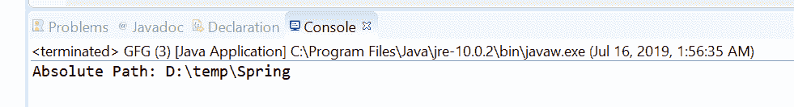
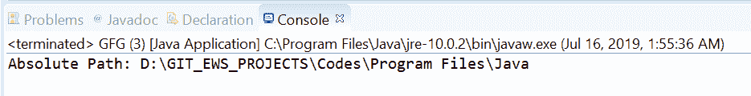

# Java 中的路径到 toAbsolutePath()方法，示例

> 原文:[https://www . geesforgeks . org/path-to bsolutepath-method-in-Java-with-examples/](https://www.geeksforgeeks.org/path-toabsolutepath-method-in-java-with-examples/)

Java 7 中的 [Java NIO](https://www.geeksforgeeks.org/tag/java-nio-package/) 增加了 Java **路径接口**。**to bsolutepath()**方法的 **java.nio.file.Path** 用来返回一个 Path 对象，表示这个 Path 对象的绝对路径。如果路径已经是绝对的，则该方法返回 path，否则该方法通过根据文件系统默认目录解析路径，以依赖于实现的方式解析该路径。根据实现的不同，如果文件系统不可访问，此方法可能会引发输入/输出错误。

**语法:**

```java
int toAbsolutePath()

```

**参数:**此方法不接受任何内容。

**返回值:**这个方法返回一个 Path 对象，表示绝对路径。

**异常:**该方法抛出以下异常:

*   **输入错误**–如果出现输入/输出错误
*   **security exception**–在默认提供程序的情况下，安装了一个安全管理器，并且该路径不是绝对的，然后是安全管理器的
*   **检查属性访问**方法被调用来检查对系统属性用户目录的访问

下面的程序说明了 toAbsolutePath()方法:
**程序 1:**

```java
// Java program to demonstrate
// java.nio.file.Path.toAbsolute() method

import java.io.IOException;
import java.nio.file.Path;
import java.nio.file.Paths;

public class GFG {
    public static void main(String[] args)
    {

        // create object of Path
        Path path = Paths.get("\\temp\\Spring");

        // call toAbsolutePath() to get
        // absolute path
        Path absPath = path.toAbsolutePath();

        // print absolute path
        System.out.println("Absolute Path: "
                           + absPath);
    }
}
```

**Output:**[](https://media.geeksforgeeks.org/wp-content/uploads/20190716015743/toAbsolute1.png)

**程序 2:**

```java
// Java program to demonstrate
// java.nio.file.Path.toAbsolutePath() method

import java.io.IOException;
import java.nio.file.Path;
import java.nio.file.Paths;

public class GFG {
    public static void main(String[] args)
    {

        // create object of Path
        Path path = Paths.get("Program Files\\Java");

        // call toAbsolutePath() to get
        // absolute path
        Path absPath= path.toAbsolutePath();

        // print absolute path
        System.out.println("Absolute Path: "
                           + absPath);
    }
}
```

**Output:**[](https://media.geeksforgeeks.org/wp-content/uploads/20190716015803/toAbsolute2.png)

**参考文献:**[https://docs . Oracle . com/javase/10/docs/API/Java/nio/file/path . html # to bsolutepath()](https://docs.oracle.com/javase/10/docs/api/java/nio/file/Path.html#toAbsolutePath())