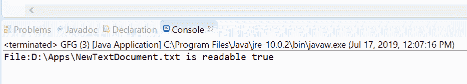
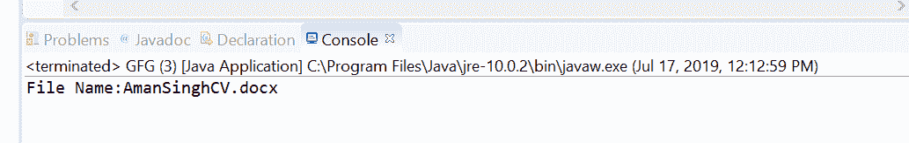

# Java 中的 Path toFile()方法，示例

> 原文:[https://www . geesforgeks . org/path-to file-method-in-Java-with-examples/](https://www.geeksforgeeks.org/path-tofile-method-in-java-with-examples/)

**java.nio.file.Path 接口**的 **toFile()** 方法，用来返回一个 [java.io.File](https://www.geeksforgeeks.org/file-class-in-java/) 对象，表示这个 Path 对象。如果这个路径与默认的提供者相关联，那么这个方法返回一个用这个路径的字符串表示构造的对象。如果这个路径是通过调用 [java.io.File](https://www.geeksforgeeks.org/file-class-in-java/) toPath 方法创建的，那么不能保证这个方法返回的 File 对象等于原始文件。如果此路径与默认提供程序不关联，此方法将引发**取消支持操作异常**。

**语法:**

```
default File toFile()

```

**参数:**此方法不接受任何内容。

**返回值:**这个方法返回一个 [java.io.File](https://www.geeksforgeeks.org/file-class-in-java/) 对象代表这个路径。

**异常:**如果此路径与默认提供程序不关联，此方法将引发**取消支持操作异常**。

以下程序说明了 toFile()方法:
**程序 1:**

```
// Java program to demonstrate
// java.nio.file.Path.toFile() method

import java.io.File;
import java.nio.file.Path;
import java.nio.file.Paths;

public class GFG {
    public static void main(String[] args)
    {

        // create object of Path
        Path path
 = Paths.get("D:\\Apps\\"
                              + "NewTextDocument.txt");

        // call toFile() to get
        // File object from path
        File file = path.toFile();

        // print file details
        System.out.println("File:" + file.toString()
                           + " is readable "
                           + file.canRead());
    }
}
```

**Output:**

**程序 2:**

```
// Java program to demonstrate
// java.nio.file.Path.toFile() method

import java.io.File;
import java.nio.file.Path;
import java.nio.file.Paths;
public class GFG {
    public static void main(String[] args)
    {

        // create object of Path
        Path path = Paths.get("D:\\temp\\"
                              + "AmanSinghCV.docx");

        // call toFile() to get
        // File object from path
        File file = path.toFile();

        // print file details
        System.out.println("File Name:"
                           + file.getName());
    }
}
```

**Output:**

**参考文献:**[https://docs . Oracle . com/javase/10/docs/API/Java/nio/file/path . html # toFile()](https://docs.oracle.com/javase/10/docs/api/java/nio/file/Path.html#toFile())