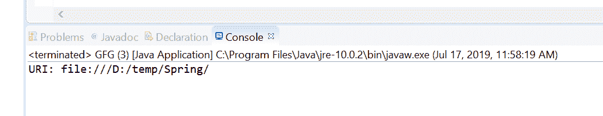

# Java 中的 Path toUri()方法，带示例

> 原文:[https://www . geesforgeks . org/path-touri-method-in-Java-with-examples/](https://www.geeksforgeeks.org/path-touri-method-in-java-with-examples/)

**java.nio.file.Path 接口**的 **toUri()** 方法用来返回一个 [URI](https://www.geeksforgeeks.org/java-net-uri-class-java/) 来表示这个路径。此方法将此路径转换为绝对 URI，其方案与标识提供者的 URI 方案相同。方案特定部分的确切形式高度依赖于提供商。在默认提供者的场景中， [URI](https://www.geeksforgeeks.org/java-net-uri-class-java/) 是分层的，路径组件是绝对的。查询和片段组件未定义。权限组件是否被定义取决于实现。不能保证 URI 可以用来构建一个 [java.io.File](https://www.geeksforgeeks.org/file-class-in-java/) 。特别地，如果该路径表示通用命名约定(UNC)路径，则 UNC 服务器名称可以被编码在结果 URI 的权威组件中。在默认提供程序的情况下，文件存在，并且可以确定该文件是一个目录，那么得到的 URI 将以斜杠结束。

**语法:**

```
URI toUri()

```

**参数:**此方法不接受任何内容。

**返回值:**此方法返回代表此路径的**[【URI】](https://www.geeksforgeeks.org/java-net-uri-class-java/)**。

**异常:**该方法抛出以下异常:

*   **IOError**–如果在获取绝对路径时出现 I/O 错误，或者文件系统被构造为作为文件系统访问文件内容，并且无法获取封闭文件系统的 URI
*   **security exception**–在默认提供程序的情况下，如果安装了安全管理器，toAbsolutePath 方法将引发安全异常。

以下程序说明了 toUri()方法:
**程序 1:**

```
// Java program to demonstrate
// java.nio.file.Path.toUri() method

import java.net.URI;
import java.nio.file.Path;
import java.nio.file.Paths;
public class GFG {
    public static void main(String[] args)
    {

        // create an object of Path
        Path path
            = Paths.get("\\temp\\Spring");

        // call toUri() to convert
        // path in URI
        URI uri = path.toUri();

        // print URI
        System.out.println("URI: "
                           + uri);
    }
}
```

**Output:**

**程序 2:**

```
// Java program to demonstrate
// java.nio.file.Path.toUri() method

import java.net.URI;
import java.nio.file.Path;
import java.nio.file.Paths;
public class GFG {
    public static void main(String[] args)
    {

        // create an object of Path
        Path path
            = Paths.get("D:\\eclipse\\configuration"
                        + "\\org.eclipse.update\\history");

        // call toUri() to convert
        // path in URI
        URI uri = path.toUri();

        // print URI
        System.out.println("URI: "
                           + uri);
    }
}
```

**Output:**

**参考:**[https://docs . Oracle . com/javase/10/docs/API/Java/nio/file/path . html # toUri()](https://docs.oracle.com/javase/10/docs/api/java/nio/file/Path.html#toUri())