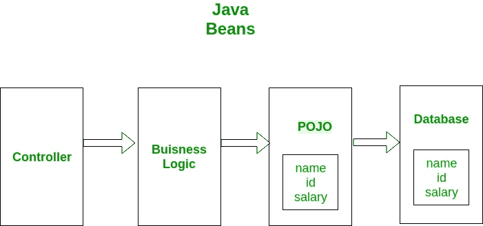

# POJO vs Java bean

> 原文:[https://www.geeksforgeeks.org/pojo-vs-java-beans/](https://www.geeksforgeeks.org/pojo-vs-java-beans/)

POJO 类

POJO 代表普通的旧 Java 对象。它是一个普通的 Java 对象，除了 Java 语言规范强制的限制之外，不受任何特殊限制的约束，也不需要任何类路径。POJOs 用于增加程序的可读性和可重用性。POJOs 获得了最多的认可，因为它们易于编写和理解。它们是由太阳微系统公司在 EJB 3.0 推出的。

**POJO 不应:**

1.  扩展预先指定的类，例如:公共类 GFG 扩展了 javax . servlet . http . HttpServlet {……}是**而不是**一个 POJO 类。
2.  实现预先指定的接口，例如:公共类 Bar 实现 javax.ejb.EntityBean { … }是**而不是**一个 POJO 类。
3.  包含预先指定的注释，例如:@javax.persistence.Entity 公共类 Baz { … }是**而不是**POJO 类。

POJOs 基本上定义了一个实体。像在您的程序中一样，如果您想要一个雇员类，那么您可以创建一个 POJO，如下所示:

## Java 语言(一种计算机语言，尤用于创建网站)

```java
// Employee POJO class to represent entity Employee
public class Employee
{
    // default field
    String name;

    // public field
    public String id;

    // private salary
    private double salary;

    //arg-constructor to initialize fields
    public Employee(String name, String id, 
                             double salary)
    {
        this.name = name;
        this.id = id;
        this.salary = salary;
    }

    // getter method for name
    public String getName()
    {
        return name;
    }

    // getter method for id
    public String getId()
    {
        return id;
    }

    // getter method for salary
    public Double getSalary()
    {
        return salary;
    }
}
```

上面的例子是一个定义良好的 POJO 类的例子。如您所见，对字段的访问修饰符没有限制。它们可以是私有的、默认的、受保护的或公共的。也没有必要在其中包含任何构造函数。
POJO 是封装业务逻辑的对象。下图显示了 POJO 类的一个工作示例。控制器与您的业务逻辑交互，业务逻辑又与 POJO 交互以访问数据库。在本例中，数据库实体由 POJO 表示。该 POJO 具有与数据库实体相同的成员。



**爪哇豆**

**豆类是婆婆纳的特殊类型。POJO 成为 bean 有一些限制。**

1.  所有的 Javabean 都是 POJOs，但不是所有的 POJOs 都是 Javabean。
2.  可序列化，即它们应该实现可序列化接口。尽管如此，一些没有实现 Serializable 接口的 POJO 被称为 POJO，因为 Serializable 是一个标记接口，因此没有太多负担。
3.  字段应该是私有的。这是为了提供对字段的完全控制。
4.  字段应该有 getters 或 setters，或者两者都有。
5.  bean 中应该有一个无参数构造函数。
6.  字段只能由构造函数或 getter setters 访问。

根据字段名，Getters 和 Setters 有一些特殊的名称。例如，如果字段名是 someProperty，那么它的 **getter** 最好是:

```java
public "returnType" getSomeProperty()
{
   return someProperty;
} 
```

而**设定器**将

```java
public void setSomePRoperty(someProperty)
{
   this.someProperty=someProperty;
}
```

吸气剂和沉降剂的可见性通常是公开的。获取器和设置器提供了对字段的完全限制。例如考虑下面的属性，

```java
Integer age;
```

如果你设置了年龄对公众的可见性，那么任何对象都可以使用这个。假设你希望年龄不能是 0。在这种情况下，你无法控制。任何对象都可以将其设置为 0。但是通过使用 setter 方法，您可以控制。您的 setter 方法中可以有一个条件。同样，对于 getter 方法，如果您希望年龄为 0，那么它应该返回 null，您可以通过使用 getter 方法来实现这一点，如下例所示:

## Java 语言(一种计算机语言，尤用于创建网站)

```java
// Java program to illustrate JavaBeans 
class Bean 
{ 
    // private field property 
    private Integer property; 
    Bean() 
    { 
        // No-arg constructor 
    } 

    // setter method for property 
    public void setProperty(Integer property) 
    { 
        if (property == 0) 
        { 
            // if property is 0 return 
            return; 
        } 
        this.property=property; 
    } 

    // getter method for property 
    public Integer getProperty() 
    { 
        if (property == 0) 
        { 
            // if property is 0 return null 
            return null; 
        } 
        return property; 
    } 
} 

// Class to test above bean 
public class GFG 
{ 
    public static void main(String[] args) 
    { 
        Bean bean = new Bean(); 

        bean.setProperty(0); 
        System.out.println("After setting to 0: " + 
                                 bean.getProperty()); 

        bean.setProperty(5); 
        System.out.println("After setting to valid" + 
                      " value: " + bean.getProperty()); 
    } 
}
```

输出:-

```java
After setting to 0: null
After setting to valid value: 5
```

**POJO vs Java Bean**

<figure class="table">

| 

POJO

 | 

Java Bean

 |
| --- | --- |
| There are no special restrictions except those imposed by Java language. | This is a special POJO with some limitations. |
| It doesn't provide much control over members. | Provides full control over members. |
| You can implement the Serializable interface. | Serializable interfaces should be implemented. |
| Fields can be accessed by name. | Fields can only be accessed by acquirers and setters. |
| The fields can have any visibility. | Only private visibility of fields. |
| There may or may not be -arg constructor. | There must be a parameterless constructor. |
| Use it when you don't want to set restrictions on your members to allow users full access to your entity. | Use when you want to provide users with your entity, but it is only a part of your entity. |

</figure>

**结论**

POJO 类和 Beans 都用于定义 java 对象，以提高它们的可读性和可重用性。POJO 没有其他限制，而 beans 是有一些限制的特殊 POJO。

本文由**维沙尔·加尔格**供稿。如果你喜欢 GeeksforGeeks 并想投稿，你也可以使用[write.geeksforgeeks.org](http://www.write.geeksforgeeks.org)写一篇文章或者把你的文章邮寄到 review-team@geeksforgeeks.org。看到你的文章出现在极客博客主页上，帮助其他极客。
如果你发现任何不正确的地方，或者你想分享更多关于上面讨论的话题的信息，请写评论。