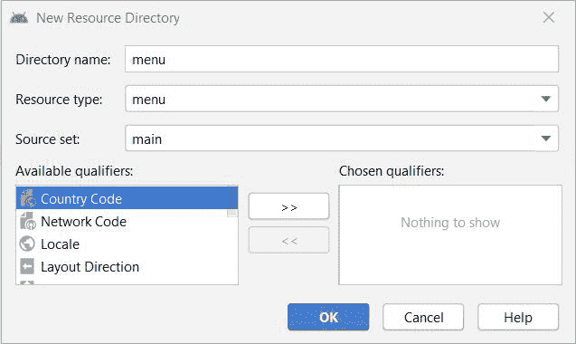

# 安卓系统弹出菜单示例

> 原文:[https://www . geeksforgeeks . org/带示例的安卓弹出式菜单/](https://www.geeksforgeeks.org/popup-menu-in-android-with-example/)

在安卓系统中， [菜单](https://www.geeksforgeeks.org/android-menus/) 是UI 组件的重要组成部分，该组件用于提供围绕应用程序的一些常见功能。借助菜单用户可以在整个应用中体验到流畅一致的体验。在安卓系统中，我们有三种类型的菜单可以用来定义我们的安卓应用程序中的一组选项和动作。安卓应用程序中的菜单如下:

*   [安卓选项菜单](https://www.geeksforgeeks.org/how-to-implement-options-menu-in-android/) : 安卓选项菜单是安卓应用程序中菜单项的主要集合，对于对搜索应用程序有全局影响的操作非常有用。
*   [安卓上下文菜单](https://www.geeksforgeeks.org/context-menu-in-android-with-example/) : 安卓上下文菜单是浮动菜单，只在用户长时间点击某个元素时出现，对影响所选内容或上下文框架的元素有用。
*   **安卓弹出菜单:** 安卓弹出菜单在垂直列表中显示项目列表，该列表呈现给调用菜单的视图，并且有助于提供与特定内容相关的动作的溢出。

因此，在本文中，我们将讨论弹出式菜单。一个**弹出窗口**在一个定位于[视图](https://www.geeksforgeeks.org/android-ui-layouts/#:~:text=Android%20List%20View%3A%20ListView%20is,View%20of%20rows%20and%20columns.)的弹出窗口中显示一个菜单 [](https://www.geeksforgeeks.org/android-menus/) 。如果视图上方有空间，弹出窗口将显示在锚定视图下方。如果任何 IME(输入法编辑器)可见，弹出窗口将不会重叠，直到视图(弹出窗口锚定)被触摸。触摸弹出窗口之外会消除它。

## **例**

在本例中，我们将制作一个固定在[按钮](https://www.geeksforgeeks.org/material-design-buttons-in-android-with-example/)上的弹出菜单，点击后，弹出菜单将出现，轻触弹出菜单项，将显示一条[祝酒信息](https://www.geeksforgeeks.org/android-what-is-toast-and-how-to-use-it-with-examples/)。下面给出了一个示例 GIF，以了解我们将在本文中做什么。请注意，我们将使用 **Java** 语言来实现这个项目。


### **分步实施**

**第一步:创建新项目**

要在安卓工作室创建新项目，请参考[如何在安卓工作室创建/启动新项目](https://www.geeksforgeeks.org/android-how-to-create-start-a-new-project-in-android-studio/)。注意选择 **Java** 作为编程语言。

**步骤 2:使用 activity_main.xml 文件**

在这一步中，我们将向布局文件中添加一个按钮，并给它一个 id，如 clickBtn。

## 可扩展标记语言

```
<?xml version="1.0" encoding="utf-8"?>
<androidx.constraintlayout.widget.ConstraintLayout 
    xmlns:android="http://schemas.android.com/apk/res/android"
    xmlns:app="http://schemas.android.com/apk/res-auto"
    xmlns:tools="http://schemas.android.com/tools"
    android:layout_width="match_parent"
    android:layout_height="match_parent"
    tools:context=".MainActivity">

    <Button
        android:id="@+id/clickBtn"
        android:layout_width="wrap_content"
        android:layout_height="wrap_content"
        android:background="#0F9D58"
        android:text="Click Me"
        android:textColor="#ffffff"
        app:layout_constraintBottom_toBottomOf="parent"
        app:layout_constraintLeft_toLeftOf="parent"
        app:layout_constraintRight_toRightOf="parent"
        app:layout_constraintTop_toTopOf="parent" />

</androidx.constraintlayout.widget.ConstraintLayout>
```

在进一步移动之前，让我们添加一些颜色属性，以增强应用程序栏。转到**应用程序> res >值> colors.xml** 并添加以下颜色属性。

## 可扩展标记语言

```
<resources>
    <color name="colorPrimary">#0F9D58</color>
    <color name="colorPrimaryDark">#16E37F</color>
    <color name="colorAccent">#03DAC5</color>
</resources>
```

**第三步:创建菜单目录和菜单文件**

首先，我们将创建一个包含菜单文件的菜单控制器。进入 **app > res >右键>新建>安卓资源目录**并给出目录名和资源类型作为菜单。



现在，我们将在菜单资源目录中创建一个**弹出菜单**文件。转到**应用程序> res >菜单>右键单击>新建>菜单资源文件**，创建一个菜单资源文件，并将其命名为 popup_menu。在 popup_menu 文件中，我们将添加菜单项。下面是 **popup_menu.xml** 文件的代码片段。

## 可扩展标记语言

```
<?xml version="1.0" encoding="utf-8"?>
<menu xmlns:android="http://schemas.android.com/apk/res/android">

    <item
        android:id="@+id/java"
        android:title="Java" />

    <item
        android:id="@+id/kotlin"
        android:title="Kotlin" />

    <item
        android:id="@+id/android"
        android:title="Android" />

    <item
        android:id="@+id/react_native"
        android:title="React Native" />

</menu>
```

**步骤 4:使用 MainActivity.java 文件**

在**MainActivity.java**文件中，我们将获取按钮的引用并初始化它。向按钮添加 onClick 行为，并向其扩展弹出菜单。以下是**MainActivity.java**文件的代码片段。

## Java 语言(一种计算机语言，尤用于创建网站)

```
import androidx.appcompat.app.AppCompatActivity;
import android.os.Bundle;
import android.view.MenuItem;
import android.view.View;
import android.widget.Button;
import android.widget.PopupMenu;
import android.widget.Toast;

public class MainActivity extends AppCompatActivity {

    Button button;

    @Override
    protected void onCreate(Bundle savedInstanceState) {
        super.onCreate(savedInstanceState);
        setContentView(R.layout.activity_main);

        // Referencing and Initializing the button
        button = (Button) findViewById(R.id.clickBtn);

          // Setting onClick behavior to the button
        button.setOnClickListener(new View.OnClickListener() {
            @Override
            public void onClick(View view) {
                // Initializing the popup menu and giving the reference as current context
                PopupMenu popupMenu = new PopupMenu(MainActivity.this, button);

                  // Inflating popup menu from popup_menu.xml file
                popupMenu.getMenuInflater().inflate(R.menu.popup_menu, popupMenu.getMenu());
                popupMenu.setOnMenuItemClickListener(new PopupMenu.OnMenuItemClickListener() {
                    @Override
                    public boolean onMenuItemClick(MenuItem menuItem) {
                        // Toast message on menu item clicked
                        Toast.makeText(MainActivity.this, "You Clicked " + menuItem.getTitle(), Toast.LENGTH_SHORT).show();
                        return true;
                    }
                });
                // Showing the popup menu
                popupMenu.show();
            }
        });
    }
}
```

### **输出:在仿真器上运行**

<video class="wp-video-shortcode" id="video-517712-1" width="640" height="360" preload="metadata" controls=""><source type="video/mp4" src="https://media.geeksforgeeks.org/wp-content/uploads/20201124223252/Popup-Menu-in-Android.mp4?_=1">[https://media.geeksforgeeks.org/wp-content/uploads/20201124223252/Popup-Menu-in-Android.mp4](https://media.geeksforgeeks.org/wp-content/uploads/20201124223252/Popup-Menu-in-Android.mp4)</video>