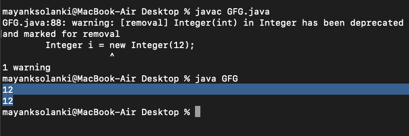

# 原语包装类在 Java 中是不可变的

> 原文:[https://www . geeksforgeeks . org/primitive-wrapper-class-in-Java 是不可变的/](https://www.geeksforgeeks.org/primitive-wrapper-classes-are-immutable-in-java/)

在 Java 中，不可变类是一个类(整数、字节、长、浮点、双精度、字符、布尔和短)，一旦创建，它的主体就不能更改，同样的情况也适用于一旦创建就不能更改的不可变对象。现在问题来了，在 Java 中处理原始数据类型时，我们确实需要包装类的帮助，因为这些类是不可变的。

极客们，现在你们一定想知道为什么我们要把它们变成不可变的，为此我们将列出一些优势，如下所示:

*   它们是自动同步的，因为根据不变性的定义，它们的状态不能改变。
*   不一致的范围为零，因为包装类的对象不能更改。
*   它有助于缓存，因为特定类型的一个实例本身就可以方便几十个应用程序。

> **提示:**包装类作为不可变对象的最佳用法是作为映射的键。**T3】**

**示例:**

## Java 语言(一种计算机语言，尤用于创建网站)

```java
// Java Program to Demonstrate that Primitive
// Wrapper Classes are Immutable

// Main class
class GFG {

    // Main driver method
    public static void main(String[] args)
    {

        // Getting an integer value
        Integer i = new Integer(12);

        // Printing the same integer value
        System.out.println(i);

        // Calling method 2
        modify(i);

        // Now printing the value stored in above integer
        System.out.println(i);
    }

    // Method 2
    // To modify integer value
    private static void modify(Integer i) { i = i + 1; }
}
```

**输出:**



**输出解释:**

这里，参数“I”是修改时的引用，它引用的对象与 main()中的“I”相同，但对“I”所做的更改不会反映在 main()方法中。这是因为 Java 中所有的原语包装类(Integer、Byte、Long、Float、Double、Character、Boolean 和 Short)都是不可变的，所以像加法和减法这样的操作会创建一个新的对象，而不会修改旧的对象。
modify 方法中的下面一行代码在包装类 Integer 上运行，而不是在 int 上运行，并且如下所述执行以下操作:

```java
i = i + 1;
```

*   将“I”取消装箱为 int 值
*   给那个值加 1
*   将结果框入另一个整数对象
*   将结果整数赋给“I”(从而改变“I”引用的对象)

因为对象引用是通过值传递的，所以在修改后的方法中采取的操作不会改变在修改调用中用作参数的 I。因此，在该方法返回后，主例程仍然打印 12。

本文由 **Yogesh D Doshi** 供稿。如果你发现任何不正确的地方，或者你想分享更多关于上面讨论的话题的信息，请写评论。