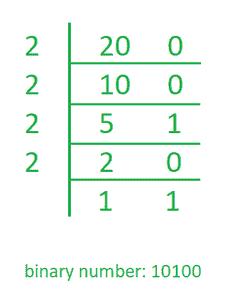

# 在 Java 中使用递归打印整数的二进制等价物

> 原文:[https://www . geesforgeks . org/print-二进制-等价于整数-使用 java 中的递归/](https://www.geeksforgeeks.org/print-binary-equivalent-of-an-integer-using-recursion-in-java/)

给定一个整数作为输入，我们需要编写一个程序，用 JAVA 将给定的整数转换成等价的二进制数。 [【大整数类】](https://www.geeksforgeeks.org/biginteger-class-in-java/) 用于数学运算，该运算涉及非常大的整数计算，超出了所有可用原始数据类型的限制。

**示例:**

```
Input : 1
Output:    1

Input : 12
Output: 1100

Input : 32
Output: 100000

```

**算法**

1.  当数组中的数被 2 除时，跟踪余数。
2.  把这个数除以 2。
3.  重复以上两个步骤，直到数字大于零。
4.  现在以相反的顺序打印数组。

**分步执行:**假设二进制数为 20。

*   当 20 除以 2 时，余数为零。因此，a[0] = 0。
*   20 除以 2。新数字是 20/2 = 10。
*   当 10 除以 2 时，余数为零。因此，a[1] = 0。
*   10 除以 2。新数字是 10/2 = 5。
*   当 5 除以 2 时，余数是 1。因此，a[2] = 1。
*   5 除以 2。新数字是 5/2 = 2。
*   当 2 除以 2 时，余数为零。因此，a[3] = 0。
*   2 除以 2。新数字是 2/2 = 1。
*   当 1 除以 2 时，余数是 1。因此，a[4] = 1。
*   1 除以 2。新数字是 1/2 = 0。
*   因为数字变成= 0。以相反的顺序打印数组。因此，等效的二进制数是 10100。

下图更清楚地展示了这个过程。



下面是上述思想在 JAVA 中的实现。

## Java 语言(一种计算机语言，尤用于创建网站)

```
// Java Program to Print Binary
// Equivalent of an Integer
// using Recursion
import java.util.*;
class GFG {

    public static int binaryConv(int n)
    {
        if (n == 1) {

            return 1;
        }
        return binaryConv(n / 2) * 10 + n % 2;
    }
    public static void main(String[] args)
    {
        int N = 20;
        System.out.println(binaryConv(N));
    }
}
```

**Output**

```
10100

```

**时间复杂度:** O (log(n))

**B .使用 BigInteger 类的转换**

## Java 语言(一种计算机语言，尤用于创建网站)

```
// Java Program to Print Binary
// Equivalent of an Integer
// using Recursion
import java.util.*;
import java.math.*;
class GFG {

    public static BigInteger binaryConv(BigInteger n)
    {
        if (n.compareTo(BigInteger.valueOf(1)) == 0) {

            return BigInteger.valueOf(1);
        }
        return ((binaryConv(n.divide(BigInteger.valueOf(2))).multiply(BigInteger.valueOf(10))).add(n.mod(BigInteger.valueOf(2))));
    }
    public static void main(String[] args)
    {
        BigInteger N = new BigInteger("9876543210987543210");
        System.out.println(binaryConv(N));
    }
}
```

**Output**

```
1000100100010000100001111011100011100011101101010101101010101010

```

**时间复杂度:** O (log(n))