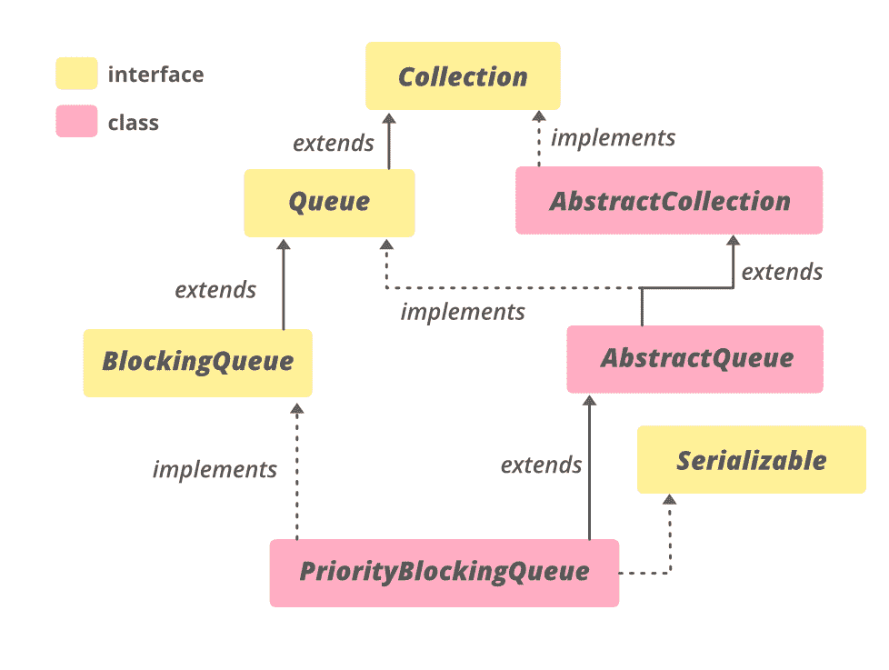

# Java 中的 PriorityBlockingQueue 类

> 原文:[https://www . geeksforgeeks . org/priorityblockingqueue-class-in-Java/](https://www.geeksforgeeks.org/priorityblockingqueue-class-in-java/)

**优先级阻塞队列**是一个无界阻塞队列，它使用与类 [**优先级队列**](https://www.geeksforgeeks.org/priority-queue-class-in-java-2/) 相同的排序规则，并提供阻塞检索操作。由于它是无界的，添加元素有时可能会因为资源耗尽而失败，导致 [**OutOfMemoryError**](https://www.geeksforgeeks.org/understanding-outofmemoryerror-exception-java/) 。此类不允许空元素。
PriorityBlockingQueue 类及其迭代器实现了 Collection 和 iterator 接口的所有可选方法。

方法[中提供的迭代器()和方法](https://www.geeksforgeeks.org/priorityblockingqueue-iterator-method-in-java/)[中提供的拆分器()和](https://www.google.com/url?client=internal-element-cse&cx=009682134359037907028:tj6eafkv_be&q=https://www.geeksforgeeks.org/priorityblockingqueue-spliterator-method-in-java/&sa=U&ved=2ahUKEwjTw86U7oHsAhU54XMBHY0_D7U4ChAWMAR6BAgFEAI&usg=AOvVaw1om6Xdr33wSkHRL1tNyIMC)不能保证以任何特定的顺序遍历优先级阻塞队列的元素。对于有序遍历，使用[**arrays . sort(pq . to array())**](https://www.geeksforgeeks.org/arrays-sort-in-java-with-examples/)。此外，方法 drainTo()可用于按优先级顺序移除一些或所有元素，并将它们放入另一个集合中。

对这个类的操作不能保证具有相同优先级的元素的顺序。如果需要强制排序，请定义自定义类或比较器，这些类或比较器使用辅助键来断开主优先级值的联系。
这个类是 Java 集合框架的成员。

**优先等级封锁队列**



它实现了**可序列化**、**可迭代< E >** 、**集合< E >** 、[阻塞队列< E >](https://www.geeksforgeeks.org/blockingqueue-interface-in-java/) 、[队列< E >](https://www.geeksforgeeks.org/queue-interface-java/) 接口并扩展了[抽象队列< E >](https://www.geeksforgeeks.org/abstractqueue-in-java-with-examples/) 类。

**申报:**

> 公共类优先级阻塞队列<e>扩展抽象队列<e>实现阻塞队列<e>，可序列化</e></e></e>

这里， **E** 是这个集合中持有的元素类型。

### 优先级阻塞队列的构造函数

为了创建 PriorityBlockingQueue 的实例，我们需要从**Java . util . concurrent . PriorityBlockingQueue**导入。

**1。PriorityBlockingQueue()**–创建一个具有默认初始容量(11)的 PriorityBlockingQueue，根据元素的自然顺序对其进行排序。添加超过初始容量的元素会动态更改优先级阻塞队列的容量，因为优先级阻塞队列不受容量限制。

> PriorityBlockingQueue <e>pbq =新的 PriorityBlockingQueue<e>()；</e></e>

**例:**

## Java 语言(一种计算机语言，尤用于创建网站)

```
// Java program to demonstrate
// PriorityBlockingQueue() constructor

import java.util.concurrent.PriorityBlockingQueue;

public class GFG {

    public static void main(String[] args)
    {

        // create object of PriorityBlockingQueue
        // using PriorityBlockingQueue() constructor
        PriorityBlockingQueue<Integer> pbq
            = new PriorityBlockingQueue<Integer>();

        // add  numbers
        pbq.add(1);
        pbq.add(2);
        pbq.add(3);
        pbq.add(4);
        pbq.add(5);

        // print queue
        System.out.println("PriorityBlockingQueue:" + pbq);
    }
}
```

**Output:** 

```
PriorityBlockingQueue:[1, 2, 3, 4, 5]
```

**2。优先级阻塞队列(集合<？扩展 E>c)**–创建一个包含指定集合中元素的 PriorityBlockingQueue。

> PriorityBlockingQueue <e>pbq =新的 PriorityBlockingQueue(集合 extends E>c)；</e>

**例:**

## Java 语言(一种计算机语言，尤用于创建网站)

```
// Java program to demonstrate
// PriorityBlockingQueue(Collection c) constructor

import java.util.concurrent.PriorityBlockingQueue;
import java.util.*;

public class GFG {

    public static void main(String[] args)
    {

        // Creating a Collection
        Vector<Integer> v = new Vector<Integer>();
        v.addElement(1);
        v.addElement(2);
        v.addElement(3);
        v.addElement(4);
        v.addElement(5);

        // create object of PriorityBlockingQueue
        // using PriorityBlockingQueue(Collection c)
        // constructor
        PriorityBlockingQueue<Integer> pbq
            = new PriorityBlockingQueue<Integer>(v);

        // print queue
        System.out.println("PriorityBlockingQueue:" + pbq);
    }
}
```

**Output:** 

```
PriorityBlockingQueue:[1, 2, 3, 4, 5]
```

**3。PriorityBlockingQueue(int initial capacity)**–创建具有指定初始容量的 PriorityBlockingQueue，该队列根据元素的自然顺序对其进行排序。

**例:**

## Java 语言(一种计算机语言，尤用于创建网站)

```
// Java program to demonstrate
// PriorityBlockingQueue(int initialCapacity)
// constructor

import java.util.concurrent.PriorityBlockingQueue;

public class GFG {

    public static void main(String[] args)
    {
        // define capacity of PriorityBlockingQueue
        int capacity = 15;

        // create object of PriorityBlockingQueue
        // using PriorityBlockingQueue(int initialCapacity)
        // constructor
        PriorityBlockingQueue<Integer> pbq
            = new PriorityBlockingQueue<Integer>(capacity);

        // add  numbers
        pbq.add(1);
        pbq.add(2);
        pbq.add(3);

        // print queue
        System.out.println("PriorityBlockingQueue:" + pbq);
    }
}
```

**Output:** 

```
PriorityBlockingQueue:[1, 2, 3]
```

**4。优先级阻塞队列(int initialCapacity，比较器<？super E >比较器)**–创建具有指定初始容量的 PriorityBlockingQueue，该队列根据指定的比较器对其元素进行排序。

**例:**

## Java 语言(一种计算机语言，尤用于创建网站)

```
// Java program to demonstrate
// PriorityBlockingQueue(int initialCapacity, Comparator
// comparator) constructor

import java.util.concurrent.PriorityBlockingQueue;
import java.util.*;

public class GFG {

    public static void main(String[] args)
    {
        // define capacity of PriorityBlockingQueue
        int capacity = 15;

        // create object of PriorityBlockingQueue
        PriorityBlockingQueue<Integer> pbq
            = new PriorityBlockingQueue<Integer>(
                capacity, Comparator.reverseOrder());

        // add  numbers
        pbq.add(1);
        pbq.add(2);
        pbq.add(3);

        // print queue
        System.out.println("PriorityBlockingQueue:" + pbq);
    }
}
```

**Output:** 

```
PriorityBlockingQueue:[3, 1, 2]
```

### 基本操作

**1。添加元素**

PriorityBlockingQueue 的 [add(E e)](https://www.geeksforgeeks.org/priorityblockingqueue-add-method-in-java/) 方法将作为参数传递的元素插入到这个 PriorityBlockingQueue 尾部的方法中。如果元素的添加成功，此方法返回 true。否则返回假。

## Java 语言(一种计算机语言，尤用于创建网站)

```
// Java program to demonstrate adding elements
// to the PriorityBlockingQueue

import java.util.concurrent.PriorityBlockingQueue;

public class AddingElementsExample {

    public static void main(String[] args)
    {
        // define capacity of PriorityBlockingQueue
        int capacity = 15;

        // create object of PriorityBlockingQueue
        PriorityBlockingQueue<Integer> pbq
            = new PriorityBlockingQueue<Integer>(capacity);

        // add  numbers
        pbq.add(1);
        pbq.add(2);
        pbq.add(3);

        // print queue
        System.out.println("PriorityBlockingQueue:" + pbq);
    }
}
```

**Output:** 

```
PriorityBlockingQueue:[1, 2, 3]
```

**2。拆卸元件**

PriorityBlockingQueue 的 [remove(Object o)](https://www.geeksforgeeks.org/priorityblockingqueue-remove-method-in-java/) 方法用于从该队列中删除一个元素。此方法移除作为参数传递的元素的单个实例(如果存在)。当且仅当元素被移除时，它返回 true，否则它返回 false。 [clear()](https://www.google.com/url?client=internal-element-cse&cx=009682134359037907028:tj6eafkv_be&q=https://www.geeksforgeeks.org/priorityblockingqueue-clear-method-in-java/&sa=U&ved=2ahUKEwjTw86U7oHsAhU54XMBHY0_D7U4ChAWMAF6BAgJEAI&usg=AOvVaw1bdg89flKjV_5yftq07h6j) 用于一次性清除所有元素。

## Java 语言(一种计算机语言，尤用于创建网站)

```
// Java program to demonstrate removing
// elements from the PriorityBlockingQueue

import java.util.concurrent.PriorityBlockingQueue;

public class RemovingElementsExample {

    public static void main(String[] args)
    {
        // define capacity of PriorityBlockingQueue
        int capacity = 15;

        // create object of PriorityBlockingQueue
        PriorityBlockingQueue<Integer> pbq
            = new PriorityBlockingQueue<Integer>(capacity);

        // add  numbers
        pbq.add(1);
        pbq.add(2);
        pbq.add(3);

        // print queue
        System.out.println("PriorityBlockingQueue:" + pbq);

        // remove all the elements
        pbq.clear();

        // print queue
        System.out.println("PriorityBlockingQueue:" + pbq);
    }
}
```

**Output:** 

```
PriorityBlockingQueue:[1, 2, 3]
PriorityBlockingQueue:[]
```

**3。访问元素**

PriorityBlockingQueue 的 [peek()](https://www.geeksforgeeks.org/priorityblockingqueue-peek-method-in-java/) 方法返回 PriorityBlockingQueue 头部的元素。它检索 LinkedBlockingQueue 头的值，但不删除它。如果 PriorityBlockingQueue 不包含任何元素，则此方法返回 null。优先级阻塞队列使用与类优先级队列相同的排序规则。

## Java 语言(一种计算机语言，尤用于创建网站)

```
// Java Program Demonstrate accessing
// elements of PriorityBlockingQueue

import java.util.concurrent.PriorityBlockingQueue;

public class AccessingElementsExample {
    public static void main(String[] args)
    {
        // define capacity of PriorityBlockingQueue
        int capacityOfQueue = 5;

        // create object of PriorityBlockingQueue
        PriorityBlockingQueue<Integer> PrioQueue
            = new PriorityBlockingQueue<Integer>(
                capacityOfQueue);

        // Add elements to PriorityBlockingQueue
        PrioQueue.add(464161);
        PrioQueue.add(416165);

        // print PrioQueue
        System.out.println("PrioQueue: " + PrioQueue);

        // get head of PriorityBlockingQueue
        int head = PrioQueue.peek();

        // print head of PriorityBlockingQueue
        System.out.println("Head of Queue: " + head);
    }
}
```

**Output**

```
PrioQueue: [416165, 464161]
Head of Queue: 416165
```

**4。迭代**

PriorityBlockingQueue 类的[迭代器()](https://www.geeksforgeeks.org/priorityblockingqueue-iterator-method-in-java/)方法返回这个队列中元素的迭代器。从该方法返回的元素不遵循任何顺序。返回的迭代器弱一致。

## Java 语言(一种计算机语言，尤用于创建网站)

```
// Java Program Demonstrate iterating
// over PriorityBlockingQueue

import java.util.concurrent.PriorityBlockingQueue;
import java.util.*;

public class IteratingExample {
    public static void main(String[] args)
    {

        // define capacity of PriorityBlockingQueue
        int capacityOfQueue = 5;

        // create object of PriorityBlockingQueue
        PriorityBlockingQueue<String> names
            = new PriorityBlockingQueue<String>(
                capacityOfQueue);

        // Add names of students of girls college
        names.add("Geeks");
        names.add("forGeeks");
        names.add("A");
        names.add("Computer");
        names.add("Portal");

        // Call iterator() method of PriorityBlockingQueue
        Iterator iteratorVals = names.iterator();

        // Print elements of iterator
        // created from PriorityBlockingQueue
        System.out.println("The Names are:");

        while (iteratorVals.hasNext()) {
            System.out.println(iteratorVals.next());
        }
    }
}
```

**Output**

```
The Names are:
A
Computer
Geeks
forGeeks
Portal

```

**5。比较器示例**

PriorityBlockingQueue 的[比较器()](https://www.geeksforgeeks.org/priorityblockingqueue-comparator-method-in-java/)方法返回可用于对 PriorityBlockingQueue 中的元素进行排序的比较器。如果队列遵循元素的自然排序模式，则方法返回空值。

## Java 语言(一种计算机语言，尤用于创建网站)

```
// Java Program Demonstrate comparator()
// method and passing Comparator to PriorityBlockingQueue

import java.util.concurrent.PriorityBlockingQueue;
import java.util.*;

public class ComparatorExample {
    public static void main(String[] args)
        throws InterruptedException
    {

        // create object of PriorityBlockingQueue
        PriorityBlockingQueue<Integer> PrioQueue
            = new PriorityBlockingQueue<Integer>(
                10, new Comparator<Integer>() {
                    public int compare(Integer a, Integer b)
                    {
                        return a - b;
                    }
                });

        // Add numbers to PriorityBlockingQueue
        PrioQueue.put(45815616);
        PrioQueue.put(4981561);
        PrioQueue.put(4594591);
        PrioQueue.put(9459156);

        // get String representation of
        // PriorityBlockingQueue
        String str = PrioQueue.toString();

        // Creating a comparator using comparator()
        Comparator comp = PrioQueue.comparator();

        // Displaying the comparator values
        System.out.println("Comparator value: " + comp);

        if (comp == null)
            System.out.println(
                "PriorityBlockingQueue follows natural ordering");
        else
            System.out.println(
                "PriorityBlockingQueue follows : " + comp);
    }
}
```

**Output**

```
Comparator value: ComparatorExample$1@27bc2616
PriorityBlockingQueue follows : ComparatorExample$1@27bc2616
```

### 优先级阻塞队列的方法

<figure class="table">

| 

方法

 | 

描述

 |
| --- | --- |
| [加(E e)](https://www.google.com/url?client=internal-element-cse&cx=009682134359037907028:tj6eafkv_be&q=https://www.geeksforgeeks.org/priorityblockingqueue-add-method-in-java/&sa=U&ved=2ahUKEwi8_-Hh7YHsAhXGc94KHRvmB_YQFjAFegQIABAC&usg=AOvVaw2_M8LNnHV-BkHj8hw1qZiE) | 将指定的元素插入此优先级队列。 |
| [晴()](https://www.google.com/url?client=internal-element-cse&cx=009682134359037907028:tj6eafkv_be&q=https://www.geeksforgeeks.org/priorityblockingqueue-clear-method-in-java/&sa=U&ved=2ahUKEwjTw86U7oHsAhU54XMBHY0_D7U4ChAWMAF6BAgJEAI&usg=AOvVaw1bdg89flKjV_5yftq07h6j) | 自动从该队列中移除所有元素。 |
| [比较器()](https://www.google.com/url?client=internal-element-cse&cx=009682134359037907028:tj6eafkv_be&q=https://www.geeksforgeeks.org/priorityblockingqueue-comparator-method-in-java/&sa=U&ved=2ahUKEwjTw86U7oHsAhU54XMBHY0_D7U4ChAWMAB6BAgEEAI&usg=AOvVaw2AvWsT00z4rELtOZORp9V-) | 返回用于对该队列中的元素进行排序的比较器，如果该队列使用其元素的自然排序，则返回 null。 |
| [包含(对象 o)](https://www.google.com/url?client=internal-element-cse&cx=009682134359037907028:tj6eafkv_be&q=https://www.geeksforgeeks.org/priorityblockingqueue-contains-method-in-java/&sa=U&ved=2ahUKEwi8_-Hh7YHsAhXGc94KHRvmB_YQFjAIegQIAxAB&usg=AOvVaw3qvVo2amW1K9RZ2KFMZm3L) | 如果此队列包含指定的元素，则返回 true。 |
| [沥水图(收藏<？超 E > c)](https://www.google.com/url?client=internal-element-cse&cx=009682134359037907028:tj6eafkv_be&q=https://www.geeksforgeeks.org/priorityblockingqueue-drainto-method-in-java/&sa=U&ved=2ahUKEwi8_-Hh7YHsAhXGc94KHRvmB_YQFjAGegQIAhAC&usg=AOvVaw1c90K2h0L_HqctZbghZcVE) | 从此队列中移除所有可用元素，并将它们添加到给定集合中。 |
| [沥水图(收藏<？超 E > c，int maxElements)](https://www.google.com/url?client=internal-element-cse&cx=009682134359037907028:tj6eafkv_be&q=https://www.geeksforgeeks.org/priorityblockingqueue-drainto-method-in-java/&sa=U&ved=2ahUKEwi8_-Hh7YHsAhXGc94KHRvmB_YQFjAGegQIAhAC&usg=AOvVaw1c90K2h0L_HqctZbghZcVE) | 从该队列中最多移除给定数量的可用元素，并将它们添加到给定集合中。 |
| forEach(消费者 super E>行动) | 对 Iterable 的每个元素执行给定的操作，直到所有元素都被处理完或者该操作引发异常。 |
| [迭代器()](https://www.geeksforgeeks.org/priorityblockingqueue-iterator-method-in-java/) | 返回该队列中元素的迭代器。 |
| [报价(E e)](https://www.google.com/url?client=internal-element-cse&cx=009682134359037907028:tj6eafkv_be&q=https://www.geeksforgeeks.org/priorityblockingqueue-offer-method-in-java/&sa=U&ved=2ahUKEwjTw86U7oHsAhU54XMBHY0_D7U4ChAWMAJ6BAgHEAI&usg=AOvVaw1dMuJCK-vAValEmrXACQ5m) | 将指定的元素插入此优先级队列。 |
| [报价(E e，长超时，时间单位单位)](https://www.google.com/url?client=internal-element-cse&cx=009682134359037907028:tj6eafkv_be&q=https://www.geeksforgeeks.org/priorityblockingqueue-offer-method-in-java/&sa=U&ved=2ahUKEwjTw86U7oHsAhU54XMBHY0_D7U4ChAWMAJ6BAgHEAI&usg=AOvVaw1dMuJCK-vAValEmrXACQ5m) | 将指定的元素插入此优先级队列。 |
| [放(E e)](https://www.google.com/url?client=internal-element-cse&cx=009682134359037907028:tj6eafkv_be&q=https://www.geeksforgeeks.org/priorityblockingqueue-put-method-in-java/&sa=U&ved=2ahUKEwjTw86U7oHsAhU54XMBHY0_D7U4ChAWMAV6BAgGEAE&usg=AOvVaw3Ij4ttWny1VQ1xsOgtf2sk) | 将指定的元素插入此优先级队列。 |
| [剩余容量()](https://www.google.com/url?client=internal-element-cse&cx=009682134359037907028:tj6eafkv_be&q=https://www.geeksforgeeks.org/priorityblockingqueue-remainingcapacity-method-in-java/&sa=U&ved=2ahUKEwjTw86U7oHsAhU54XMBHY0_D7U4ChAWMAN6BAgIEAI&usg=AOvVaw21mnqfPKe2Kk1Q_Keb63Dg) | 总是返回整数。最大值，因为优先级阻塞队列不受容量限制。 |
| [移除(物体 o)](https://www.google.com/url?client=internal-element-cse&cx=009682134359037907028:tj6eafkv_be&q=https://www.geeksforgeeks.org/priorityblockingqueue-remove-method-in-java/&sa=U&ved=2ahUKEwi8_-Hh7YHsAhXGc94KHRvmB_YQFjAJegQIBRAC&usg=AOvVaw3nz4ab3WHgY97vFYkehDAk) | 从该队列中移除指定元素的单个实例(如果存在)。 |
| 移除所有(集合> c) | 移除此集合中也包含在指定集合中的所有元素(可选操作)。 |
| 移除 If(谓词 super E>过滤器) | 移除此集合中满足给定谓词的所有元素。 |
| 零售(集合> c) | 仅保留此集合中包含在指定集合中的元素(可选操作)。 |
| [分流器()](https://www.google.com/url?client=internal-element-cse&cx=009682134359037907028:tj6eafkv_be&q=https://www.geeksforgeeks.org/priorityblockingqueue-spliterator-method-in-java/&sa=U&ved=2ahUKEwjTw86U7oHsAhU54XMBHY0_D7U4ChAWMAR6BAgFEAI&usg=AOvVaw1om6Xdr33wSkHRL1tNyIMC) | 返回该队列中元素的拆分器。 |
| [toaarray()](https://www.google.com/url?client=internal-element-cse&cx=009682134359037907028:tj6eafkv_be&q=https://www.geeksforgeeks.org/priorityblockingqueue-toarray-method-in-java/&sa=U&ved=2ahUKEwi8_-Hh7YHsAhXGc94KHRvmB_YQFjADegQIBxAC&usg=AOvVaw0GzQtc6JyMDZSEgoufIobn) | 返回包含该队列中所有元素的数组。 |
| [toaarray(t[]a)](https://www.google.com/url?client=internal-element-cse&cx=009682134359037907028:tj6eafkv_be&q=https://www.geeksforgeeks.org/priorityblockingqueue-toarray-method-in-java/&sa=U&ved=2ahUKEwi8_-Hh7YHsAhXGc94KHRvmB_YQFjADegQIBxAC&usg=AOvVaw0GzQtc6JyMDZSEgoufIobn) | 返回包含该队列中所有元素的数组；返回数组的运行时类型是指定数组的运行时类型。 |

</figure>

### java.util.AbstractQueue 类中声明的方法

<figure class="table">

| 

方法

 | 

描述

 |
| --- | --- |
| [addAll(收藏<？延伸 E > c)](https://www.geeksforgeeks.org/abstractqueue-addall-method-in-java-with-examples/) | 将指定集合中的所有元素添加到该队列中。 |
| [元素()](https://www.geeksforgeeks.org/abstractqueue-element-method-in-java-with-examples/) | 检索但不移除该队列的头。 |
| [移除()](https://www.geeksforgeeks.org/abstractqueue-remove-method-in-java-with-examples/#:~:text=The%20remove()%20method%20of,the%20head%20of%20this%20queue.&text=Parameters%3A%20This%20method%20does%20not,if%20the%20queue%20is%20empty.) | 检索并删除该队列的头。 |

</figure>

### java.util.AbstractCollection 类中声明的方法

<figure class="table">

| 

方法

 | 

描述

 |
| --- | --- |
| [包含所有(收藏<？> c)](https://www.geeksforgeeks.org/abstractcollection-containsall-method-in-java-with-examples/) | 如果此集合包含指定集合中的所有元素，则返回 true。 |
| [【isempty()](https://www.geeksforgeeks.org/abstractcollection-isempty-method-in-java-with-examples/) | 如果此集合不包含元素，则返回 true。 |
| [toString()](https://www.geeksforgeeks.org/abstractcollection-tostring-method-in-java-with-examples/) | 返回此集合的字符串表示形式。 |

</figure>

### 接口 Java . util . concurrent . blockingqueue 中声明的方法

<figure class="table">

| 

方法

 | 

描述

 |
| --- | --- |
| [轮询(长超时，时间单位单位)](https://www.geeksforgeeks.org/blockingqueue-poll-method-in-java-with-examples/) | 检索并删除该队列的头，如果需要某个元素变得可用，则等待指定的等待时间。 |
| [取()](https://www.geeksforgeeks.org/blockingqueue-take-method-in-java-with-examples/) | 检索并移除该队列的头，如有必要，等待直到某个元素变得可用。 |

</figure>

### 接口 java.util.Collection 中声明的方法

<figure class="table">

| 

方法

 | 

描述

 |
| --- | --- |
| [addAll(收藏<？延伸 E > c)](https://www.geeksforgeeks.org/collection-addall-method-in-java-with-examples/) | 将指定集合中的所有元素添加到此集合中(可选操作)。 |
| 包含所有(集合> c) | 如果此集合包含指定集合中的所有元素，则返回 true。 |
| 等于(对象 0) | 将指定的对象与此集合进行比较，看是否相等。 |
| hashCode() | 返回此集合的哈希代码值。 |
| isEmpty() | 如果此集合不包含元素，则返回 true。 |
| 并行流() | 以此集合为源返回一个可能并行的流。 |
| 大小() | 返回此集合中的元素数量。 |
| 流() | 返回以此集合为源的顺序流。 |
| toArray (IntFunction <t>生成器)</t> | 使用提供的生成器函数分配返回的数组，返回包含此集合中所有元素的数组。 |

</figure>

### 接口 java.util.Queue 中声明的方法

<figure class="table">

| 

方法

 | 

描述

 |
| --- | --- |
| [元素()](https://www.geeksforgeeks.org/queue-element-method-in-java/) | 检索但不移除该队列的头。 |
| [peek()](https://www.geeksforgeeks.org/queue-peek-method-in-java/) | 检索但不移除该队列的头，如果该队列为空，则返回 null。 |
| [投票()](https://www.geeksforgeeks.org/queue-poll-method-in-java/) | 检索并删除该队列的头，如果该队列为空，则返回 null。 |
| [移除()](https://www.geeksforgeeks.org/queue-remove-method-in-java/#:~:text=The%20remove()%20method%20of,when%20the%20Queue%20is%20empty.&text=Returns%3A%20This%20method%20returns%20the%20head%20of%20the%20Queue.) | 检索并删除该队列的头。 |

</figure>

**参考:**[https://docs . Oracle . com/en/Java/javase/11/docs/API/Java . base/Java/util/concurrent/priorityblockingqueue . html](https://docs.oracle.com/en/java/javase/11/docs/api/java.base/java/util/concurrent/PriorityBlockingQueue.html)