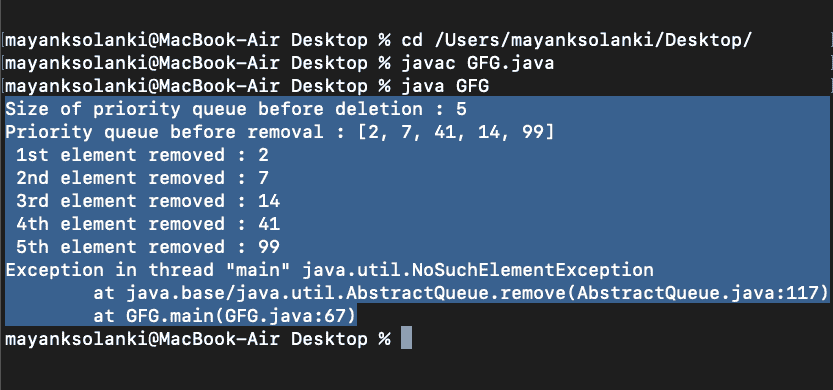

# Java 中的 PriorityQueue remove()方法

> 原文:[https://www . geesforgeks . org/priorityqueue-remove-method-in-Java/](https://www.geeksforgeeks.org/priorityqueue-remove-method-in-java/)

的 [PriorityQueue 类](https://www.geeksforgeeks.org/priority-queue-class-in-java/)[Java . util 包](https://www.geeksforgeeks.org/java-util-package-java/) 的 remove()方法用于从 PriorityQueue 中移除特定元素。众所周知，进入优先级队列时的元素没有被排序，但是众所周知，从优先级队列中取出元素时，元素总是被排序，这是优先级队列的一个特征。这里，数据类型的元素优先级的默认顺序定义如下:

*   **整数**:最先出现的最小元素(只处理正数时)
*   **字符串**:字母顺序

> **注意:**我们还可以在创建这个类的实例时插入一个比较器，告诉我们应该如何定义优先级。

**语法:**

```java
PriorityQueue<String> = new PriorityQueue<String>(ComparatorHere);
```

**语法:**移除方法

```java
Priority_Queue.remove(Object O)
```

**参数:**参数 *O* 属于优先级队列类型，指定要从优先级队列中删除的元素。

**返回值:**如果队列中存在指定的元素，该方法返回真，否则返回假。

**例 1**

## Java 语言(一种计算机语言，尤用于创建网站)

```java
// Java Program to Illustrate remove() Method
// in PriorityQueue
// Where Elements are of String Type

// Importing all utility classes
import java.util.*;

// Main class
// PriorityQueueDemo
public class GFG {

    // Main driver method
    public static void main(String args[])
    {

        // Creating an empty PriorityQueue
        // where elements are of string type
        PriorityQueue<String> queue
            = new PriorityQueue<String>();

        // Adding elements into the Queue
        // using add() method
        queue.add("Welcome");
        queue.add("To");
        queue.add("Geeks");
        queue.add("For");
        queue.add("Geeks");

        // Printing the elements of PriorityQueue
        System.out.println("Initial PriorityQueue: "
                           + queue);

        // Removing elements from PriorityQueue
        // using remove() method
        queue.remove("Geeks");
        queue.remove("For");
        queue.remove("Welcome");

        // Displaying the PriorityQueue
        // after removal of element
        System.out.println("PriorityQueue after removing "
                           + "elements: " + queue);
    }
}
```

**Output**

```java
Initial PriorityQueue: [For, Geeks, To, Welcome, Geeks]
PriorityQueue after removing elements: [Geeks, To]
```

**例 2**

## Java 语言(一种计算机语言，尤用于创建网站)

```java
// Java Program to Illustrate remove() Method
// of PriorityQueue class
// Where Elements are of Integer type

// Importing required classes
import java.util.*;

// Main class
// PriorityQueueDemo
public class GFG {

    // Main driver method
    public static void main(String args[])
    {

        // Creating an empty PriorityQueue by
        // creating an object of integer type
        PriorityQueue<Integer> queue
            = new PriorityQueue<Integer>();

        // Adding custom input elements
        // using add() method
        queue.add(10);
        queue.add(15);
        queue.add(30);
        queue.add(20);
        queue.add(5);

        // Displaying the PriorityQueue
        System.out.println("Initial PriorityQueue: "
                           + queue);

        // Removing elements from the PriorityQueue
        // using remove() method
        queue.remove(30);
        queue.remove(5);

        // Displaying the PriorityQueue elements
        // after removal
        System.out.println("PriorityQueue after removing "
                           + "elements: " + queue);
    }
}
```

**Output:** 

```java
Initial PriorityQueue: [5, 10, 30, 20, 15]
PriorityQueue after removing elements: [10, 20, 15]
```

Geek，你有没有想过如果 remove()方法的调用超过了队列中存在的元素，会发生什么？在这种情况下，它将继续删除那里的元素，此后它将找不到任何元素来优先删除，因此它将**抛出一个异常**，如下所示。

> **注意:**这个类确实实现了 AbstractQueueInterface

**例**

## Java 语言(一种计算机语言，尤用于创建网站)

```java
// Java Program to illustrate remove() Method
// in PriorityQueue
// Where Exception is encountered

// Importing required classes
import java.io.*;
import java.util.PriorityQueue;

// Main class
// PriorityQueueException
class GFG {

    // Main driver method
    public static void main(String[] args)
    {

        // Creating an empty PriorityQueue
        PriorityQueue<Integer> pq
            = new PriorityQueue<Integer>();

        // Note: Elements are inserted in unsorted order in
        // priority queue but after removal of elements
        // queue is always sorted.

        // Adding elements in above queue
        // using add() method
        pq.add(2);
        pq.add(14);
        pq.add(41);
        pq.add(7);
        pq.add(99);

        // Elements in queue are unsorted by far

        // Getting size of above queue before deletion
        // of any element using size() method
        System.out.println(
            "Size of priority queue before deletion : "
            + pq.size());

        // Printing all elements of above queue
        System.out.println(
            "Priority queue before removal : " + pq);

        // Calling remove() method over priority queue
        // in which there were 5 elements

        // Here calling remove() method say be it 2 times
        // So 2 top priority elements will be removed
        System.out.println(" 1st element removed : "
                           + pq.remove());
        System.out.println(" 2nd element removed : "
                           + pq.remove());
        System.out.println(" 3rd element removed : "
                           + pq.remove());
        System.out.println(" 4th element removed : "
                           + pq.remove());
        System.out.println(" 5th element removed : "
                           + pq.remove());

        // By now queue is empty and if now we made further
        // remove() call it will throw exception for this
        System.out.println(" 6th element removed : "
                           + pq.remove());

        // As we know smaller the integer bigger the
        // priority been set by default comparator of this
        // class

        // Note: Now the element is always returned sorted
        // from a priority queue is a trait of this class

        // Printing the queue after removal of priority
        // elements
        System.out.println(
            "Priority queue after removal as follows: "
            + pq);
    }
}
```

**输出:**



输出解释:

它展示了队列中已经没有其他元素了，因为队列现在是空的，所以它抛出了 [NoSuchElementException](https://www.geeksforgeeks.org/how-to-fix-java-util-nosuchelementexception-in-java/) 。